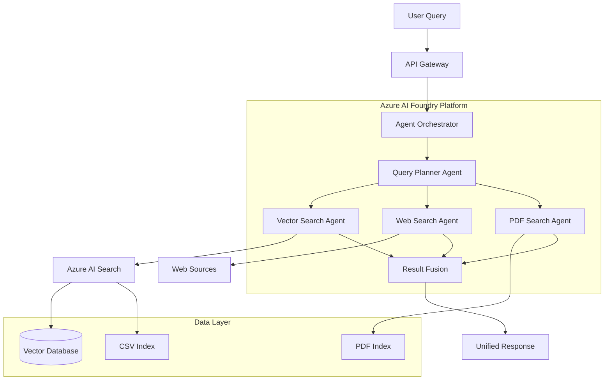
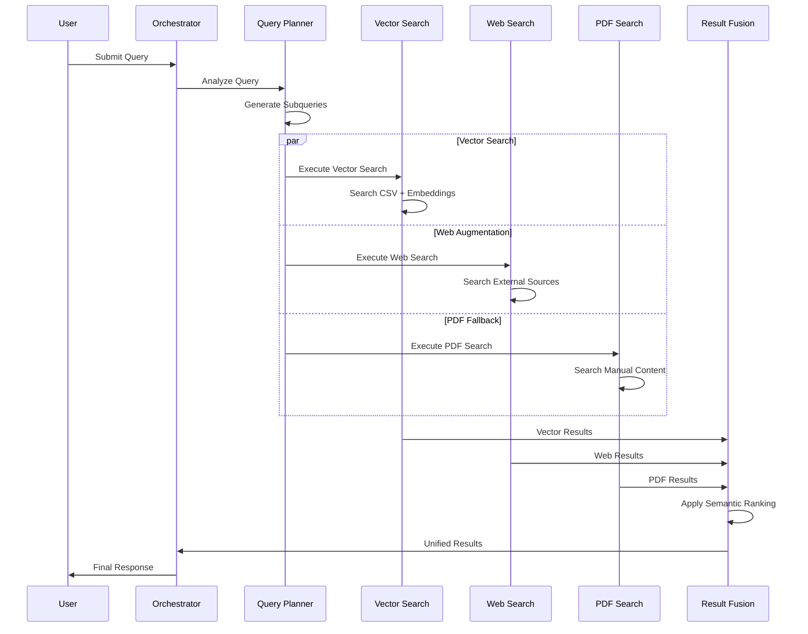

# Design Document

## Overview

The Motorcycle RAG System is built on Azure AI Foundry platform, implementing a sophisticated multi-agent architecture that orchestrates intelligent search across heterogeneous data sources. The system employs a sequential search pattern (Vector DB → Web Augmentation → PDF Fallback) to provide comprehensive motorcycle information retrieval.

The architecture leverages Azure's native AI services including Azure AI Search for hybrid vector/keyword search, Azure OpenAI for language model capabilities, and Semantic Kernel Agent Framework for multi-agent coordination. The system is designed to handle both structured CSV data (motorcycle specifications) and unstructured PDF content (maintenance manuals) while maintaining cost efficiency and production reliability.

## Architecture

### High-Level Architecture



### Component Architecture

The system follows a microservices pattern with the following core components:

1. **API Gateway Layer**: ASP.NET Core Web API providing RESTful endpoints
2. **Agent Orchestration Layer**: Semantic Kernel-based multi-agent coordination
3. **Search Service Layer**: Specialized search agents for different data sources
4. **Data Processing Layer**: ETL pipelines for CSV and PDF ingestion
5. **Storage Layer**: Azure AI Search with hybrid indexing capabilities

### Sequential Search Flow



## Components and Interfaces

### Core Service Interfaces

```csharp
public interface IMotorcycleRAGService
{
    Task<MotorcycleQueryResponse> QueryAsync(MotorcycleQueryRequest request);
    Task<HealthCheckResult> GetHealthAsync();
}

public interface IAgentOrchestrator
{
    Task<SearchResult[]> ExecuteSequentialSearchAsync(string query, SearchContext context);
    Task<string> GenerateResponseAsync(SearchResult[] results, string originalQuery);
}

public interface ISearchAgent
{
    Task<SearchResult[]> SearchAsync(string query, SearchOptions options);
    SearchAgentType AgentType { get; }
}

public interface IDataProcessor<T>
{
    Task<ProcessingResult> ProcessAsync(T input);
    Task<IndexingResult> IndexAsync(ProcessedData data);
}
```

### Agent Implementations

**Query Planner Agent**
- Analyzes user queries using GPT-4o
- Breaks complex queries into focused subqueries
- Determines optimal search strategy
- Coordinates parallel search execution

**Vector Search Agent**
- Executes hybrid search in Azure AI Search
- Combines keyword and semantic search
- Handles both CSV and embedded content
- Implements result ranking and filtering

**Web Search Agent**
- Augments results with authoritative web sources
- Implements web scraping with rate limiting
- Validates source credibility
- Formats web content for integration

**PDF Search Agent**
- Searches processed PDF manual content
- Maintains document structure context
- Handles multimodal content references
- Provides section and page citations

### Data Processing Components

**CSV Processor**
```csharp
public class MotorcycleCSVProcessor : IDataProcessor<CSVFile>
{
    private readonly IAzureOpenAIClient _openAIClient;
    private readonly ISearchClient _searchClient;
    
    public async Task<ProcessingResult> ProcessAsync(CSVFile csvFile)
    {
        // Row-based chunking for relational integrity
        // Metadata augmentation
        // Embedding generation
        // Field mapping and validation
    }
}
```

**PDF Processor**
```csharp
public class MotorcyclePDFProcessor : IDataProcessor<PDFDocument>
{
    private readonly IDocumentIntelligenceClient _documentClient;
    private readonly IAzureOpenAIClient _openAIClient;
    
    public async Task<ProcessingResult> ProcessAsync(PDFDocument pdf)
    {
        // Document Intelligence extraction
        // Semantic chunking with boundaries
        // Multimodal content processing
        // Hierarchical structure preservation
    }
}
```

## Data Models

### Core Domain Models

```csharp
public class MotorcycleSpecification
{
    public string Id { get; set; }
    public string Make { get; set; }
    public string Model { get; set; }
    public int Year { get; set; }
    public EngineSpecification Engine { get; set; }
    public PerformanceMetrics Performance { get; set; }
    public SafetyFeatures Safety { get; set; }
    public PricingInformation Pricing { get; set; }
    public Dictionary<string, object> AdditionalSpecs { get; set; }
}

public class MotorcycleDocument
{
    public string Id { get; set; }
    public string Title { get; set; }
    public string Content { get; set; }
    public DocumentType Type { get; set; }
    public DocumentMetadata Metadata { get; set; }
    public float[] ContentVector { get; set; }
}

public class SearchResult
{
    public string Id { get; set; }
    public string Content { get; set; }
    public float RelevanceScore { get; set; }
    public SearchSource Source { get; set; }
    public Dictionary<string, object> Metadata { get; set; }
}
```

### Query and Response Models

```csharp
public class MotorcycleQueryRequest
{
    public string Query { get; set; }
    public SearchPreferences Preferences { get; set; }
    public string UserId { get; set; }
    public QueryContext Context { get; set; }
}

public class MotorcycleQueryResponse
{
    public string Response { get; set; }
    public SearchResult[] Sources { get; set; }
    public QueryMetrics Metrics { get; set; }
    public string QueryId { get; set; }
}
```

### Configuration Models

```csharp
public class AzureAIConfiguration
{
    public string FoundryEndpoint { get; set; }
    public string OpenAIEndpoint { get; set; }
    public string SearchServiceEndpoint { get; set; }
    public string DocumentIntelligenceEndpoint { get; set; }
    public ModelConfiguration Models { get; set; }
}

public class ModelConfiguration
{
    public string ChatModel { get; set; } = "gpt-4o-mini";
    public string EmbeddingModel { get; set; } = "text-embedding-3-large";
    public int MaxTokens { get; set; } = 4096;
    public float Temperature { get; set; } = 0.1f;
}
```

## Error Handling

### Resilience Patterns

**Circuit Breaker Implementation**
```csharp
public class AzureOpenAICircuitBreaker
{
    private readonly CircuitBreakerPolicy _circuitBreaker;
    
    public AzureOpenAICircuitBreaker()
    {
        _circuitBreaker = Policy
            .Handle<HttpRequestException>()
            .Or<TaskCanceledException>()
            .CircuitBreakerAsync(
                handledEventsAllowedBeforeBreaking: 5,
                durationOfBreak: TimeSpan.FromMinutes(1));
    }
}
```

**Retry Policy with Exponential Backoff**
```csharp
public class RetryPolicyConfiguration
{
    public static IAsyncPolicy<T> CreateRetryPolicy<T>()
    {
        return Policy
            .Handle<HttpRequestException>()
            .Or<TimeoutException>()
            .WaitAndRetryAsync(
                retryCount: 3,
                sleepDurationProvider: retryAttempt => 
                    TimeSpan.FromSeconds(Math.Pow(2, retryAttempt)),
                onRetry: (outcome, timespan, retryCount, context) =>
                {
                    // Log retry attempt
                });
    }
}
```

### Error Response Handling

- **Graceful Degradation**: When primary search fails, fallback to cached results
- **Partial Results**: Return available results even if some agents fail
- **User-Friendly Messages**: Convert technical errors to actionable user guidance
- **Monitoring Integration**: All errors logged to Application Insights with correlation IDs

## Testing Strategy

### Unit Testing Approach

**Agent Testing**
- Mock Azure service dependencies using interfaces
- Test query planning logic with various input scenarios
- Validate search result ranking and fusion algorithms
- Verify error handling and retry mechanisms

**Data Processing Testing**
- Test CSV parsing with various column configurations
- Validate PDF extraction accuracy with sample documents
- Test embedding generation and vector operations
- Verify chunking strategies preserve content integrity

### Integration Testing

**End-to-End Scenarios**
- Complete query flow from API to response
- Multi-agent coordination under various conditions
- Data pipeline processing with real Azure services
- Performance testing with concurrent users

**Azure Service Integration**
- Azure AI Search indexing and querying
- Azure OpenAI model interactions
- Document Intelligence processing accuracy
- Authentication and authorization flows

### Performance Testing

**Load Testing Metrics**
- Concurrent user capacity (target: 100 concurrent users)
- Response time targets (< 3 seconds for 95th percentile)
- Throughput measurements (queries per second)
- Resource utilization monitoring

**Cost Optimization Testing**
- Token usage optimization across different query types
- Caching effectiveness measurement
- Batch processing efficiency validation
- Model selection impact on cost and quality

### Monitoring and Observability

**Application Insights Integration**
```csharp
public class TelemetryService
{
    private readonly TelemetryClient _telemetryClient;
    
    public void TrackQuery(string queryId, string query, TimeSpan duration)
    {
        _telemetryClient.TrackEvent("MotorcycleQuery", new Dictionary<string, string>
        {
            ["QueryId"] = queryId,
            ["Query"] = query,
            ["Duration"] = duration.TotalMilliseconds.ToString()
        });
    }
}
```

**Key Metrics to Monitor**
- Query response times and success rates
- Agent coordination effectiveness
- Search result relevance scores
- Cost per query and monthly spend
- Error rates by component and error type
- User satisfaction through feedback mechanisms