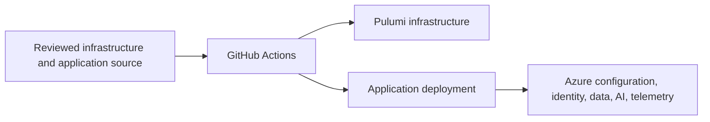

# Azure Environment Architecture

## Overview

The Azure Environment is the declarative infrastructure and deployment boundary for MotorcycleRAG. Source lives under `7-Deployment/`; GitHub Actions applies reviewed changes to the selected environment.

## Architecture

## Components and Interfaces

- Pulumi defines cloud resources and their dependencies.
- GitHub Actions is the deployment control plane.
- Application services use managed identity, configuration, and health endpoints to interact with their Azure dependencies.

## Data Models

Infrastructure configuration and Pulumi stack state describe environment-specific resources. Secret values remain in approved secret stores and are not represented in documentation.

## Error Handling

Pipeline failures remain visible in GitHub Actions logs. Operators diagnose configuration and runtime issues through read-only Azure inspection, telemetry, and health endpoints; infrastructure changes are corrected in source and redeployed through the pipeline.

## Testing Strategy

- Validate infrastructure source with review and permitted previews.
- Run pipeline checks for deployment changes.
- Verify deployed health and telemetry through documented operational procedures.
