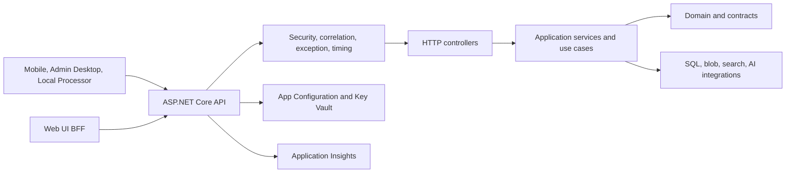

# MotorcycleRAG API Architecture

## Overview

The API is the platform's HTTP composition root. It configures security and observability, exposes versioned controller routes, maps requests to application services, and returns sanitized HTTP results. It depends inward on application, domain, contracts, core, and persistence projects; business rules are not implemented in controllers.

## Architecture

## Components and Interfaces

| Component | Responsibility | Interfaces |
| --- | --- | --- |
| `Program` and configuration extensions | Composition root for configuration, telemetry, MVC, CORS, persistence, search/AI, health, authentication, authorization, and rate limiting; it invokes the single Persistence registration path | ASP.NET Core service registrations |
| Middleware | Host validation, security headers, correlation IDs, authorization, timing, and exception-to-problem-details handling | HTTP request pipeline |
| Controllers | Request validation and HTTP mapping for queries, ingestion, manuals, users, access requests, web sources, MCP administration, and health-related operations; they invoke application services rather than repositories | `/api/*` endpoints and shared DTOs |
| Orphan reconciliation background service | Periodically sweeps for orphaned search-chunks artifacts (stored without indexing due to missing ingestion jobs) and reconciles their states to indexed success or terminal failure | `OrphanedArtifactSweepBackgroundService` running per `IngestionOptions` configuration |
| Application services | Query planning, ingestion lifecycle, search, orphan reconciliation, and administrative use cases | Contracts and application DTOs |
| External integrations | SQL, blob storage, search, AI/Foundry, App Configuration, Key Vault, telemetry | Persistence-owned adapters, credential providers, and SDK client factories registered with documented lifetimes |

## Orphaned Artifact Reconciliation

The API includes admin-only endpoints for managing orphaned search-chunks artifacts (stored but not indexed due to missing ingestion jobs):

- `GET /api/ingestion/artifacts/orphaned` — List all orphaned artifacts (both `Orphaned` and `OrphanedTerminal` states) with reason, attempt count, and first-detected timestamp.
- `POST /api/ingestion/artifacts/orphaned/sweep` — Trigger an immediate orphan sweep cycle; each cycle re-drives reconciliation and transitions permanent failures to terminal state.
- `POST /api/ingestion/artifacts/orphaned/{uploadId}/adopt` — Manually bind an orphaned artifact to a valid ingestion job and re-index it.

All three endpoints require the `mcr-api-admin` policy. The sweep is also invoked automatically on a configurable interval via `OrphanedArtifactSweepBackgroundService`.

## Data Models

| Model | Purpose |
| --- | --- |
| Query request/response models | Carry a user query, contextual preferences, answer, sources, and suggestions across the HTTP boundary. |
| Ingestion upload and job models | Separate the staged source (`uploadId`) from the durable ingestion job and its processor-run correlation identifier. |
| Orphan listing and sweep DTOs | Carry orphan state and reconciliation outcome across the admin HTTP boundary. |
| `ProblemDetails` | Standard safe representation of validation and server failures. |
| Health response models | Report overall and component health without exposing secrets. |

Shared transport DTOs belong in `MotorcycleRAG.Contracts.Models`; interfaces remain in `MotorcycleRAG.Contracts`.

## Error Handling

- Middleware converts unhandled exceptions into sanitized error responses and preserves correlation information for operators.
- Controllers return validation errors as `ProblemDetails` and do not leak implementation or credential details.
- Authentication and authorization reject callers before protected controller actions run; role-based rate limits limit accepted traffic.
- Downstream failures are surfaced through the application-layer policy and health checks. Ingestion status remains observable through the job API rather than inferred from a single request result.

## Testing Strategy

- **Unit:** test application/domain behavior in their owning projects; controller tests cover validation and mapping.
- **Integration:** use the API integration test projects for authorization, persistence, ingestion, and real HTTP contracts.
- **Security:** verify unauthenticated, wrong-role, wrong-client, oversized, and malformed requests against protected routes.
- **End-to-end:** exercise a real source upload, job creation, local-processor handoff, and terminal job state using the same API paths as the operator applications.
