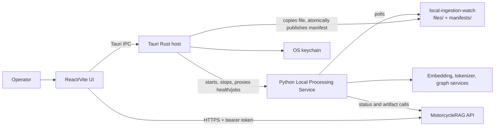

# MotorcycleRAG Admin Desktop Architecture

## Overview

Admin Desktop is a local-first operator application. It combines a React user interface with a Tauri native host and supervises, rather than implements, the Python Local Processing Service. Its design keeps native file access, process lifecycle control, and credential storage outside the webview while preserving a clear API-backed record of ingestion work.

## Architecture

The browser-like React runtime never directly starts a local executable or writes the watch folder. Those privileged operations cross the Tauri command boundary. The processor is a FastAPI service bound locally, normally on `127.0.0.1:8100`; the host proxies selected processor requests to avoid exposing a broad browser-facing local API.

## Components and Interfaces

| Component | Responsibility | Primary interfaces |
| --- | --- | --- |
| React/Vite UI (`src/`) | Sign-in state, operator screens, validation, job presentation, and configuration | Tauri `invoke`, Axios API client, React Query |
| Tauri host (`src-tauri/`) | File picker, keychain-backed authentication support, processor path resolution and lifecycle, local HTTP proxy, queue publication | Tauri commands including `processor_start`, `processor_request`, `pick_local_ingestion_file`, and `queue_local_ingestion_work_item` |
| Local Processing Service | PDF, CSV, and bike-graph processing; watch-folder consumption; local job status | HTTP endpoints including `/health`, `/jobs`, `/process/pdf`, `/process/csv`, and `/control/shutdown` |
| MotorcycleRAG API | Cloud ingestion-job creation, constraints, metadata, retries, and durable progress | `/api/ingestion/jobs` family, authenticated with the admin access token or processor credentials as appropriate |

### Local-first ingestion contract

1. The UI validates the selected file and queries API upload constraints.
2. The UI creates or obtains the cloud ingestion identifiers, including a `processorRunId`.
3. The host copies the source file to `files/{uploadId}-{sanitizedSourceFileName}`.
4. The host writes a manifest containing `jobId`, `uploadId`, `processorRunId`, `documentType`, `localFileName`, `sizeBytes`, and `createdAtUtc` to a temporary file, then renames it into `manifests/{processorRunId}.json`.
5. The Python worker validates the manifest and its paired file, processes the file, and reports stage progress to the API using the processor-run identifier.

The manifest is the publication signal. The temporary-write-plus-rename sequence prevents the worker from consuming partial JSON.

## Data Models

| Model | Key fields | Relationship |
| --- | --- | --- |
| `AppConfig` | API/auth settings, processor port and working directory, model endpoints, tokenizer path, storage URL, upload secret | Persisted locally in the Tauri store; passed to processor startup |
| `LocalIngestionWorkItemRequest` | `sourcePath`, `jobId`, `uploadId`, `processorRunId`, `documentType`, `createdAtUtc`, optional file name and size | UI-to-host command payload |
| Local ingestion manifest | `jobId`, `uploadId`, `processorRunId`, `documentType`, `sourceFileName`, `localFileName`, `sizeBytes`, `createdAtUtc` | Durable handoff from host to Python worker |
| Processor job | local `job_id`, status/stage, chunk counts and error details | Correlated to the API ingestion record through `processorRunId` / `docIngestionRunId` |

Authentication tokens are intentionally excluded from the local configuration model and are stored through the OS keychain integration.

## Error Handling

- The Rust queue command rejects unreadable files, missing or invalid identifiers, file-size changes, and watch-folder write failures before it publishes a manifest.
- The UI blocks local submission when the upload secret is absent, the running processor was started without it, or processor health says it is not accepting work.
- The Python worker rejects malformed manifests, path traversal, missing paired files, and size mismatches; these failures remain observable through processor and API job status.
- Tauri command failures return `Result` errors to the UI, which presents sanitized, actionable error text instead of raw infrastructure details.
- If a cloud job remains active but no longer exists locally, the Processor screen marks it stale after its grace period rather than presenting it as progressing indefinitely.

## Testing Strategy

- **Frontend unit/component tests:** Vitest and Testing Library cover routes, configuration, API adapters, queue interactions, and screen behavior (`npm test`).
- **Rust unit tests:** `cargo test` in `src-tauri` covers native validation and queue publication behavior.
- **Processor tests:** run the Python service's unit and integration suite in `2-Application/local-processing-service`; test PDF, CSV, health, and watch-folder behavior there.
- **End-to-end:** run the Tauri app with a real local PDF or CSV, a ready processor, valid API credentials, and the real watch-folder path. Verify the item appears in both local and cloud job views and reaches a terminal API state.
