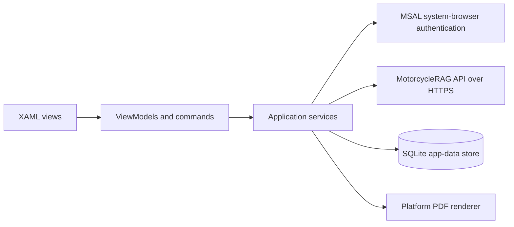

# MotorcycleRAG Mobile App Architecture

## Overview

The Mobile App is a single-project .NET MAUI application with XAML views and CommunityToolkit MVVM ViewModels. It separates presentation state from API, authentication, storage, and PDF-viewing services, allowing the same feature behavior to run across the configured native platforms.

## Architecture

## Components and Interfaces

| Component | Responsibility | Interfaces |
| --- | --- | --- |
| `MauiProgram`, `App`, and `AppShell` | `MauiProgram` is the composition root: it builds the validated MSAL application, registers services, and supplies `AppShell` directly to `App`; `AppShell` provides navigation and XAML presentation | MAUI DI, XAML binding, and Shell navigation |
| ViewModels | Observable state and commands using CommunityToolkit MVVM | Injected service interfaces |
| `AuthenticationService` | MSAL account/session acquisition and sign-out using the `IPublicClientApplication` composed by `MauiProgram` | `IAuthenticationService`, `IPublicClientApplication` |
| `MotorcycleRagApiClient` | HTTPS calls for queries and profile data, retry and typed error mapping | `IApiClient` |
| Conversation and memory services | Conversation workflows and user-memory extraction | `IConversationService`, `IUserMemoryService` |
| SQLite repositories | Persist conversations, messages, citations, and user memory | Repository interfaces and `SQLiteAsyncConnection` |
| Platform PDF services | Render and view PDFs using paired transient platform implementations so a singleton does not retain a transient renderer | `IPdfRenderer`, `IPdfViewerService` |

## Data Models

| Model | Purpose |
| --- | --- |
| `QueryRequest` / `QueryResponse` | API query payload and answer data. |
| `ConversationSession` and `ChatMessage` | Presentation-level conversation state. |
| Conversation, message, citation, and user-memory entities | SQLite persistence representation. |
| `UserProfile` and `SourceCitation` | API-sourced profile and answer attribution data. |

The local store is a cache of user information, not an authorization source of truth.

## Error Handling

- API configuration is rejected at startup unless the base URL is an absolute HTTPS URI.
- HTTP failures are translated into authentication, rate-limit, or API exceptions; retry excludes HTTP 429 responses.
- MSAL silently acquires an eligible token where possible and indicates when user interaction is required rather than embedding a webview fallback.
- The storage service prunes oldest conversations when usage exceeds its 100 MB limit and retains active local state consistently through the repository interfaces.

## Testing Strategy

- **Unit:** ViewModels, API error mapping, authentication behavior, conversation services, and repositories.
- **Integration:** API-client requests against a test API and SQLite repository behavior against an isolated database.
- **Platform:** build each configured target and exercise system-browser authentication and PDF rendering on the matching simulator/device.
- **End-to-end:** sign in, submit a query, inspect citations, reopen a cached conversation, and validate quota pruning with representative local data.
