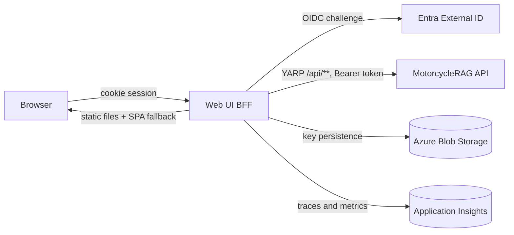

# MotorcycleRAG Web UI BFF Architecture

## Overview

The BFF is the browser's only origin. It terminates the interactive sign-in, holds the session in an encrypted cookie, serves the React single-page application, and reverse-proxies `/api/*` to the platform API with a bearer token attached server-side. No access token ever reaches browser JavaScript.

It is a presentation-layer host: it composes configuration, security, and proxying policy. It contains no business rules and no data access.

## Architecture

## Request pipeline

`UseMotorcycleRagBffMiddleware` in `WebApplicationExtensions` defines the ordering, and the order is load-bearing:

| # | Stage | Rationale |
| --- | --- | --- |
| 0 | Forwarded headers | Must run first so scheme and host are correct behind the ingress; every later decision depends on them. |
| 1 | HSTS | Transport policy before any content is emitted. |
| 2 | Host header validation | `HostHeaderValidationMiddleware` rejects unlisted hosts before routing work is done. |
| 3 | Security headers | `SecurityHeadersExtensions` applies CSP, frame, sniffing, referrer, and permissions policy. |
| 4 | Static files | SPA assets. |
| 5 | Routing | |
| 6 | CORS | `AllowFrontend` policy. |
| 7 | Authentication, then authorization | |
| 8 | Endpoints | Controllers, the YARP reverse proxy, and `/health`. |
| 9 | SPA fallback | `index.html` for client-side routes. |

`HostHeaderValidationMiddleware` reads `AllowedHosts`, treats `*` as allow-all, and **fails fast at construction** when the allowlist parses to empty — an empty allowlist is a misconfiguration, not a permissive default.

## Components and interfaces

| Component | Responsibility |
| --- | --- |
| `AuthController` | The three auth endpoints. `Login` issues an OIDC challenge; `Logout` signs out both the cookie and OIDC schemes; `GetUser` reports approval-aware session state. |
| `YarpServiceConfiguration` | Loads proxy routes from the `ReverseProxy` configuration section and installs two request transforms: pin the downstream `Host` header, and attach the session's `access_token` as a bearer credential. |
| `AuthenticationServiceConfiguration` | Cookie plus OpenID Connect schemes, and the named HTTP client used for approval-status lookups. |
| `CorsServiceConfiguration` | The `AllowFrontend` policy: explicit origins, methods, and headers with credentials enabled. Development adds the local Vite origins on top of configured ones. |
| `DataProtectionServiceConfiguration` | Blob-backed data-protection key persistence. See [data protection](data-protection.md). |
| `TelemetryServiceConfiguration` | Application Insights wiring. |
| `SecurityHeadersExtensions` | Response security headers, with a tighter production CSP than development. |

## Endpoints

| Endpoint | Behaviour |
| --- | --- |
| `GET /auth/login` | Returns an OIDC challenge, redirecting to `returnUrl` or `/`. |
| `POST /auth/logout` | Signs out the cookie and OIDC schemes. |
| `GET /auth/me` | Session and approval state. |

`GET /auth/me` is a **polling endpoint, not a protected resource**: it always returns `200`, never `401`, and reports state in the body. Callers distinguish three cases — `sessionAuthenticated` (a valid BFF cookie exists), `accessApproved` (the API confirmed the account is approved), and `approvalStatus` (`SignedOut`, `Approved`, `ApprovalRequired`, `ApiUnauthorized`, or `Unknown`). A signed-in user whose approval cannot be confirmed reports `authenticated: false` with `sessionAuthenticated: true`; the UI must not treat that as signed out.

## Error handling

Approval-state lookup degrades rather than failing the request. A missing access token, an unconfigured API base address, an unexpected status code, or a transport exception all produce `approvalStatus: "Unknown"` with a user-facing message, and are logged at warning or error. The distinction matters operationally: `Unknown` means the BFF could not reach a verdict, while `ApprovalRequired` means the API returned a definite `403`.

## Testing strategy

`5-Test/MotorcycleRag.WebUI.BFF.Tests` covers the controller's session and approval branches, host-header validation, authorization policy evaluation, and data-protection configuration. The data-protection health check is exercised through an injected `IDataProtectionBlobProbe` so no SDK client or credential is constructed during a health request.

## Related documentation

- [Data protection key persistence](data-protection.md) — architecture
- [Operations](../operations/webui-bff-data-protection-operations.md), [disaster recovery](../operations/webui-bff-data-protection-disaster-recovery.md), [troubleshooting](../operations/webui-bff-data-protection-troubleshooting.md)
- [Web UI architecture](../MotorcycleRag.WebUI/architecture.md) — the SPA this host serves
- [Authentication and authorization design](../reference/auth-design.md)
