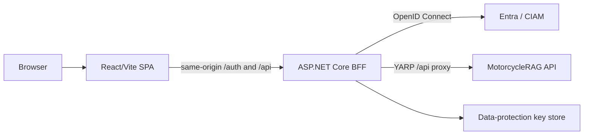

# MotorcycleRAG Web UI Architecture

## Overview

The Web UI is a React SPA paired with an ASP.NET Core BFF. The SPA presents login, chat, and settings experiences; the BFF authenticates users with OpenID Connect, maintains the browser session, applies web security policy, and reverse-proxies API requests. This is a deliberate browser security boundary, not an optional development convenience.

## Architecture

## Components and Interfaces

| Component | Responsibility | Interfaces |
| --- | --- | --- |
| React SPA | Routes, authentication-aware UI, chat interaction, settings, and rendered responses | `/auth/me`, `/auth/login`, `/auth/logout`, `/api/motorcycles/query` |
| `AuthProvider` and protected route | Retrieves same-origin session state and gates protected presentation routes | React Query and browser navigation |
| Chat interface | Maintains transient in-browser message state and sends structured query payloads | `fetch` with an abort signal |
| ASP.NET Core BFF | OIDC/session cookies, data protection, telemetry, CORS, host validation, security headers, and reverse proxy | Authentication controller and YARP `/api/{**catch-all}` route; an injected data-protection probe checks the same configured blob client used for key persistence when blob-backed keys are enabled |
| MotorcycleRAG API | Performs authenticated query processing behind the BFF | Proxied HTTPS requests |

## Data Models

| Model | Purpose |
| --- | --- |
| BFF auth user | Represents authenticated/session/approval state returned by `/auth/me`. |
| Chat message | Transient UI message with role, content, timestamp, and optional suggested actions. |
| Query payload | Query text, preferences, user identifier field, and recent conversation context sent to the API route. |
| Query response | Answer text plus optional model, suggestions, and sources used by the chat UI. |

The SPA does not persist bearer tokens or long-lived chat history in browser storage.

## Error Handling

- Protected routes show the login experience while the session is absent or loading rather than assuming an API token exists.
- The chat UI aborts a request after two minutes, differentiates timeout from a general connection error, and returns the UI to a usable state.
- The BFF applies configuration-backed CORS, host validation, authentication, security headers, exception handling, and data-protection policy before proxying. Its health check reports injected-probe failures without constructing credentials or SDK clients during a health request.
- API errors remain HTTP failures from the same-origin BFF route; the SPA must not bypass the BFF to recover from them.

## Testing Strategy

- **Unit/component:** Vitest and Testing Library for routes, auth context, chat behavior, settings, and layout.
- **Static checks:** TypeScript build and ESLint.
- **Browser:** Playwright smoke coverage against the built application.
- **Integration:** BFF authentication and YARP routing with a test API destination.
- **End-to-end:** run through the BFF origin, sign in, call the chat endpoint, verify a rendered response, and sign out.
