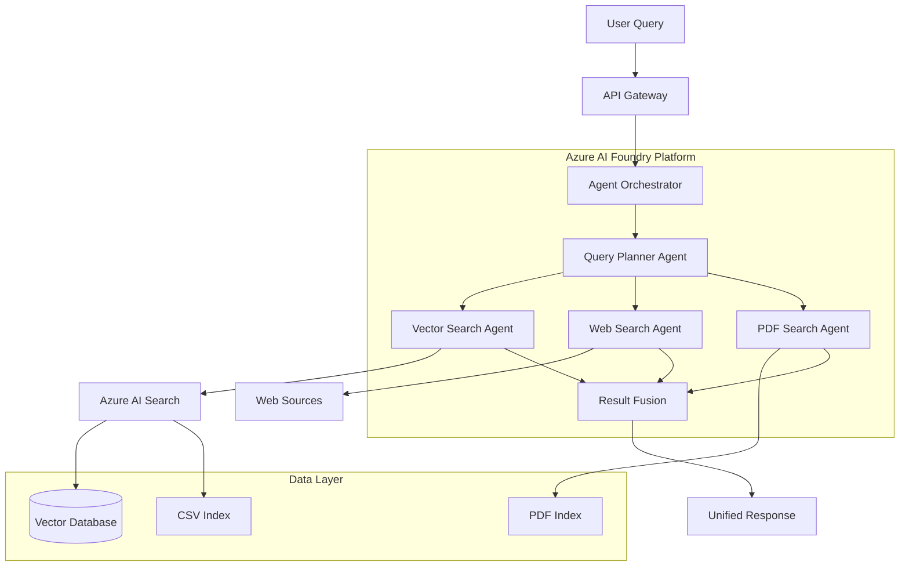

# Motorcycle RAG System - Complete Documentation

## Table of Contents
1. [System Overview](#system-overview)
2. [Architecture](#architecture)
3. [Components](#components)
4. [Data Pipeline](#data-pipeline)
5. [API Reference](#api-reference)
6. [Configuration](#configuration)
7. [Deployment](#deployment)
8. [Monitoring](#monitoring)
9. [Performance](#performance)
10. [Security](#security)
11. [Troubleshooting](#troubleshooting)

## System Overview

The Motorcycle RAG (Retrieval-Augmented Generation) System is an AI-powered information retrieval platform that intelligently searches across multiple data sources to provide comprehensive motorcycle information. The system combines structured CSV specifications, PDF maintenance manuals, and web sources through a sophisticated multi-agent architecture.

### Key Features
- **Multi-Source Intelligence**: Sequential search pattern (Vector DB → Web Augmentation → PDF Fallback)
- **Intelligent Processing**: Multi-agent coordination using Semantic Kernel
- **Cost Optimization**: Uses GPT-4o-mini for standard operations, GPT-4o for complex planning
- **Production Ready**: Deployed on Azure AI Foundry with comprehensive monitoring
- **Scalable Architecture**: Handles 100+ concurrent users with sub-3-second response times

### Target Users
- **Motorcycle Enthusiasts**: Detailed specifications and technical information
- **Mechanics**: Maintenance procedures and technical documentation
- **System Administrators**: Data ingestion and system management

## Architecture

### High-Level Architecture



### Component Architecture

The system follows a microservices pattern with clear separation of concerns:

1. **Presentation Layer** (`1-Presentation/`)
   - ASP.NET Core Web API
   - Controllers for motorcycle queries and data pipeline operations
   - Configuration and service registration

2. **Application Layer** (`2-Application/`)
   - Core business logic and orchestration
   - Multi-agent implementations
   - Caching and optimization services
   - Data pipeline orchestration

3. **Domain Layer** (`3-Domain/`)
   - Domain models and contracts
   - Service interfaces
   - Business rules and validation

4. **Persistence Layer** (`4-Persistence/`)
   - Azure service integrations
   - Data processors for CSV and PDF
   - Resilience and telemetry services

5. **Test Layer** (`5-Test/`)
   - Comprehensive test suite
   - Unit, integration, and end-to-end tests
   - Performance and load tests

## Components

### Core Services

#### MotorcycleRAGService
Main service coordinating query processing through the multi-agent system.

**Key Methods:**
- `QueryAsync(MotorcycleQueryRequest)`: Process user queries
- `GetHealthAsync()`: System health check

#### AgentOrchestrator
Coordinates multiple specialized agents using Semantic Kernel framework.

**Agents:**
- **QueryPlannerAgent**: Analyzes queries using GPT-4o
- **VectorSearchAgent**: Searches indexed motorcycle data
- **WebSearchAgent**: Augments with web sources
- **PDFSearchAgent**: Searches maintenance manuals

#### Data Pipeline Services

##### DataPipelineOrchestrator
Coordinates ETL operations for motorcycle data processing.

**Features:**
- Batch processing with configurable concurrency
- Resilience patterns (retry, circuit breaker)
- Real-time monitoring and metrics

##### FileUploadService
Handles secure file uploads with validation.

**Supported Formats:**
- CSV files (motorcycle specifications)
- PDF files (maintenance manuals)
- Content validation and type detection

##### ScheduledPipelineService
Background service for automated data processing.

**Features:**
- Cron-based scheduling
- Automatic file discovery
- Error handling and notifications

##### PipelineMonitoringService
Monitors pipeline executions and provides alerting.

**Capabilities:**
- Real-time health monitoring
- Configurable alerting thresholds
- Detailed metrics and reporting

### Data Processors

#### MotorcycleCSVProcessor
Processes CSV files containing motorcycle specifications.

**Features:**
- Row-based chunking for relational integrity
- Support for 100+ columns
- Automatic header detection
- Embedding generation using text-embedding-3-large

#### MotorcyclePDFProcessor
Processes PDF maintenance manuals.

**Features:**
- Azure Document Intelligence integration
- Semantic chunking with embedding boundaries
- Multimodal content processing (GPT-4 Vision)
- Document structure preservation

## Data Pipeline

### Processing Flow

1. **File Upload**
   - Secure upload with validation
   - File type detection
   - Content validation

2. **Processing**
   - Route to appropriate processor (CSV/PDF)
   - Extract and chunk content
   - Generate embeddings
   - Apply metadata

3. **Indexing**
   - Store in Azure AI Search
   - Create vector and keyword indexes
   - Maintain document relationships

4. **Monitoring**
   - Track processing metrics
   - Send notifications
   - Update health status

### Batch Processing

The system supports efficient batch processing:
- **Batch Size**: 100-1000 documents per batch
- **Concurrency**: Configurable concurrent executions
- **Resilience**: Automatic retry and error handling
- **Monitoring**: Real-time progress tracking

## API Reference

### Motorcycle Query API

#### POST /api/motorcycle/query
Process a motorcycle-related query.

**Request:**
```json
{
  "query": "What are the specifications for Honda CBR600RR?",
  "userId": "user123",
  "preferences": {
    "maxResults": 10,
    "includeMetadata": true
  }
}
```

**Response:**
```json
{
  "response": "The Honda CBR600RR is a 599cc inline-4 sport motorcycle...",
  "sources": [
    {
      "id": "doc1",
      "content": "Honda CBR600RR specifications...",
      "relevanceScore": 0.95,
      "source": "CSV",
      "metadata": {
        "make": "Honda",
        "model": "CBR600RR"
      }
    }
  ],
  "queryId": "query-123",
  "metrics": {
    "responseTime": "00:00:02.150",
    "sourcesSearched": 3,
    "documentsRetrieved": 15
  }
}
```

### Data Pipeline API

#### POST /api/datapipeline/upload
Upload files for processing.

**Request:** Multipart form data with files

**Response:**
```json
{
  "uploadId": "upload-123",
  "totalFiles": 2,
  "successfulUploads": 2,
  "failedUploads": 0,
  "results": [
    {
      "fileId": "file-123",
      "originalFileName": "motorcycles.csv",
      "detectedFileType": "CSV",
      "isValid": true
    }
  ]
}
```

#### POST /api/datapipeline/process
Process uploaded files.

**Request:**
```json
{
  "fileName": "motorcycles.csv",
  "filePath": "/uploads/motorcycles.csv",
  "fileType": "CSV",
  "options": {
    "indexImmediately": true,
    "processImages": false,
    "generateEmbeddings": true
  }
}
```

#### GET /api/datapipeline/status/{executionId}
Get pipeline execution status.

#### GET /api/datapipeline/metrics
Get pipeline performance metrics.

## Configuration

### Application Settings

The system uses hierarchical configuration with the following sections:

#### Azure AI Configuration
```json
{
  "AzureAI": {
    "FoundryEndpoint": "https://your-foundry.cognitiveservices.azure.com/",
    "OpenAIEndpoint": "https://your-openai.openai.azure.com/",
    "SearchServiceEndpoint": "https://your-search.search.windows.net/",
    "DocumentIntelligenceEndpoint": "https://your-document.cognitiveservices.azure.com/",
    "Models": {
      "ChatModel": "gpt-4o-mini",
      "EmbeddingModel": "text-embedding-3-large",
      "QueryPlannerModel": "gpt-4o",
      "VisionModel": "gpt-4-vision-preview"
    }
  }
}
```

#### Pipeline Configuration
```json
{
  "Pipeline": {
    "MaxConcurrentExecutions": 3,
    "DefaultTimeout": "00:30:00",
    "MaxRetries": 3
  },
  "FileUpload": {
    "MaxFileSizeBytes": 52428800,
    "MaxFilesPerBatch": 10,
    "AllowedExtensions": [".csv", ".pdf"]
  },
  "ScheduledProcessing": {
    "DefaultCronExpression": "0 0 2 * * *",
    "IsEnabledByDefault": true,
    "BaseDirectory": "data"
  }
}
```

### Environment Variables

- `AZURE_CLIENT_ID`: Azure service principal client ID
- `AZURE_CLIENT_SECRET`: Azure service principal secret
- `AZURE_TENANT_ID`: Azure tenant ID
- `APPLICATIONINSIGHTS_CONNECTION_STRING`: Application Insights connection string

## Deployment

### Azure Container Apps Deployment

1. **Build Container Image**
```bash
docker build -t motorcycle-rag-system .
docker tag motorcycle-rag-system your-registry.azurecr.io/motorcycle-rag-system:latest
docker push your-registry.azurecr.io/motorcycle-rag-system:latest
```

2. **Deploy to Azure Container Apps**
```bash
az containerapp create \
  --name motorcycle-rag \
  --resource-group rg-motorcycle-rag \
  --environment containerapp-env \
  --image your-registry.azurecr.io/motorcycle-rag-system:latest \
  --target-port 80 \
  --ingress external \
  --min-replicas 1 \
  --max-replicas 10
```

3. **Configure Environment Variables**
```bash
az containerapp update \
  --name motorcycle-rag \
  --resource-group rg-motorcycle-rag \
  --set-env-vars \
    AZURE_CLIENT_ID=your-client-id \
    AZURE_TENANT_ID=your-tenant-id \
    APPLICATIONINSIGHTS_CONNECTION_STRING=your-connection-string
```

### Infrastructure as Code

The system includes Pulumi infrastructure definitions in `7-Deployment/infrastructure/`:

```bash
cd 7-Deployment/infrastructure
pulumi up
```

## Monitoring

### Application Insights Integration

The system provides comprehensive monitoring through Azure Application Insights:

- **Request Tracking**: All API requests with response times
- **Dependency Tracking**: Azure service calls and performance
- **Exception Tracking**: Detailed error information with stack traces
- **Custom Metrics**: Pipeline processing metrics and business KPIs

### Health Checks

Health check endpoints provide system status:

- `GET /health`: Overall system health
- Individual component health checks for Azure services

### Pipeline Monitoring

Real-time pipeline monitoring includes:

- **Execution Tracking**: Start, completion, and failure events
- **Performance Metrics**: Processing times and throughput
- **Alert Configuration**: Configurable thresholds and notifications
- **Health Status**: Active executions and failure rates

## Performance

### Performance Targets

- **Query Response Time**: < 3 seconds (95th percentile)
- **Concurrent Users**: 100+ simultaneous users
- **Batch Processing**: 100-1000 documents per batch
- **Throughput**: 10+ documents per second

### Optimization Features

1. **Caching**
   - Query result caching for common requests
   - Configurable expiration policies
   - Redis support for distributed caching

2. **Connection Pooling**
   - HTTP client connection pooling
   - Azure service connection optimization
   - Configurable pool sizes and timeouts

3. **Vector Compression**
   - Embedding compression for storage efficiency
   - Reduced memory footprint
   - Faster similarity searches

4. **Batch Processing**
   - Efficient batch operations
   - Parallel processing with concurrency limits
   - Resource optimization

## Security

### Authentication and Authorization

- **Managed Identity**: Azure services use managed identity
- **API Security**: Configurable authentication schemes
- **Role-Based Access**: Different access levels for users and administrators

### Data Security

- **Encryption**: Data encrypted in transit and at rest
- **Input Validation**: Comprehensive input validation and sanitization
- **File Upload Security**: File type validation and content scanning
- **Secure Configuration**: Sensitive settings in Azure Key Vault

### Network Security

- **HTTPS Only**: All communications over HTTPS
- **CORS Configuration**: Configurable cross-origin policies
- **Rate Limiting**: Protection against abuse and DoS attacks

## Troubleshooting

### Common Issues

#### High Response Times
1. Check Azure service health and quotas
2. Review Application Insights for bottlenecks
3. Verify caching configuration
4. Check concurrent request limits

#### Pipeline Processing Failures
1. Review pipeline monitoring logs
2. Check file format and content validation
3. Verify Azure service connectivity
4. Review error notifications and alerts

#### Memory Issues
1. Monitor memory usage in Application Insights
2. Check for memory leaks in long-running operations
3. Review caching configuration and limits
4. Verify proper disposal of resources

### Diagnostic Commands

```bash
# Check application logs
az containerapp logs show --name motorcycle-rag --resource-group rg-motorcycle-rag

# Monitor resource usage
az monitor metrics list --resource motorcycle-rag --metric-names CPUUsage,MemoryUsage

# Check health endpoints
curl https://your-app.azurecontainerapps.io/health
```

### Support and Maintenance

- **Log Analysis**: Use Application Insights for detailed log analysis
- **Performance Monitoring**: Regular performance reviews and optimization
- **Security Updates**: Keep dependencies and Azure services updated
- **Backup and Recovery**: Regular backup of configuration and data

For additional support, refer to the Azure documentation and Application Insights troubleshooting guides.