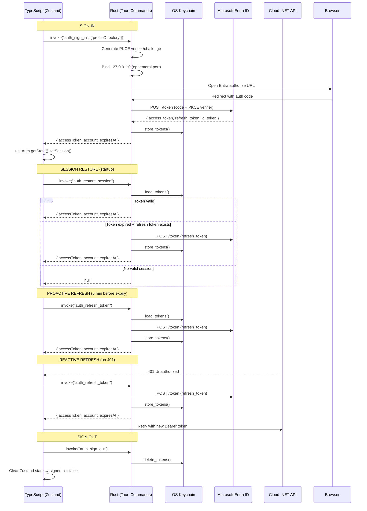

# Admin Desktop — Auth (Entra PKCE Loopback)

**Decision:** no MSAL library. The entire OAuth2 flow is implemented in Rust using the `oauth2` crate (v5), with token persistence via the OS keyring (`keyring` crate v3). The frontend calls Tauri commands and manages session state via Zustand.

## Architecture Overview



## Rust Commands

All auth commands are registered in `lib.rs` via `tauri::generate_handler![]` and implemented in `auth.rs`.

### `auth_sign_in`

| Aspect | Detail |
|---|---|
| **File** | `auth.rs` → `sign_in()` |
| **Signature** | `async fn sign_in(config: &AuthConfig, profile_directory: Option<String>) -> Result<AuthSession, String>` |
| **Tauri command** | `async fn auth_sign_in(app: tauri::AppHandle, profile_directory: Option<String>)` — reads `authority`, `clientId`, `scope` from the Tauri config store internally via `read_auth_config()` |
| **Purpose** | Full Entra auth-code + PKCE loopback flow |

**Flow:**
1. Generate PKCE `code_verifier` and `code_challenge` via `oauth2::PkceCodeChallenge::new_random_sha256()`.
2. Bind `tokio::net::TcpListener` on `127.0.0.1:0` (random ephemeral port).
3. Build the Entra authorize URL with scopes: `{scope}`, `openid`, `profile`, `offline_access`.
4. Open the URL in the system browser. If `profile_directory` is `Some`, launch Google Chrome with `--profile-directory` flag (platform-specific: `open -a` on macOS, direct path on Windows, `google-chrome` on Linux). If `None`, open the default browser via `open` (macOS), `cmd /c start` (Windows), or `xdg-open` (Linux).
5. Accept one TCP connection on the loopback listener, read the GET request, write a "Sign-in complete" HTML response, extract `code` + `state` from the query string.
6. Validate CSRF state (mismatch → hard error).
7. Exchange the authorization code for tokens via `POST {authority}/oauth2/v2.0/token` using the `oauth2` crate's `exchange_code()` with PKCE verifier.
8. Decode `id_token` JWT payload (base64url, no signature verification) to extract `preferred_username` → `email` → `name` as the account identifier.
9. Persist `StoredToken` to the OS keyring via `store_tokens()`.
10. Return `AuthSession { accessToken, account, expiresAt }` to TypeScript.

**5-minute timeout** via `tokio::time::timeout`. State mismatch → hard error `"state mismatch — possible CSRF attack"`.

### `auth_refresh_token`

| Aspect | Detail |
|---|---|
| **File** | `auth.rs` → `refresh()` |
| **Signature** | `async fn refresh(config: &AuthConfig) -> Result<AuthSession, String>` |
| **Tauri command** | `async fn auth_refresh_token(app: tauri::AppHandle)` |
| **Config source** | Reads `authAuthority`, `authClientId`, `authScope` from the Tauri config store (`config.json`) via `read_auth_config()` |

**Flow:**
1. Load stored tokens from the OS keyring via `load_tokens()`. Fail if no stored session or no refresh token.
2. Build an OAuth2 client (no redirect URI needed for refresh).
3. Exchange the refresh token via `POST {authority}/oauth2/v2.0/token` using `oauth2::Client::exchange_refresh_token()`.
4. Persist the new tokens (keeping the old refresh token if Entra didn't return a new one).
5. Return the updated `AuthSession`.

### `auth_restore_session`

| Aspect | Detail |
|---|---|
| **File** | `auth.rs` → `restore()` |
| **Signature** | `async fn restore(config: &AuthConfig) -> Result<Option<AuthSession>, String>` |
| **Tauri command** | `async fn auth_restore_session(app: tauri::AppHandle)` |

**Flow:**
1. Load stored tokens from the OS keyring via `load_tokens()`. If none exist, return `Ok(None)`.
2. If the access token is still valid (with a 60-second skew buffer), return the session immediately.
3. If a refresh token is available, try to exchange it:
   - On success → persist new tokens and return the new session.
   - On failure → delete stored tokens and return `None`.
4. Otherwise (no refresh token, token expired) → delete stored tokens and return `None`.

### `auth_sign_out`

| Aspect | Detail |
|---|---|
| **File** | `auth.rs` → `sign_out()` |
| **Signature** | `fn sign_out() -> Result<(), String>` |
| **Tauri command** | `fn auth_sign_out()` |

Deletes the persisted session tokens from the OS keyring via `delete_tokens()`. Returns `Ok(())` even if no entry existed. The TypeScript side then clears the Zustand store (`accessToken: null`, `signedIn: false`), which causes `App.tsx` to re-render the `SignInScreen`.

### `auth_list_chrome_profiles`

| Aspect | Detail |
|---|---|
| **File** | `auth.rs` → `list_chrome_profiles()` |
| **Signature** | `fn list_chrome_profiles() -> Vec<ChromeProfile>` |
| **Tauri command** | `fn auth_list_chrome_profiles()` |

**Flow:**
1. Resolve the Chrome `Local State` file path (platform-specific):
   - macOS: `~/Library/Application Support/Google/Chrome/Local State`
   - Windows: `%LOCALAPPDATA%\Google\Chrome\User Data\Local State`
   - Linux: `~/.config/google-chrome/Local State`
2. Parse the JSON `profile.info_cache` object to extract each profile's `directory`, `name`, and `user_name`.
3. Sort: `"Default"` first, then alphabetical by directory.
4. If Chrome is not installed or the file cannot be parsed, return `[{ directory: "Default", name: "Default" }]`.

## Keyring Storage

Tokens are persisted to the OS keychain using the `keyring` crate (v3).

| Constant | Value |
|---|---|
| `KEYRING_SERVICE` | `com.palfrey.motorcyclerag.admin.desktop` |
| `KEYRING_ACCOUNT` | `session` |

### `StoredToken` (serialized to JSON in keyring)

```rust
struct StoredToken {
    access_token: String,
    refresh_token: Option<String>,
    id_token: Option<String>,
    account: String,       // preferred_username | email | name from id_token
    expires_at: u64,       // Unix timestamp (seconds)
    scope: String,
}
```

### Functions

| Function | Purpose |
|---|---|
| `store_tokens(token: &StoredToken)` | Serializes to JSON and writes to the OS keychain via `keyring::Entry::set_password()`. |
| `load_tokens() -> Option<StoredToken>` | Reads and deserializes from the OS keychain. Returns `None` if no entry exists or deserialization fails. |
| `delete_tokens()` | Deletes the credential from the OS keychain. Returns `Ok(())` even if no entry existed. |

## Scopes

The authorize URL includes four scopes:

| Scope | Purpose |
|---|---|
| `{config.scope}` | The API scope (default: `api://motorcyclerag-api/admin`) — grants access to the cloud .NET API |
| `openid` | Required for OIDC — returns the `id_token` |
| `profile` | Requests the `preferred_username` claim in the `id_token` |
| `offline_access` | Requests a `refresh_token` — enables silent token refresh without user interaction |

The `offline_access` scope is critical: without it, Entra does not return a `refresh_token`, and the refresh strategy cannot function.

## Refresh Strategy

The system uses a **dual refresh strategy**: proactive (timer-based) and reactive (401 interceptor).

### Proactive Refresh (`useAuthExpiry`)

A React hook (`useAuthExpiry.ts`) sets a timer to refresh the access token **5 minutes before it expires**.

```typescript
const REFRESH_BUFFER_MS = 5 * 60 * 1000; // 5 minutes
```

- When `expiresAt` changes (after sign-in or refresh), a `setTimeout` is scheduled for `expiresAt - 5min - now`.
- If the token is already within 5 minutes of expiry (or expired), refresh fires immediately.
- On refresh failure, the user is signed out with a toast notification.
- The timer is cleared and re-armed whenever `expiresAt` or `signedIn` changes.
- Uses a `mountedRef` to avoid state updates after unmount.

### Reactive Refresh (401 Interceptor)

The axios response interceptor in `apiClient.ts` handles 401 responses:

1. On receiving a 401, the interceptor sets `_retry = true` on the original request.
2. Calls `refreshAccessToken()` which uses a **single-flight pattern** (`refreshPromise`) to prevent concurrent refresh calls when multiple requests receive 401 simultaneously.
3. On success, retries the original request with the new Bearer token.
4. On failure, signs the user out and shows a toast: "Your session has expired. Please sign in again."

The single-flight pattern is critical: `refreshPromise` is a module-level variable that all concurrent 401 callers share. Only the first caller triggers the actual `invoke("auth_refresh_token")`; subsequent callers await the same promise.

## Session Restore (Startup)

In `main.tsx`, after the config store loads:

```typescript
void useAuth.getState().restoreSession()
    .catch((err) => console.warn("Session restore failed:", err));
```

This is fire-and-forget — the UI never blocks on it. If a valid session is restored, `useAuth.getState().setSession()` flips `signedIn: true` and `App.tsx` immediately renders the full `AppShell` instead of `SignInScreen`.

## Chrome Profile Selection

The `SignInScreen` component offers a Chrome profile picker before sign-in:

1. On mount, calls `invoke("auth_list_chrome_profiles")` to enumerate profiles from Chrome's `Local State` file.
2. Displays a `<select>` dropdown showing each profile's `name` and optional `userName`.
3. The selected profile is persisted to the Tauri config store as `selectedChromeProfile`.
4. When the user clicks "Sign in with Microsoft", the selected profile directory is passed to `auth_sign_in` as `profileDirectory`.
5. If no Chrome profile is selected, the system default browser is used.

## Sign-out Flow

1. User clicks sign-out in `AppShell.tsx`.
2. TypeScript calls `useAuth.getState().signOut()`.
3. The Zustand action calls `invoke("auth_sign_out")` → Rust deletes the keyring entry.
4. Zustand state is reset: `accessToken: null`, `account: null`, `signedIn: false`, `expiresAt: null`.
5. `App.tsx` re-renders the `SignInScreen` (no server-side logout endpoint is called).

## Entra App Registration Requirements

| Setting | Value |
|---|---|
| Platform | Mobile and desktop applications |
| Redirect URI | `http://localhost` (Entra's loopback exception covers any ephemeral port) |
| Allow public client flows | Yes |
| Tenant ID | `0f8f8a52-f135-43af-af88-e0b54ca9ff91` |
| Client ID | `a86e8458-4482-4bb6-808a-28d65b2668ef` |
| Scope | `api://motorcyclerag-api/admin` (default in config store `authScope`) |

## Config Store Integration

Auth configuration is read from the Tauri config store (`config.json`) by `read_auth_config()` in `lib.rs`:

| Config Key | Default Value |
|---|---|
| `authAuthority` | `https://login.microsoftonline.com/0f8f8a52-f135-43af-af88-e0b54ca9ff91` |
| `authClientId` | `a86e8458-4482-4bb6-808a-28d65b2668ef` |
| `authScope` | `api://motorcyclerag-api/admin` |

All three commands (`auth_sign_in`, `auth_refresh_token`, `auth_restore_session`) read the config internally via `read_auth_config()` — the TypeScript side never passes authority, client ID, or scope explicitly.

## TypeScript Types

```typescript
interface AuthSession {
  accessToken: string;
  account: string;
  expiresAt: number;  // Unix timestamp (seconds)
}

interface ChromeProfile {
  directory: string;
  name: string;
  userName?: string;
}
```

## Zustand Store (`useAuth`)

| State | Type | Description |
|---|---|---|
| `accessToken` | `string \| null` | Current Bearer token |
| `account` | `string \| null` | User identifier (email/username) |
| `signedIn` | `boolean` | Whether a session is active |
| `expiresAt` | `number \| null` | Unix timestamp when the token expires |
| `isRefreshing` | `boolean` | Guards against concurrent `refreshToken()` calls from the store |

| Action | Description |
|---|---|
| `setSession(token, account, expiresAt)` | Sets session fields and flips `signedIn = true` |
| `signIn(chromeProfileDirectory?)` | Calls `auth_sign_in` Rust command, then `setSession` |
| `signOut()` | Calls `auth_sign_out` Rust command, then clears all state |
| `restoreSession()` | Calls `auth_restore_session` Rust command; returns `true` if session restored |
| `refreshToken()` | Calls `auth_refresh_token` Rust command; guarded by `isRefreshing` |

## Dependencies

| Crate | Version | Purpose |
|---|---|---|
| `oauth2` | 5 (no default features, `reqwest` feature) | OAuth2 client for PKCE, token exchange, refresh |
| `keyring` | 3 | OS keychain integration (macOS Keychain, Windows Credential Manager, Linux Secret Service) |
| `reqwest` | (via oauth2) | HTTP client for token endpoint calls |
| `tokio` | (Tauri) | Async runtime, TCP listener for loopback redirect |
| `serde` / `serde_json` | (Tauri) | Token serialization, Chrome Local State parsing |
| `base64` | (Tauri) | URL-safe no-pad base64 for id_token payload decoding |
| `urlencoding` | (Tauri) | Decode URL-encoded query parameters from the redirect |
