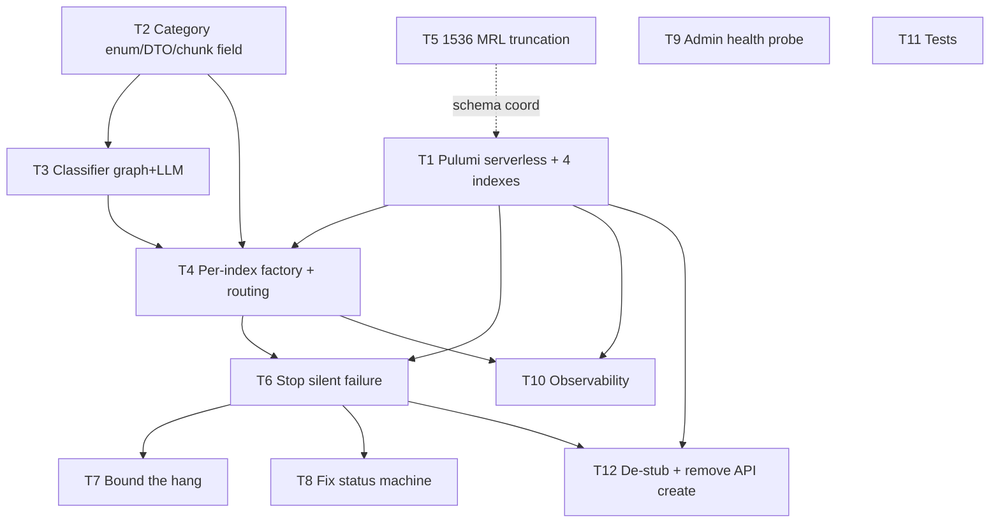

# Chunk-Upload Freeze Fix + Serverless Search + Category Partitioning

**Status:** Ready
**Date:** 2026-07-07
**Owner:** Project owner (dispatching specialist agents per §9)
**Decision sources:**
- `6-Docs/azure-ai-search-serverless-decisions.md` (read in full — cited verbatim in §3)
- Primary-source investigation: live source (`*.cs`, `*.py`, `*.sql`), Pulumi program, Microsoft Learn (REST API `2026-03-01-preview` + tier docs)

> This is an **implementation plan only**. No code is written here. Every code claim carries a `file:line` reference verified during investigation. Section §8 ("Skill → Agent mapping") and §6 ("Sequencing") exist so each task can be dispatched to a specialist agent independently.

---

## 1. Problem & verified root cause

### Symptom
The chunk-upload job **freezes in the "uploading chunks" phase and reports no error**. Root cause was verified against live Azure and source; this section records it, it is not re-litigated.

### Root-cause chain (each link verified)
1. **The Azure AI Search index does not exist.** Target service `mcr-rag-dev-cus-search2a9ee23f` (RG `mcr-rag-dev-cus-rg49bcb82b`, Central US): `GET /indexes` returns empty; both `motorcycle-dev-index` and `motorcycle-index` return 404; `DocumentsProcessedCount=0` for 48h; zero write ops in 72h.
2. **`AzureSearchDocumentService.ExecuteCreateIndexAsync` is a non-functional stub** — `4-Persistence/MotorcycleRAG.Persistence/Azure/Search/AzureSearchDocumentService.cs:167-177` does `await Task.Delay(300); return true;`. It lies about success.
3. The real schema lives only in `MotorcycleIndexingService.CreateMotorcycleDocumentIndexDefinition` (`4-Persistence/.../Search/MotorcycleIndexingService.cs:176-253`), invoked only by `RebuildIndexAsync` — **never auto-called at startup** (verified: the only hosted services are `JobDeletionBackgroundService` and `ScheduledPipelineService`).
4. **`ChunkIndexingService.IndexBatchAsync` swallows the 404** (`4-Persistence/.../Azure/Search/ChunkIndexingService.cs:120-138`): marks the batch "failed", never rethrows → silent.
5. **`ProcessorArtifactsController.ProcessSearchChunksAsync` catch only logs** (`1-Presentation/MotorcycleRAG.API/Controllers/ProcessorArtifactsController.cs:340-346`): no terminal job transition, so the job stays parked.
6. **Indexing is awaited inline** inside `POST /upload` (`ProcessorArtifactsController.cs:208` and `:249`) — the `// fire-and-handle` comment at `:204` describes the outcome, not the timing. The HTTP request stays open for the full indexing duration.
7. **No timeout, no Polly** on the `SearchClient`/`SearchIndexClient` singletons (`4-Persistence/.../Azure/ServiceCollectionExtensions.cs:90-102`); only `DefaultAzureCredential` (a known cold-auth hang source).
8. **Python `upload_artifact`** (`2-Application/local-processing-service/src/api/api_client.py:190-246`): `httpx` `timeout=120.0`, 3 retries, backoff `2**attempt` → ~6 min perceived freeze.
9. **Status-machine defect:** `IngestionJobService.TransitionStageAsync` "completed" branch (`2-Application/.../Services/Ingestion/IngestionJobService.cs:586-590`) asserts `Status = Indexing`. An `IsTerminalStatus` guard exists (`:556-562`) for already-terminal jobs, so the real bug is the **non-terminal** job parked in `Indexing` by the fire-and-forget `report_stage("completed")` from Python (`pdf_processor.py:437-444`).

---

## 2. Approved decisions (recorded verbatim — do not change)

- **D1 — Provisioning failure policy:** API **starts but fails the request** (option B) if the index is missing at runtime. Indexes are NOT created by the API (see D4). Additionally: add an **admin-app startup health check** that verifies (a) the cloud API is reachable and (b) the Search index is reachable.
- **D2 — Tier change:** Move Azure AI Search from **Free** to **Serverless Developer tier** (preview). Source of truth: `6-Docs/azure-ai-search-serverless-decisions.md`. Must use a US region that supports Serverless Developer.
- **D3 — Embedding dimension = 1536, hard-coded.** Changing it requires rebuilding indexes and re-chunking all manuals.
- **D4 — Indexes provisioned by Pulumi IaC, not API logic.** Create **4 indexes**: **Dirt, Touring, Sport, Cruiser** (domain/category-based partitioning, per the decisions doc). The API must NOT create indexes; remove/replace the stub accordingly.
- **D5 — Synchronous indexing:** Keep the synchronous `await` in the controller; only **bound it** (timeout + targeted retry). Do not re-architect into a queue in this change.
- **D6 — MRL truncation to 1536:** Use Qwen3-Embedding-4B with **Matryoshka truncation to 1536**. Wire `dimensions=1536` into **all three** Python embedders (Ollama, DeepInfra, Foundry-local) and the .NET query-time embedder, and correct every wrong `3584` hard-code. Qwen3-Embedding-4B is natively 2560, so the existing `3584` assumption is itself a latent bug.
- **D7 — Motorcycle category classifier (NEW component):** A classifier backed by a **local `qwen3.5 9b` LLM endpoint** assigns each motorcycle to one of {Dirt, Touring, Sport, Cruiser}. Flow: (1) check SQL graph for an existing bike→category classification; use it if present. (2) Else call the local classifier LLM. (3) Insert a graph record (bike make+model → category node + edge) to cache. (4) The category selects which of the 4 indexes the chunks are written to.

---

## 3. Investigation findings (facts + open-question answers)

### 3.1 Index resolution today (must change to 4)
- `SearchOptions.IndexName` default `"motorcycle-index"` — `0-Base/MotorcycleRAG.Core/Options/SearchOptions.cs:16`.
- `SearchClient` and `SearchIndexClient` are **singletons bound to ONE index name at DI time** — `4-Persistence/.../Azure/ServiceCollectionExtensions.cs:90-102`. A singleton `SearchClient` cannot target multiple indexes → must become a **per-index factory** for BOTH indexing and querying.
- Both query consumers take the singleton `SearchClient` in their constructors: `AzureSearchQueryService` (`4-Persistence/.../Azure/Search/AzureSearchQueryService.cs:25-37`) and `AzureSearchClientWrapper` (`4-Persistence/.../Azure/AzureSearchClientWrapper.cs`). Both indexing consumers do too: `ChunkIndexingService` (`.../Azure/Search/ChunkIndexingService.cs:24-28`) and `AzureSearchDocumentService`. → T4 must re-plumb all four.
- Inconsistent index-name hard-codes exist: `DataPipelineOrchestrator.cs:506` (`IndexName = "motorcycle-documents"`), `MotorcyclePDFProcessor.cs:118` (`"motorcycle-pdf-index"`), `MotorcycleCSVProcessor.cs:142` (`"motorcycle-csv-index"`).

### 3.2 Query path today (must route to category index)
`MotorcycleRagService.QueryAsync` → `IAgentOrchestrator.ExecuteSequentialSearchAsync` → Foundry sub-agents → `VectorSearchAgent` → `SubAgentToolHandlers.HandleExecuteAzureSearchAsync` (`2-Application/.../Agents/Orchestration/SubAgentToolHandlers.cs:61-90`) → `AzureSearchClientWrapper.SearchAsync` → `AzureSearchQueryService.SearchAsync` (`:59-67`) → singleton `SearchClient.SearchAsync`.
- The `execute_azure_search` agent tool (`7-Deployment/AgentProvisioning/Azure/AgentDefinitions.cs:241-253`) has only `query` + `max_results` — **no category parameter**.
- `MotorcycleQueryRequest`, `SearchPreferences`, `SearchContext`: no category filter.

### 3.3 No category field exists today
- `ChunkIndexingService.ChunkIndexRecord` (`ChunkIndexingService.cs:147-208`): no category (has make/model/year).
- DTOs `PDFDocument.cs`, `CSVFile.cs`, `IngestionJobConfiguration.cs`: no category.
- Python `pdf_processor.py:358-379` and `csv_processor.py:297-318` chunk keys: no category.
- C# `MotorcyclePdfProcessor.cs:821-951`, `MotorcycleCsvProcessor.cs:287-320`: no category.
- Verdict: **category must be added end-to-end** (Domain value-object/enum → DTOs → chunk records → index schema field → routing).

### 3.4 Graph DB already has Category nodes (relevant to D7) — schema verified
SQL Server Graph tables (`4-Persistence/.../Sql/Migrations/GraphTablesMigration.sql`):
- **`GraphNode` (AS NODE)** (`:18-40`): `[Id] UNIQUEIDENTIFIER PK`, `[Name] NVARCHAR(512)`, `[Type] NVARCHAR(128)`, `[Description] NVARCHAR(MAX)`, `[SourceDocumentId] UNIQUEIDENTIFIER NULL`, `[CreatedAtUtc]`, `[UpdatedAtUtc]`. Indexes: `IX_GraphNode_SourceDocumentId`, `IX_GraphNode_Type`.
- **`GraphEdge` (AS EDGE)** (`:49-65`): `[FromNodeId]`, `[ToNodeId]`, `[RelationshipType] NVARCHAR(256)`, `[Weight] FLOAT`, `[Context] NVARCHAR(MAX)`, `[CreatedAtUtc]`. Indexes: `IX_GraphEdge_RelationshipType`, `IX_GraphEdge_FromTo_RelationshipType`.
- How nodes are authored today (`2-Application/local-processing-service/src/processors/bike_graph_processor.py:447-488`): bike node `Type="Motorcycle"`, `Name="{model} {year}"`; category node `Type="Category"`, `Name=<category string>`; edge `RelationshipType="BELONGS_TO"`, `FromNodeId=bike`, `ToNodeId=category`.
- **Separate `BikeModels` table** (`.../Sql/Migrations/BikeModelsMigration.sql:11-31`): `[Id]`, `[Make]`, `[Model]`, `[Year]`, `[Aliases]`, `[CreatedAtUtc]`, `[UpdatedAtUtc]`; unique index `UQ_BikeModels_Make_Model_Year`. **No category column.** This is the canonical make/model/year store.
- .NET repositories: `SqlGraphRepository : IGraphRepository` (Dapper, `4-Persistence/.../Sql/Repositories/SqlGraphRepository.cs`); interface at `3-Domain/MotorcycleRAG.Contracts/Repositories/IGraphRepository.cs:11`. `BikeModelRepository : IBikeModelRepository`; interface at `3-Domain/MotorcycleRAG.Contracts/Interfaces/IBikeModelRepository.cs:9`.
- `IGraphRepository` methods today: `UpsertNodeAsync`, `UpsertNodesAsync`, `UpsertEdgeAsync`, `UpsertEdgesAsync`, `GetNodesByDocumentAsync`, `DeleteByDocumentAsync`, `SearchNodesAsync`, `GetNeighboursAsync`, `FindPathsAsync`, `GetEdgesByTypeAsync`.
- **There is NO existing `getCategory(make, model)` query.** Must be added (D7).

### 3.5 Admin app (D1 health-check target)
- Tauri v2 (Rust + React 19 + TS + Vite) at `1-Presentation/MotorcycleRAG.AdminDesktop`.
- Startup (`src/main.tsx:69-85`) loads config and wires the API client; **no cloud-API reachability check**. The only startup health poll is `ensureProcessorReady` → local processor `/health` on `127.0.0.1:8100` (`src/components/AppShell.tsx:46-57`).
- Backend already exposes anonymous `GET /health` (`1-Presentation/.../Extensions/WebApplicationExtensions.cs:75-78`) with `AzureSearchHealthCheck` registered as `"azure_search"` (`1-Presentation/.../Configuration/Services/HealthChecksConfiguration.cs:19-24`, impl `4-Persistence/.../HealthChecks/AzureSearchHealthCheck.cs`). Response carries `checks["self"]` and `checks["azure_search"]` in one call.
- Admin has **no direct Search credentials** (secrets in Key Vault, accessed by API). Health check must call `GET /health` via the existing `api` axios client (`src/lib/apiClient.ts`) and read both keys.
- Config: `apiBaseUrl` in `src/lib/config.ts:11`, persisted via `tauri-plugin-store` to `config.json` key `appConfig`. `apiClient.ts`: `api` (30s timeout), `uploadApi` (no timeout).

### 3.6 Embedding/dimension facts (D6)
- `.env` (`2-Application/local-processing-service/src/.env`): `EMBEDDING_BACKEND=ollama`, `OLLAMA_BASE_URL=http://localhost:11434`, `OLLAMA_MODEL=qwen3-embedding`, `EMBEDDING_MODEL=text-embedding-qwen3-embedding-8b`, `EMBEDDING_PROVIDER_ENDPOINT=http://localhost:1234`, `DEEPINFRA_EMBEDDING_MODEL=Qwen/Qwen3-Embedding-4B`, `AZURE_FOUNDRY_LOCAL_EMBEDDING_MODEL=qwen3-embedding`. `.env:40` comment says "3584-dim"; `.env:41` `AZURE_SEARCH_INDEX=motorcycle-index`. **No `*_EMBEDDING_DIMS` set.**
- No embedder passes a `dimensions` param today. `DeepInfraEmbedder` reads `DEEPINFRA_EMBEDDING_DIMS` but only as a **validation check**, not as an API param (`src/embeddings/deepinfra_embedder.py:41-42, 64-74`). All three embedders + the .NET wrapper must add `dimensions=1536` to the API call.
- 3584 hard-codes to fix: `MotorcycleIndexingService.cs:225`; `AzureFoundryClientWrapper.cs:153,165`; embedder docstrings `ollama_embedder.py:47-49,78-81`, `deepinfra_embedder.py:55-58`, `foundry_local_embedder.py:95-98`; `.env:40` comment; test mocks currently split between 1536 and 3584 (must align to 1536).
- `ModelOptions.cs:16` default `EmbeddingModel = "text-embedding-3-large"` — must be reconciled to the Qwen3 model actually used.

### 3.7 Pulumi current state (D2, D4)
- `7-Deployment/infrastructure/Program.cs:440-450`: `Sku = { Name = "free" }`, `HostingMode = Default`, AAD auth 403. RBAC Search Index Data Contributor + Reader scoped to `searchService.Id` (`:811-823`). Log Analytics workspace exists (`:125`). **No Search diagnostic setting; no SearchIndex resources.**
- SDK: `Pulumi` 3.101.0, `Pulumi.AzureNative` 3.13.0, net10.0. Only `Pulumi.dev.yaml`. Naming: `mcr-rag-dev-cus-<type>`. Default location `centralus`.

### 3.8 Answers to the 6 open questions (primary-source)

**OQ1 — Serverless Developer SKU string + region.**
- **SKU name = `serverless`.** Verified in the management REST API `Services - Create Or Update` (`2026-03-01-preview`) example `SearchCreateOrUpdateServiceWithServerless`: `"sku": { "name": "serverless" }` (Java enum `SkuName.SERVERLESS`, Go `armsearch.SKUNameServerless`). The tier is *marketed* as "Serverless Developer" but the ARM/Pulumi SKU string is `serverless`. In Pulumi set `Sku = new SkuArgs { Name = "serverless" }`.
- **`hostingMode`/`partitionCount`/`replicaCount`:** on serverless, **omit `partitionCount` and `replicaCount`** (they are "dedicated search service" properties). Keep `HostingMode = Default` (the API requires `Default` for all non-standard3 SKUs). The serverless example sets only `sku.name` + `hostingMode`.
- **Region (critical constraint):** The Serverless Developer preview is **only** available in **West Central US, Switzerland North, and Japan East** (Microsoft Learn, multiple pages). **`centralus` (Central US) is NOT supported.** The only qualifying **US region is `westcentralus`.** → The new Search service must be created in `westcentralus` (it may live in the existing `centralus` resource group; a resource region may differ from its RG).

**OQ2 — Can Pulumi declaratively create the 4 indexes? Recommendation.**
- `Pulumi.AzureNative.Search` exposes a data-plane-backed `SearchIndex` resource. Vector/HNSW config is expressible via its args. **Recommendation: use Pulumi `SearchIndex` resources as the PRIMARY path** (honors D4 — "indexes provisioned by Pulumi IaC"). Define all 4 (Dirt/Touring/Sport/Cruiser) with the 1536-dim HNSW schema (see T1 schema spec) plus a `category` filterable field. Pulumi becomes the source of truth for index shape; the C# create method is de-stubbed/removed in T12.
- **Contingency (must be exercised by the implementer in `pulumi preview`):** if provider 3.13.0 rejects the vector field/HNSW schema, or AAD-auth data-plane index creation is denied on the preview tier, fall back to a **nested ARM-template deployment** (`Pulumi.AzureNative.Resources.Deployment` with an inline template that PUTs the 4 indexes via `Microsoft.Search/searchServices/indexes`) **or** an idempotent data-plane REST provisioner invoked once post-deploy. Either fallback keeps creation out of API request logic (D1/D4). The acceptance gate for T1 is: `pulumi preview` shows the 4 indexes (primary) **or** the documented fallback is wired and validated.

**OQ3 — SQL graph schema for the classifier (D7).** See §3.4. Concrete answer:
- **Read API `getCategory(make, model)` does not exist** — add a method to `IGraphRepository` + `SqlGraphRepository`. Two viable implementations (implementer picks; both are parameterized):
  - (a) Graph traversal: resolve the Motorcycle node by name and walk `BELONGS_TO` to a Category node, using the `MATCH(n1-(e)->n2)` pattern already used in `GetNeighboursAsync` (`SqlGraphRepository.cs:386-425`).
  - (b) Reconcile via `BikeModels` (Make/Model/Year) since the graph Motorcycle `Name` is `"{model} {year}"` with **no make** — this is a real impedance. **Recommendation:** key the classifier cache on `(make, model)` and write a deterministic `Motorcycle` node whose `Name` includes make (e.g. `"{make} {model}"`) **or** add a make-aware lookup; do not rely on fragile `LIKE` on `{model} {year}`. Flag the make-vs-name impedance to the implementer.
- **Write API `upsertBikeCategory(make, model, category)`:** composes existing `UpsertNodeAsync` (Motorcycle node) + `UpsertNodeAsync` (Category node) + `UpsertEdgeAsync` (`BELONGS_TO`) — all already implemented and idempotent (`SqlGraphRepository.cs:33-182`). No new migration strictly required, but adding a make column/naming convention is recommended (see above).

**OQ4 — Local `qwen3.5 9b` endpoint for the classifier.**
- **There is NO existing local chat-completion client in .NET.** `IAzureFoundryClient` / `AzureFoundryClientWrapper` (`4-Persistence/.../Azure/AzureFoundryClientWrapper.cs`) does embeddings + multimodal only (DeepInfra-backed). The .NET chat path is the cloud Foundry agents SDK (`FoundryAgentRunner` → `ProjectOpenAIClient`, `4-Persistence/.../Azure/FoundryAgentRunner.cs:22,39`).
- **However, a local OpenAI-compatible chat endpoint already exists and is used for graph entity extraction:** Admin config exposes `graphExtractionEndpoint` (default `http://localhost:1234/v1`) and `graphExtractionModel`, and `tokenizerModelPath = ".../mlx-community/Qwen3.5-9B-8bit"` (`src/lib/config.ts:18-21,39`). So **Qwen3.5-9B is already the local chat model** (LM Studio). The classifier reuses this endpoint/model.
- **To add:** a new lightweight .NET OpenAI-compatible chat client (IHttpClientFactory against `{endpoint}/chat/completions`, model from a new `ClassifierOptions`), used by the D7 classifier. It is a *chat* model, distinct from the embedding model.

**OQ5 — Classifier placement. Recommendation: .NET (during indexing).**
Justification: (1) index routing (which of the 4 indexes) is a .NET concern — the per-index `SearchClient` factory + `ChunkIndexingService` are .NET (T4); (2) the SQL graph cache is accessed via .NET repos (`SqlGraphRepository`); (3) the JSONL chunk stream arrives at the API and each `ChunkIndexRecord` already carries `make`/`model` (`ChunkIndexingService.cs:147-208`), so the API can resolve the category before writing; (4) keeps Python simpler (Python only embeds; no category/graph awareness needed). The LLM endpoint is reachable from the API host in local-first dev; for containerized prod the endpoint is configurable via `ClassifierOptions`.

**OQ6 — Free-tier vs serverless migration. Recommendation: fresh replacement (no refresh/import).**
- Microsoft Learn is explicit: "The Serverless Developer tier **doesn't support migration to or from other pricing tiers**." Therefore the serverless service is a **new resource** (new name, `westcentralus`); do **not** `pulumi refresh`/`import` the existing Free service or change its SKU in place.
- Recommended Pulumi update path: (1) add a new serverless `Service` resource (**name `mcr-rag-dev-wcus-search`**, `wcus` prefix per R1) in `westcentralus`; (2) retarget the RBAC role assignments (`Program.cs:811-823`) and the `SearchServiceEndpoint` app configuration to the new service; (3) **remove the old Free `searchService` resource from `Program.cs` entirely** so the pipeline **destroys** `mcr-rag-dev-cus-search2a9ee23f` on the next `pulumi up` — full removal, not orphaning (safe: `DocumentsProcessedCount=0`, no real data). Because `pulumi destroy`/`pulumi up` are pipeline-only (per `7-Deployment/infrastructure/AGENTS.md`), the destroy happens via commit+push; the implementer only edits code and runs `pulumi preview` locally.

---

## 4. Task list

Each task: objective (one completion condition), exact files/symbols, acceptance criteria (observable), verification, **required skills**, **owning agent** (see §8 mapping), dependencies, priority. **No code is written in this plan.**

> **Convention:** `azure-reader` may run read-only verification on any task. The owning agent does the change.

---

### T1 — Pulumi: serverless tier + 4 category indexes + diagnostic settings
**Objective:** A serverless Azure AI Search service exists in a supported US region, with 4 indexes (Dirt/Touring/Sport/Cruiser) provisioned declaratively, RBAC intact, and diagnostics flowing to Log Analytics.
**Decisions:** D2, D4.
**Files / symbols:**
- `7-Deployment/infrastructure/Program.cs:440-450` (replace Free `Service` with serverless `Service`, **name `mcr-rag-dev-wcus-search`** (`wcus` prefix per R1), location `westcentralus`, `Sku.Name = "serverless"`, `HostingMode = Default`, omit partition/replica counts). **Remove the old Free `searchService` resource entirely** so `pulumi up` destroys `mcr-rag-dev-cus-search2a9ee23f` — full removal, do not orphan it (R1/OQ6).
- RBAC retarget at `Program.cs:811-823` (scope to new service — automatic via `searchService.Id`).
- New `Pulumi.AzureNative.Search.SearchIndex` resources ×4 (or ARM-template fallback per OQ2). Schema (from `MotorcycleIndexingService.cs:176-253`, **dimension 1536**, plus filterable `category` field): `id` (key, filterable); `title`, `content`, `make`, `model`, `section`, `pageRange`, `primarySection`, `sectionHeadings`(collection), `tableCaption`, `tags`(collection) searchable/filterable; `documentType`, `category` filterable+facetable; `year`, `pageNumber`, `sectionLevel`, `chunkIndex`, `createdAt`, `updatedAt` filterable/sortable; `contentVector` collection(Single), `VectorSearchDimensions = 1536`, HNSW profile `vector-config` (algo `vector-algo`, M=4, EfConstruction=400, EfSearch=500).
- New Search diagnostic setting → existing Log Analytics workspace (`Program.cs:125`) via `Pulumi.AzureNative.Insights.DiagnosticSetting`.
- App Configuration `SearchServiceEndpoint` update to the new service endpoint.
**Acceptance criteria:**
1. `pulumi preview` (local) shows: old Free service `mcr-rag-dev-cus-search2a9ee23f` **destroyed** (removed from `Program.cs`, not orphaned); new serverless service `mcr-rag-dev-wcus-search` created in `westcentralus`; 4 `SearchIndex` resources (or validated fallback per R3/OQ2); diagnostic setting added; no RBAC regressions.
2. After pipeline `pulumi up`: `GET https://<new-service>/indexes` lists the 4 indexes; each has a 1536-dim `contentVector` field and a `category` field.
3. No secrets appear in diffs/logs.
**Verification:** `pulumi preview`; (post-deploy) read-only `az search service show` + `az search index list` via `azure-reader`.
**Required skills:** Pulumi/AzureNative IaC; Azure AI Search (serverless + index schema + vector/HNSW).
**Owning agent:** `pulumi-dev` (with `azure-reader` verification).
**Depends on:** none (foundation; all .NET routing depends on this existing). Coordinate index schema with **T5** (dimension 1536) and **T2** (`category` field).
**Priority:** P0 (blocks end-to-end validation).

---

### T2 — Category value-object/enum + DTO/chunk field end-to-end
**Objective:** A single canonical `MotorcycleCategory` value (Dirt|Touring|Sport|Cruiser) flows from Domain through DTOs, chunk records, the index schema field, and Python chunk keys.
**Decisions:** D7 prerequisite; supports D4.
**Files / symbols:**
- Domain: new `MotorcycleCategory` value-object/enum (3-Domain/MotorcycleRAG.Domain; per architecture rules a value object enforcing the 4 valid values belongs in Domain).
- Contracts.Models DTOs: `PDFDocument.cs`, `CSVFile.cs`, `IngestionJobConfiguration.cs` — add `category`.
- `ChunkIndexingService.ChunkIndexRecord` (`ChunkIndexingService.cs:147-208`) — add `[JsonPropertyName("category")]`.
- Python chunk keys: `pdf_processor.py:358-379`, `csv_processor.py:297-318` — emit `category` per chunk.
- C# processors: `MotorcyclePdfProcessor.cs:821-951`, `MotorcycleCsvProcessor.cs:287-320` — propagate category.
**Acceptance criteria:**
1. `dotnet build` + `npm`/pytest green.
2. A serialized chunk JSONL line contains a `category` key; the C# chunk record deserializes it.
3. No layer-boundary violations (interfaces in Contracts; DTOs in Contracts.Models; value-object in Domain).
**Verification:** `dotnet build`; targeted unit test for serialization; `rg "category" pdf_processor.py csv_processor.py`.
**Required skills:** C#/DDD (layer placement); Python.
**Owning agent:** `dotnet-dev` (C#/Domain/DTOs) + `python-dev` (chunk keys).
**Depends on:** none (parallel-safe with T1/T5).
**Priority:** P0 (T3/T4 consume it).

---

### T3 — Motorcycle category classifier (graph cache + local LLM + cache-on-miss)
**Objective:** Given (make, model), resolve a `MotorcycleCategory` via SQL graph cache hit → else local Qwen3.5-9B LLM → write-back to graph; expose `ResolveCategoryAsync(make, model)`.
**Decisions:** D7.
**Files / symbols:**
- `3-Domain/MotorcycleRAG.Contracts/Repositories/IGraphRepository.cs:11` — add `GetCategoryAsync(make, model)` + `UpsertBikeCategoryAsync(make, model, category)`.
- `4-Persistence/.../Sql/Repositories/SqlGraphRepository.cs` — implement (reuse `UpsertNodeAsync`/`UpsertEdgeAsync` patterns `:33-182`; resolve the make-vs-name impedance per OQ3).
- New `0-Base/.../Options/ClassifierOptions.cs` — `Endpoint` (default `http://localhost:1234/v1`), `Model` (default `qwen3.5-9b`/Qwen3.5-9B), timeout.
- New local OpenAI-compatible chat client (Persistence, IHttpClientFactory) for `{endpoint}/chat/completions` (per OQ4 — none exists today).
- New Application service `MotorcycleCategoryClassifier` (under Application `Services`, per architecture rules) — cache-on-miss orchestration; constrain output to the 4 valid categories; deterministic fallback policy on parse failure.
- Register classifier + options in DI.
**Acceptance criteria:**
1. Cache hit returns stored category without calling the LLM (asserted in test).
2. Cache miss calls the LLM exactly once, then writes a `BELONGS_TO` edge + Category node; a second call for the same (make, model) is a cache hit.
3. LLM unreachable/invalid → defined fallback (e.g., default category + logged warning), never an unhandled throw that parks the job.
**Verification:** xUnit tests (cache-hit/miss/LLM-fallback) with the LLM client mocked; do **not** use the in-memory Search shim to mask behavior.
**Required skills:** C#/Application services; SQL graph (Dapper + Graph `MATCH`); LLM/HTTP client design.
**Owning agent:** `dotnet-dev` + `sql-database-architect` (graph query design + impedance fix).
**Depends on:** **T2** (uses `MotorcycleCategory`); OQ4 client is new here.
**Priority:** P0 (T4 routing consumes the resolved category).

---

### T4 — Per-index SearchClient factory + category routing (indexing AND query)
**Objective:** Indexing writes each chunk to its category index; querying accepts/infers a category and routes (or fans out across the 4 indexes and merges).
**Decisions:** D2/D4/D7.
**Files / symbols:**
- `4-Persistence/.../Azure/ServiceCollectionExtensions.cs:90-102` — replace singleton `SearchClient`/`AzureSearchClientWrapper` with a **per-index factory** (`ISearchClientFactory.GetForIndex(category)`) that builds `SearchClient` per index name.
- Re-plumb consumers to obtain the client per category: `ChunkIndexingService.cs:24-28`, `AzureSearchDocumentService` ctor, `AzureSearchQueryService.cs:25-37`, `AzureSearchClientWrapper`.
- Indexing: `ChunkIndexingService.IndexFromJsonlAsync` resolves category per unique (make, model) via **T3** classifier, then routes each batch to the resolved index.
- Query: `SubAgentToolHandlers.HandleExecuteAzureSearchAsync` (`SubAgentToolHandlers.cs:61-90`) — accept optional `category`; when absent, fan out across the 4 indexes and merge by score. Tool schema in `AgentDefinitions.cs:241-253` — add optional `category` property.
- `MotorcycleQueryRequest`, `SearchPreferences`, `SearchContext` — add optional category filter (Contracts.Models).
- Fix the inconsistent index-name hard-codes (`DataPipelineOrchestrator.cs:506`, `MotorcyclePDFProcessor.cs:118`, `MotorcycleCSVProcessor.cs:142`) to route through the factory.
**Acceptance criteria:**
1. Chunks for a "Dirt" bike are written to the Dirt index only (asserted); querying with `category=Dirt` searches only Dirt; querying without category merges all 4.
2. No singleton `SearchClient` bound to a single index remains in DI.
3. `execute_azure_search` tool advertises the optional `category` param.
**Verification:** xUnit routing tests (per-index write + fan-out merge); read-only `az search index list` confirms 4 indexes populated.
**Required skills:** C#/.NET DI; Azure Search SDK (multi-index); Microsoft Agent Framework tooling.
**Owning agent:** `dotnet-dev`.
**Depends on:** **T1** (4 indexes exist), **T2** (category field), **T3** (classifier).
**Priority:** P0.

---

### T5 — Dimension 1536 MRL truncation (3 Python embedders + .NET wrapper + tests + options)
**Objective:** Every embedding path produces exactly 1536-dim vectors via server-side `dimensions=1536`; no `3584` hard-code remains.
**Decisions:** D6, D3.
**Files / symbols:**
- Python (pass `dimensions=1536` to the API call, not just validation): `src/embeddings/ollama_embedder.py`, `deepinfra_embedder.py:64-74`, `foundry_local_embedder.py`; fix docstrings `ollama_embedder.py:47-49,78-81`, `deepinfra_embedder.py:55-58`, `foundry_local_embedder.py:95-98`.
- .NET query-time wrapper: `AzureFoundryClientWrapper.cs:153,165` (replace `3584` check + `new float[3584]` fallback with 1536; pass `dimensions` to DeepInfra request body `:126-131`).
- `MotorcycleIndexingService.cs:225` — `VectorSearchDimensions = 1536` (also covered by T1 schema in Pulumi).
- `0-Base/.../Options/ModelOptions.cs:16` — reconcile `EmbeddingModel` default to the Qwen3 model in use.
- `.env:40` comment + any `*_EMBEDDING_DIMS` — set/align to 1536.
- Tests: align all mocks split between 1536 and 3584 to 1536.
**Acceptance criteria:**
1. Each embedder (Ollama, DeepInfra, Foundry-local) sends `dimensions=1536` in its request (asserted); returned vectors are length 1536.
2. `rg "3584"` returns zero matches across repo (excluding this plan).
3. `.NET` + Python test suites green.
**Verification:** `rg "3584"` (expect none outside this doc); pytest; `dotnet test`.
**Required skills:** Python (openai SDK / MRL); C#.
**Owning agent:** `python-dev` (embedders) + `dotnet-dev` (wrapper + options + tests).
**Depends on:** none (parallel-safe). Coordinate schema dimension with **T1**.
**Priority:** P0 (1536 must match the provisioned indexes or every write fails).

---

### T6 — Stop silent failure (existence precheck + rethrow + terminal job transition)
**Objective:** A missing index or non-transient batch error fails loudly and transitions the job to `Failed` with a precise reason (while still returning 202 from the upload endpoint per D5).
**Decisions:** D1, D5.
**Files / symbols:**
- New `SearchIndexNotFoundException` (or use `Azure.RequestFailedException` with status 404) surfaced from indexing.
- `ChunkIndexingService.IndexBatchAsync` (`ChunkIndexingService.cs:120-138`) — **rethrow non-transient errors (404/400/401)**; keep per-chunk outcome recording only for partial batch failures.
- `ProcessorArtifactsController.ProcessSearchChunksAsync` catch (`ProcessorArtifactsController.cs:340-346`) — on non-transient failure, transition the job to `Failed` (via `TryTransitionSearchChunkJobToTerminalAsync` at `:296`) with a precise `FailureReason`; still return 202 to the caller.
- Add an index-existence precheck before the first batch (per-index, via the factory from T4).
**Acceptance criteria:**
1. Index-missing → job reaches `Failed` with a reason mentioning the missing index; the upload endpoint still returns 202.
2. A 400/401 batch error propagates (no silent swallow); logs contain the status code.
3. No regression: a healthy batch still indexes and transitions to success.
**Verification:** xUnit: index-not-found throws (not silent); batch-failure → `Failed`. **Do not** use the in-memory shim to mask these.
**Required skills:** C#/.NET error handling.
**Owning agent:** `dotnet-dev`.
**Depends on:** **T4** (per-index precheck uses the factory).
**Priority:** P0.

---

### T7 — Bound the hang (timeout + targeted Polly; Python client distinct timeouts)
**Objective:** Indexing cannot hang indefinitely; transient errors retry, non-transient do not.
**Decisions:** D5.
**Files / symbols:**
- `.NET`: `BatchIndexTimeoutSeconds` option → linked `CancellationTokenSource`; targeted Polly on the per-index `SearchClient` operations (transient only — never retry 404/400/401). Wire into the factory from T4 and the resilience pipeline (`ResilienceService` already exists for other keys).
- Python: `api_client.py:190-246` — reduce to 90s × 2 retries with **distinct, named timeout logging** (so a hang is observable, not silent).
**Acceptance criteria:**
1. A stalled indexing call is cancelled at `BatchIndexTimeoutSeconds`; the job transitions to `Failed` with a timeout reason.
2. Transient 5xx/429 retries; 404/400/401 do not retry.
3. Python logs distinguish connect/read/overall timeouts.
**Verification:** xUnit timeout test; pytest for Python timeout logging.
**Required skills:** C#/.NET resilience (Polly + CTS); Python httpx.
**Owning agent:** `dotnet-dev` + `python-dev`.
**Depends on:** **T4** (factory), **T6** (failure transitions the job).
**Priority:** P1 (after T6).

---

### T8 — Fix status machine (do not assert `Indexing` on non-terminal "completed")
**Objective:** A non-terminal job is never parked in `Indexing` by the fire-and-forget Python `report_stage("completed")`.
**Decisions:** D5 (status correctness).
**Files / symbols:**
- `IngestionJobService.TransitionStageAsync` "completed" branch (`IngestionJobService.cs:586-590`) — stop asserting `Status = Indexing` for non-terminal jobs; reconcile with the controller's synchronous indexing outcome (the controller owns the real terminal transition via `TryTransitionSearchChunkJobToTerminalAsync`). Keep the `IsTerminalStatus` guard (`:556-562`).
**Acceptance criteria:**
1. After Python reports "completed", a job that is not genuinely terminal is not left stuck in `Indexing`.
2. A genuinely completed indexing run transitions to `Completed`; a failed one to `Failed`.
3. Terminal jobs are never re-flipped.
**Verification:** xUnit: terminal-status-no-flip; completed-without-failure → Completed; completed-with-failure → Failed.
**Required skills:** C#/.NET state machines.
**Owning agent:** `dotnet-dev`.
**Depends on:** **T6** (terminal-transition contract).
**Priority:** P1.

---

### T9 — Admin app startup health probe (API reachable + Search index reachable)
**Objective:** On startup the operator sees whether the cloud API and the Search index are reachable, via the existing `GET /health`.
**Decisions:** D1.
**Files / symbols:**
- `1-Presentation/MotorcycleRAG.AdminDesktop/src/main.tsx:69-85` — after `setApiBaseUrl`, call `GET /health` via the `api` axios client (`src/lib/apiClient.ts`); surface `checks.self` (API) and `checks.azure_search` (Search) to the operator.
- No direct Search credentials in the admin app (architecture unchanged); read both keys from the single `/health` response.
- Reuse existing `AzureSearchHealthCheck` server-side (no API change).
**Acceptance criteria:**
1. On launch, the UI shows API reachability + Search reachability derived from `/health`.
2. When the API/Search is unreachable, the operator sees a clear degraded status (not a silent hang/white screen).
3. Existing auth interceptor still attaches the bearer token to the `/health` call (or `/health` remains anonymous — confirmed anonymous at `WebApplicationExtensions.cs:75-78`).
**Verification:** `npm test` (Vitest) for the probe; manual `npm run tauri dev` against a down API.
**Required skills:** Tauri/React/TS (axios + Zustand).
**Owning agent:** `tauri-dev` (+ `frontend-dev` for the status UI).
**Depends on:** none (the `/health` endpoint already exists).
**Priority:** P1.

---

### T10 — Observability (per-batch structured logs + Search diagnostics)
**Objective:** Indexing failures are diagnosable from logs/metrics, not silent.
**Decisions:** D1, D2.
**Files / symbols:**
- `.NET`: structured per-batch logs in `ChunkIndexingService` (counts, succeeded/failed, reasons, target index, category) and in `ProcessSearchChunksAsync` (terminal transition outcome).
- Pulumi: Search diagnostic setting → Log Analytics (coordinate with **T1**).
**Acceptance criteria:**
1. Each batch emits one structured log line with counts + failure reasons + target index name.
2. Search diagnostic logs appear in the Log Analytics workspace (post-deploy, read-only check).
**Verification:** read-only KQL/`az` via `azure-reader`; unit test asserting log fields.
**Required skills:** C# (structured logging); Pulumi (diagnostic settings).
**Owning agent:** `dotnet-dev` + `pulumi-dev`.
**Depends on:** **T1** (workspace + setting), **T4** (target index in logs).
**Priority:** P2.

---

### T11 — Tests (index-not-found throws; batch→Failed; terminal-no-flip; classifier cache hit/miss/LLM-fallback; per-index routing; 1536-dim enforcement)
**Objective:** The behaviors above are locked by automated tests; the in-memory shim is not used to mask them.
**Decisions:** all.
**Files / symbols:**
- `5-Test/...` (xUnit): T6/T7/T8 behaviors; T3 classifier; T4 routing/fan-out; T5 1536-dim enforcement.
- Python `tests/` (pytest): embedder `dimensions=1536` request assertion; `api_client` timeout logging.
**Acceptance criteria:**
1. `dotnet test` + `pytest` green with the new cases.
2. No test relies on the in-memory Search shim to hide a missing index or a 404.
**Verification:** `dotnet test`; `pytest`.
**Required skills:** C#/xUnit; Python/pytest.
**Owning agent:** `dotnet-dev` + `python-dev`.
**Depends on:** T3–T8.
**Priority:** P1 (incremental with each task; finalized last).

---

### T12 — De-stub + remove API index creation (authoritative in Pulumi)
**Objective:** `ExecuteCreateIndexAsync` can never silently return `true`; index creation authority lives in Pulumi (T1), not API request logic.
**Decisions:** D1, D4.
**Files / symbols:**
- `AzureSearchDocumentService.ExecuteCreateIndexAsync` (`AzureSearchDocumentService.cs:167-177`) — replace the stub. Per D1/D4 the API must NOT create indexes: either throw `NotSupportedException` on runtime create, or remove the call sites. `CreateOrUpdateIndexAsync` (`:112-121`) callers must be audited/removed.
- Keep an operator-only `RebuildIndexAsync` path (manual) if useful, but **no auto-create** at startup or per-request.
- Ensure Pulumi (T1) is the sole index authority; remove the now-dead `CreateMotorcycleDocumentIndexDefinition` runtime usage (schema lives in Pulumi) — keep the schema spec only if reused by the T1 fallback.
**Acceptance criteria:**
1. No code path silently returns `true` for index creation.
2. No hosted service or request handler auto-creates an index.
3. `dotnet build` green; no caller relies on runtime create.
**Verification:** `rg "Task.Delay\(300" AzureSearchDocumentService.cs` (none); xUnit that runtime create throws/`NotSupportedException`.
**Required skills:** C#/.NET.
**Owning agent:** `dotnet-dev`.
**Depends on:** **T1** (Pulumi owns indexes), **T4** (no per-request create), **T6** (existence precheck replaces create).
**Priority:** P1.

---

## 5. Sequencing / dependency graph

**Wave 1 (parallel — no inter-dependencies):** T1, T2, T5, T9. *(T1 & T5 coordinate on the 1536-dim schema; T2/T9 are fully independent.)*
**Wave 2:** T3 (needs T2).
**Wave 3:** T4 (needs T1, T2, T3).
**Wave 4 (parallel):** T6 (needs T4), T10 (needs T1, T4).
**Wave 5 (parallel):** T7 (needs T4, T6), T8 (needs T6), T12 (needs T1, T4, T6).
**Wave 6:** T11 (consolidates all).

---

## 6. Residual decisions / risks

- **R1 — Region split (ACCEPTED):** `westcentralus` is confirmed for the new serverless Search service (Serverless Developer is **not** available in `centralus`; the only US preview region is `westcentralus`, per OQ1). The service lives in `westcentralus` while the RG + the rest of the stack remain in `centralus` (a resource region may differ from its RG). **Naming change:** the new Search service uses a `wcus` prefix — `mcr-rag-dev-wcus-search` — to reflect its actual region; the existing `mcr-rag-dev-cus-` prefix is retained for all `centralus` resources (RG, App Config, etc.). **Old service removal (explicit):** the existing Free tier service `mcr-rag-dev-cus-search2a9ee23f` (Central US) must be **fully destroyed** by Pulumi on the next `pulumi up` — remove the old Free `searchService` resource from `Program.cs` entirely (per OQ6/T1); do **not** leave it orphaned. Safe: `DocumentsProcessedCount=0`, no real data.
- **R2 — Serverless preview stability:** No SLA; some features constrained; billing deferred but will start (Microsoft gives ≥30 days notice). Acceptable for dev per the decisions doc; not for production yet.
- **R3 — Pulumi `SearchIndex` compatibility (ACCEPTED, OQ2):** **Primary = Pulumi `SearchIndex` resources**; **Fallback = nested ARM-template deployment** (or idempotent data-plane REST provisioner) **only if** `pulumi preview` (provider 3.13.0) rejects the 1536-dim HNSW schema or denies AAD-auth data-plane index creation on the preview tier. This matches OQ2's recommendation and T1's acceptance criteria (4 `SearchIndex` resources **or** the documented fallback wired + validated). The implementer still must confirm via `pulumi preview` and wire the fallback only if the primary path fails.
- **R4 — Classifier accuracy / MRL quality:** Qwen3.5-9B category calls may be imperfect; MRL truncation to 1536 trades some retrieval quality for storage. Both are monitored post-ingest (T10). Define the LLM-unreachable fallback category explicitly (T3).
- **R5 — Graph make-vs-name impedance (DEFERRED to `sql-database-architect` during T3 execution, OQ3):** Existing Motorcycle graph nodes are named `"{model} {year}"` with **no make**, while the classifier keys on `(make, model)`. **Deferred to `sql-database-architect` during T3 execution** — decide between (a) renaming Motorcycle graph nodes to include make, or (b) joining through the `BikeModels` table. **Constraint (non-negotiable):** the classifier cache must key on `(make, model)` and must **not** rely on fragile `LIKE` matching on `{model} {year}`.
- **R6 — Prod local-LLM reachability:** The classifier endpoint (`localhost:1234` in dev) will not exist inside Container Apps in prod. `ClassifierOptions` must be environment-overridable; prod endpoint is a separate (later) decision.

---

## 7. Out of scope

- Adding an `Uploading` enum value.
- Background-izing indexing into a queue (D5 keeps it synchronous).
- Broad circuit breakers beyond T7's targeted Polly.
- Masking the freeze by raising the Python timeout.
- Year-based partitioning (superseded by D4 category partitioning).
- Migrating the existing Free service's SKU in place (impossible — serverless disallows tier migration; OQ6).
- Re-chunking already-ingested manuals (none exist — `DocumentsProcessedCount=0`).

---

## 8. Skill → agent mapping table

| Skill required | Owning agent | Tasks |
|---|---|---|
| Pulumi / AzureNative IaC | `pulumi-dev` | T1, T10 (diag), (T12 schema source) |
| Azure AI Search (serverless + index schema + vector/HNSW) | `pulumi-dev` (+ `azure-reader` verify) | T1, T4 |
| C# / .NET (DI, error handling, resilience, state machine) | `dotnet-dev` | T2, T3, T4, T6, T7, T8, T10, T11, T12 |
| C# / DDD (Domain value-object, layer placement) | `dotnet-dev` | T2 |
| SQL graph (Dapper + Graph `MATCH`, schema/impedance) | `sql-database-architect` | T3 (+ review T1 `category` field) |
| LLM / HTTP client design (local OpenAI-compatible chat) | `dotnet-dev` | T3 |
| Microsoft Agent Framework tooling | `dotnet-dev` | T4 |
| Azure Search SDK (multi-index factory) | `dotnet-dev` | T4 |
| Python (openai SDK / MRL, httpx) | `python-dev` | T2 (chunk keys), T5, T7 (client), T11 |
| C#/xUnit, Python/pytest | `dotnet-dev` + `python-dev` | T11 |
| Tauri / React / TS (axios + Zustand) | `tauri-dev` (+ `frontend-dev`) | T9 |
| Read-only Azure verification | `azure-reader` | all tasks (verification only) |

### Task → agents (quick dispatch view)

| Task | Primary agent(s) | Skills | Depends on | Priority |
|---|---|---|---|---|
| T1 Serverless + 4 indexes | `pulumi-dev` | Pulumi, Azure Search | — | P0 |
| T2 Category end-to-end | `dotnet-dev`, `python-dev` | C#/DDD, Python | — | P0 |
| T3 Classifier | `dotnet-dev`, `sql-database-architect` | C# services, SQL graph, LLM client | T2 | P0 |
| T4 Per-index factory + routing | `dotnet-dev` | C#/.NET, Azure Search SDK, agent tooling | T1, T2, T3 | P0 |
| T5 1536 MRL | `python-dev`, `dotnet-dev` | Python, C# | — | P0 |
| T6 Stop silent failure | `dotnet-dev` | C#/.NET | T4 | P0 |
| T7 Bound the hang | `dotnet-dev`, `python-dev` | Polly/CTS, httpx | T4, T6 | P1 |
| T8 Status machine | `dotnet-dev` | C#/.NET | T6 | P1 |
| T9 Admin health probe | `tauri-dev`, `frontend-dev` | Tauri/React/TS | — | P1 |
| T10 Observability | `dotnet-dev`, `pulumi-dev` | C#, Pulumi diag | T1, T4 | P2 |
| T11 Tests | `dotnet-dev`, `python-dev` | xUnit, pytest | T3–T8 | P1 |
| T12 De-stub + remove API create | `dotnet-dev` | C#/.NET | T1, T4, T6 | P1 |

---

## 9. Verification harness notes (for `azure-reader`)

- **Search service:** `az search service show --resource-group mcr-rag-dev-cus-rg49bcb82b --name mcr-rag-dev-wcus-search` → confirm `sku.name == serverless`, `location == westcentralus`. (RG stays `centralus`/`cus`-named; only the Search service is `westcentralus`/`wcus`-named.) Also confirm the old Free service `mcr-rag-dev-cus-search2a9ee23f` no longer exists (destroyed per R1/OQ6).
- **Indexes:** `az search index list --service-name mcr-rag-dev-wcus-search` → confirm exactly Dirt/Touring/Sport/Cruiser, each with `contentVector` (1536) and `category`.
- **Activity:** after a test upload, confirm non-zero `DocumentsProcessedCount` and write ops in the activity log (the freeze's "zero write ops" symptom is inverted).
- **Diagnostics:** KQL query against the Log Analytics workspace for the new Search diagnostic source.
- **Health:** `GET /health` returns `checks.azure_search` healthy against the new service.
