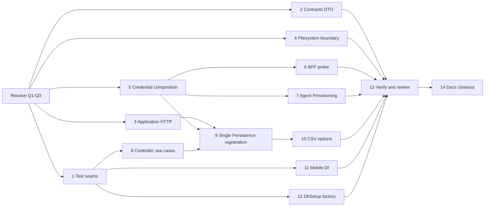

# IoC/DI and Clean Architecture Remediation

**Status:** Archived
**Date:** 2026-07-13
**Goal:** Eliminate the confirmed repository-wide .NET IoC/DI and Clean Architecture violations while preserving a single host composition root, explicit dependency lifetimes, and testable application boundaries.

## 1. Problem and scope

The 2026-07-13 .NET audit examined 27 projects and 830 C# files. It confirmed 17 production violations and one Contracts DTO-placement violation. The work covers the API, Application, Contracts/Contracts.Models, Persistence, BFF, Mobile App, Agent Provisioning CLI, DbSetup CLI, and their owning test suites. It does not change Python, TypeScript, Rust, IaC, deployment state, package versions, or public HTTP contracts unless a controller-to-application use-case extraction requires an equivalent internal interface.

The target policy is:

- Production classes receive collaborators through constructor injection as contracts or framework-approved abstractions.
- Only a designated composition root (host bootstrap and its registration extensions) selects concrete implementations and SDK credential/client construction.
- Factories may construct the SDK objects they own after receiving their configuration and credentials through DI.
- `IServiceScopeFactory` is permitted only in hosted services that must create short scopes for scoped work; no ordinary application service or controller may use `IServiceProvider` as a service locator.
- Application contains use-case orchestration and pure logic, not direct HTTP, filesystem, SQL, or Azure SDK work.
- Contracts contains interfaces only, and Contracts.Models contains shared data-only DTOs.

## 2. Approval ledger

| Q# | Decision | Options | Recommended | Why it matters | Status |
| --- | --- | --- | --- | --- | --- |
| Q1 | Credential boundary | A. Add a Persistence-owned `IAzureCredentialProvider`/factory, registered once by the existing Persistence registration extension. B. Register keyed raw `TokenCredential` services in each host composition root. | A | A creates one testable policy boundary without adding keyed-service coupling to API, BFF, and CLI hosts. Both remove hidden credential construction. | **Approved: A** |
| Q2 | Local filesystem boundary | A. Add narrow Contracts interfaces such as `ILocalFileStore` and `ILocalFileDiscovery`, implemented in Persistence. B. Move the affected Application use cases into Persistence and expose new application-facing services. | A | Preserves Application use cases and applies dependency inversion with a smaller behavior move. It introduces shared Contracts interfaces, which is a cross-cutting architectural change. | **Approved: A** |
| Q3 | Hosted-service strictness | A. Retain the documented `IServiceScopeFactory` exception for singleton hosted services. B. Require dedicated scoped worker factories so hosted services contain no direct `GetRequiredService` call. | A | ASP.NET Core requires a scope boundary for scoped work from singleton hosted services; B adds wrappers without removing the framework need. | **Approved: A** |

### Approved design decisions

- Persistence owns a testable `IAzureCredentialProvider`/factory. The provider is registered once through the authoritative Persistence extension; SDK adapters receive credentials or client factories through constructor injection.
- Contracts owns narrow local-filesystem abstractions. Persistence implements them, and Application retains only use-case orchestration and pure filename/path validation.
- Singleton hosted services continue to use `IServiceScopeFactory` to create short-lived scopes for scoped dependencies. This is a documented lifecycle exception, not a general service-locator allowance.

## 3. Requirements and acceptance criteria

### R1 — Explicit external dependency and credential ownership

**User story:** As a maintainer, I want Azure, Graph, HTTP, and SDK dependencies to be explicit and container-managed so that they are reusable, testable, and never created unexpectedly during a request.

- **R1.1:** WHEN a Foundry, Search, Blob, Graph, BFF health-check, or Agent Provisioning component needs an SDK credential/client THEN the component SHALL receive it through an injected contract, factory, or configured client rather than construct a credential/client internally.
- **R1.2:** WHEN a factory constructs an SDK client THEN it SHALL receive configuration and credential inputs through DI and SHALL be the only class that constructs that client type.
- **R1.3:** WHEN an external HTTP operation is performed THEN it SHALL use an injected named or typed `HttpClient`/adapter and SHALL not construct `HttpClient` or `SocketsHttpHandler` in Application code.

### R2 — Application-layer I/O inversion

**User story:** As an application developer, I want use cases to depend on Contracts rather than local filesystems or web transport so that they remain isolated and unit-testable.

- **R2.1:** WHEN a use case fetches trusted web content THEN Application SHALL call an injected Contracts abstraction and SHALL not create an HTTP client or web-fetch implementation.
- **R2.2:** WHEN ingestion uploads, reads, deletes, or discovers local files THEN Application SHALL call injected filesystem contracts and SHALL not call `File`, `Directory`, or `FileStream` for persistence operations.
- **R2.3:** WHEN a dependency is configuration-backed THEN the component SHALL require validated options or an injected value and SHALL not silently construct a default configuration fallback.

### R3 — Clean presentation and composition boundaries

**User story:** As an API maintainer, I want controllers to invoke application use cases and one authoritative registration path so that HTTP adapters do not become persistence callers and dependency resolution is deterministic.

- **R3.1:** WHEN a controller handles a processor artifact, current-user, or plan request THEN it SHALL invoke an Application service/query contract and SHALL not inject a repository.
- **R3.2:** WHEN the API composes Persistence services THEN every interface/implementation pair SHALL be registered by exactly one authoritative Persistence registration extension.
- **R3.3:** WHEN a public service abstraction has an intended implementation THEN the host composition root SHALL register it with a documented lifetime, or the dead abstraction/implementation SHALL be removed.
- **R3.4:** WHEN application code needs a shared transport DTO THEN it SHALL reference `MotorcycleRAG.Contracts.Models`; `MotorcycleRAG.Contracts` SHALL contain interfaces only.

### R4 — Host-specific DI correctness

**User story:** As an operator of the Mobile, BFF, and deployment tools, I want host-specific dependencies to have explicit ownership and compatible lifetimes.

- **R4.1:** WHEN Mobile authentication is created THEN the MSAL application SHALL be composed in `MauiProgram` and injected into `AuthenticationService`; `App` SHALL receive `AppShell` directly.
- **R4.2:** WHEN Mobile PDF services are resolved THEN a singleton SHALL not capture a transient dependency.
- **R4.3:** WHEN DbSetup opens a SQL connection THEN its provisioner SHALL obtain it through an injected CLI-owned connection factory.

### R5 — Verification, documentation, and closeout

**User story:** As a maintainer, I want automated proof and current canonical documentation so that DI rules remain enforceable after this remediation.

- **R5.1:** WHEN the remediated projects build and their test suites run THEN all changed dependency graphs SHALL resolve without duplicate registrations, captive dependencies, or unregistered public abstractions.
- **R5.2:** WHEN implementation changes architecture or component composition THEN canonical architecture documentation SHALL describe the resulting ownership boundaries without duplicating detail.
- **R5.3:** WHEN all acceptance criteria are verified THEN a documentation specialist SHALL perform plan closeout, update the plan index, and archive the plan according to the documentation standard.

## 4. Finding-to-requirement traceability

| Audit finding | Requirement | Planned task |
| --- | --- | --- |
| Application `HttpClient` and `WebContentExtractor` construction | R1.3, R2.1 | 3 |
| Application connection-pool/handler ownership | R1.3 | 3 |
| Application filesystem use in upload, orchestration, and scheduler | R2.2 | 4 |
| Foundry credential construction | R1.1, R1.2 | 5 |
| Search credential helper/client construction | R1.1, R1.2 | 5 |
| Blob credential construction | R1.1, R1.2 | 5 |
| Per-request Graph credential construction | R1.1 | 5 |
| BFF data-protection health-check client construction | R1.1 | 6 |
| Agent Provisioning service construction | R1.1, R1.2 | 7 |
| Repository-injecting API controllers | R3.1 | 8 |
| Duplicate Persistence registrations | R3.2 | 9 |
| Unmapped Audit/LocalPipeline/IngestionTelemetry services | R3.3 | 9 |
| CSV default configuration fallback | R2.3 | 10 |
| Contracts DTO records | R3.4 | 2 |
| Mobile MSAL construction and App service locator | R4.1 | 11 |
| Mobile captive PDF renderer lifetime | R4.2 | 11 |
| DbSetup direct `SqlConnection` construction | R4.3 | 12 |
| Unused `DefaultAzureCredential` in AzureFoundryClientWrapper | R1.1 | 5 |

## 5. Dependency-ordered implementation tasks

### 1. Establish regression coverage and DI graph checks

- Add/extend focused tests in `5-Test/MotorcycleRAG.Application.Tests`, `5-Test/MotorcycleRAG.Persistence.Tests`, `5-Test/MotorcycleRAG.API.Tests`, `5-Test/MotorcycleRag.WebUI.BFF.Tests`, `5-Test/MotorcycleRAG.MobileApp.Tests`, and `5-Test/MotorcycleRAG.AgentProvisioning.Tests` as each production packet is implemented.
- Add a container validation test at the API composition boundary that builds the service collection with test configuration and asserts the intended registrations, including the three currently unmapped abstractions.
- Keep tests isolated: mock Contracts interfaces and SDK factories; never use real Azure credentials, Graph, filesystem locations outside a temporary directory, or live SQL.
- **Acceptance criteria:** R5.1.
- **Skills:** `test-dev`, `dotnet-dev`.
- **Depends on:** Q1-Q3 for the final test seams; may be scaffolded before code changes.

### 2. Restore the Contracts / Contracts.Models boundary

- **Implementation status:** Completed 2026-07-13.
- Move `GraphPathResult` and `GraphTraversalResult` from `3-Domain/MotorcycleRAG.Contracts/Models/DTOs/` to the matching `MotorcycleRAG.Contracts.Models` DTO location.
- Move `ManualIngestionStages` and `ManualIngestionArtifactTypes` from `3-Domain/MotorcycleRAG.Contracts/Constants/` to `3-Domain/MotorcycleRAG.Domain/Constants/` under `MotorcycleRAG.Domain.Constants`, without compatibility duplicates.
- Update affected interface signatures/usings and test references without duplicating moved types.
- Extend the Contracts architecture guard to fail on every exported concrete or static production class in Contracts while allowing callable delegate contracts.
- **Verification:** Domain, Contracts, and Application builds pass with zero warnings/errors; focused Contracts guard tests pass (2); Manual Ingestion Application tests pass (12); Manual Ingestion API integration tests pass (6; one existing unrelated analyzer warning).
- **Acceptance criteria:** R3.4.
- **Skills:** `dotnet-dev`, `test-dev`.
- **Depends on:** none; may run in parallel with tasks 3, 5, 11, and 12.

### 3. Remove HTTP ownership from Application

- Replace `SubAgentToolHandlers` direct `HttpClient` use with an injected Contract owned by the outer layer; place the HTTP implementation and named/typed client registration in Persistence.
- Replace the Application-owned `ConnectionPoolService`/`IConnectionPoolService` path with named or typed `IHttpClientFactory` registrations in the existing host/Persistence registration path. Remove the obsolete application-level HTTP handler/configuration code rather than retaining it as a fallback.
- Make `WebContentExtractor` ownership explicit: inject the existing behavior through an interface or convert it to a pure, logger-free utility only if its final behavior has no collaborator.
- Unit-test timeouts, user-agent/header policy, extractor delegation, and failure translation through the injected boundary.
- **Acceptance criteria:** R1.3, R2.1.
- **Skills:** `dotnet-dev`, `test-dev`, `code-review`.
- **Depends on:** Q1 only if the HTTP adapter shares the credential provider; otherwise none.

### 4. Invert local filesystem operations out of Application

- Subject to Q2, add the narrow Contracts filesystem interfaces and Persistence local implementations needed by `FileUploadService`, `DataPipelineOrchestrator`, and `ScheduledPipelineService`.
- Replace direct `File`, `Directory`, and `FileStream` behavior with those injected dependencies, retaining pure path/filename validation in Application.
- Preserve current upload validation, cancellation, failure reporting, and scheduled-file semantics; do not silently substitute a different storage backend.
- Add unit tests with fakes plus existing ingestion/integration regressions for missing files, creation, read/write/delete, and discovery.
- **Acceptance criteria:** R2.2.
- **Skills:** `dotnet-dev`, `test-dev`, `code-review`.
- **Depends on:** Q2, task 1.

### 5. Centralize Azure and Graph credential/client composition

- Subject to Q1, add the selected credential provider/factory in Persistence and register it once through the authoritative Persistence extension.
- Refactor `FoundryAgentRunner`, `SearchClientFactory`/`SearchCredential`, `BlobServiceClientFactory.CreateFromOptions`, and `ExternalIdentityProvisioningService` to receive credentials/factories rather than constructing them.
- Remove the unused `_credential` construction from `AzureFoundryClientWrapper` rather than carrying an unused injected dependency.
- Ensure client factories remain the only constructors of their owned Azure SDK client types, cache reusable credentials/clients where the existing lifetime requires it, and keep Development-only Azurite behavior explicit and configuration-based.
- Add unit tests for managed-identity, development credential selection, Graph credential reuse, and no per-request credential construction.
- **Acceptance criteria:** R1.1, R1.2.
- **Skills:** `dotnet-dev`, `test-dev`, `security-review`.
- **Depends on:** Q1, task 1.

### 6. Refactor BFF data-protection health probing

- Replace `DataProtectionHealthCheck`'s direct `BlobClient`/`DefaultAzureCredential` construction with an injected BFF/Persistence-backed probe or configured client factory from task 5.
- Keep `DataProtectionServiceConfiguration` as composition-root configuration and preserve health endpoint result semantics.
- Add BFF unit/integration tests for healthy, unavailable, malformed configuration, and credential/probe failure paths.
- **Acceptance criteria:** R1.1, R5.1.
- **Skills:** `dotnet-dev`, `test-dev`, `code-review`.
- **Depends on:** task 5.

### 7. Refactor Agent Provisioning CLI composition

- Move Azure client, credential, and adapter creation from `AgentProvisioningService` to `7-Deployment/AgentProvisioning/Program.cs` or its dedicated registration module; inject a focused admin-client abstraction into the service.
- Preserve CLI configuration validation and logging, without adding deployment actions or storing credentials.
- Add isolated tests using a fake admin client for provisioning behavior and composition tests for the selected factory/provider.
- **Acceptance criteria:** R1.1, R1.2, R5.1.
- **Skills:** `dotnet-dev`, `test-dev`, `security-review`.
- **Depends on:** Q1, task 1.

### 8. Move controller persistence orchestration into Application use cases

- Add or extend Application query/use-case services for Processor Artifacts, current-user/profile access, and plan administration; define or reuse Contracts interfaces as their inbound boundary.
- Change `ProcessorArtifactsController`, `MeController`, and `PlansAdminController` to validate/map HTTP requests and invoke only those application services.
- Keep authorization, `ProblemDetails`, and response payloads behavior-compatible; do not move HTTP concerns into Application.
- Add controller tests proving repositories are no longer constructor dependencies and application services receive the mapped request; add use-case tests for repository orchestration.
- **Acceptance criteria:** R3.1, R5.1.
- **Skills:** `dotnet-dev`, `test-dev`, `code-review`.
- **Depends on:** task 2, task 1.

### 9. Make Persistence registration single-source and complete

- Consolidate SQL, Blob, external-identity, repository, correlation, telemetry, and related Persistence registrations into one existing Persistence-owned extension; remove duplicate descriptors from API `PersistenceConfiguration` and avoid creating a second composition root.
- Keep API registration extensions as the outer host composition mechanism and retain only Application/presentation-specific registrations there.
- Register or deliberately remove `IAuditService`, `ILocalPipelineService`, and `IIngestionTelemetryService`; document lifetimes and add resolution tests.
- Validate that `IEnumerable<T>` resolution does not receive duplicated infrastructure registrations and that hosted-service registrations still preserve a single scheduled-service instance.
- **Acceptance criteria:** R3.2, R3.3, R5.1.
- **Skills:** `dotnet-dev`, `test-dev`, `code-review`.
- **Depends on:** tasks 3-5, 8, Q3.

### 10. Remove CSV configuration fallback

- Change `MotorcycleCsvProcessor` to require a validated injected configuration/options dependency and remove the nullable/default constructor path.
- Register and validate the configuration through the single Persistence registration path.
- Add tests for missing/invalid configuration and configured processing behavior.
- **Acceptance criteria:** R2.3, R5.1.
- **Skills:** `dotnet-dev`, `test-dev`.
- **Depends on:** task 9.

### 11. Correct Mobile App composition and lifetimes

- Build/register the MSAL `IPublicClientApplication` in `MauiProgram`; inject it and validated auth settings into `AuthenticationService`.
- Inject `AppShell` directly into `App`; remove the stored `IServiceProvider` lookup.
- Align `IPdfViewerService` and `IPdfRenderer` lifetimes without making platform renderers share unsafe mutable state.
- Add mobile tests for authentication composition, shell creation, and service lifetime behavior; build the affected platform target where available.
- **Acceptance criteria:** R4.1, R4.2, R5.1.
- **Skills:** `maui-dev`, `test-dev`, `dotnet-dev`, `code-review`.
- **Depends on:** task 1.

### 12. Introduce DbSetup CLI connection factory

- Add a CLI-local connection-factory abstraction and implementation that owns `SqlConnection` creation; inject it into `SqlServerProvisioner`.
- Preserve parameterized SQL, cancellation, and existing command behavior; do not move CLI secrets into application configuration.
- Add DbSetup tests with a fake connection factory and verify all provisioner operations use it.
- **Acceptance criteria:** R4.3, R5.1.
- **Skills:** `dotnet-dev`, `dal-dev`, `test-dev`, `code-review`.
- **Depends on:** task 1.

### 13. Repository-wide verification and independent review

- Run affected project builds and focused test suites first, then the relevant solution/test-host validation that can run in the local environment.
- Add automated architecture/registration assertions for: no Application direct HTTP/filesystem calls, no repositories in API controllers, Contracts interface-only ownership, and no production `new HttpClient`/credential construction outside approved factory/composition locations.
- Run `code-review` and `security-review` over the complete remediation diff; rework all confirmed findings before plan closeout.
- **Acceptance criteria:** R5.1.
- **Skills:** `test-dev`, `code-review`, `security-review`, `dotnet-dev`.
- **Depends on:** tasks 2-12.

### 14. Documentation closeout and plan archival

- **Implementation status:** Completed 2026-07-13.
- After implementation evidence is accepted, update only the canonical architecture documents materially affected: `6-Docs/rules/architecture-general.md`, `6-Docs/system/architecture.md`, `6-Docs/MotorcycleRAG.API/architecture.md`, `6-Docs/MotorcycleRag.WebUI/architecture.md`, `6-Docs/MotorcycleRAG.MobileApp/architecture.md`, and DbSetup documentation if its internal architecture changes are documented there.
- Reassess `6-Docs/catalog.md`; no new catalog entry is expected unless the implementation introduces a maintained runnable component or public integration.
- Assign a `docs-dev` closeout review to verify every requirement and acceptance criterion, update this plan/index, and archive it only when documentation and implementation evidence agree.
- **Acceptance criteria:** R5.2, R5.3.
- **Skills:** `app-docs-standard`, `docs-dev`.
- **Depends on:** task 13.

## 6. Execution graph

## 7. Verification matrix

| Area | Required automated evidence |
| --- | --- |
| Contracts/Application/Persistence | Targeted unit tests for new interfaces, factories, file adapters, credential selection/reuse, CSV options, and DI registrations; project builds with `--no-restore` where possible. |
| API | API controller tests plus composition/container registration test; targeted API and integration tests for the affected endpoints. |
| BFF | BFF tests for data-protection probe health states and no direct SDK construction in the check. |
| Mobile | Mobile unit tests plus the affected platform build when available. |
| Agent Provisioning and DbSetup | Unit tests with fake injected client/connection factories; project builds. |
| Architecture | A deterministic source/architecture test that prevents the specific forbidden patterns and a full independent code/security review. |

## 8. Risks and non-goals

- Credential and local-file abstractions are deliberately bounded to this remediation; no new generic service-locator, fallback, or broad shared utility is permitted.
- The plan preserves deployment and configuration rules: no Azure writes, direct Docker builds, or new secrets. Development-only storage behavior remains configuration-driven and explicit.
- The plan does not refactor framework-native MAUI PDF object creation, test fixture construction, SDK construction inside an injected factory, or the documented hosted-service scope boundary.
- Existing unrelated changes in the working tree are out of scope. Implementation tasks must avoid overwriting them and validate against the final merged state.

## 9. Closeout review

**Closeout date:** 2026-07-13  
**Disposition:** Verified complete and archived.

| Requirement | Implementation and verification evidence |
| --- | --- |
| R1 — external dependency and credential ownership | Persistence owns credential/client factories and Application receives HTTP, Graph, storage, and search dependencies through contracts. The BFF data-protection health check receives an injected probe based on the configured blob client; Agent Provisioning composes its client at the CLI boundary. Static review found no remaining production direct `HttpClient`, `SocketsHttpHandler`, or credential construction outside approved factories/composition roots. |
| R2 — Application I/O inversion | Application's trusted-web and local-file operations use Contracts abstractions implemented in Persistence. CSV processing now requires validated configuration rather than silently selecting a default. Static review found no Application direct persistence filesystem or HTTP ownership. |
| R3 — presentation and composition boundaries | `ProcessorArtifactsController`, `MeController`, and `PlansAdminController` invoke application services rather than repositories. Persistence registrations have one authoritative path. `MotorcycleRAG.Contracts` is interfaces/delegates only; concrete manual-ingestion types were moved to Domain and the Contracts guard enforces the boundary. Focused API composition and controller validation tests passed (27). |
| R4 — host-specific DI correctness | Mobile composes the MSAL application in `MauiProgram`, injects `AppShell`, and aligns PDF service lifetimes. DbSetup's injected connection factory is the sole production owner of `SqlConnection`; its four boundary tests passed. Mobile tests could not run on this host because MacCatalyst SDK 26.5 requires Xcode 26.5 and the installed Xcode is 26.6; this is an external toolchain mismatch, not a failing test result. |
| R5 — verification, documentation, and closeout | `dotnet test MotorcycleRAG.UnitTests.slnf --no-restore` passed 2,639 tests (with two pre-existing nullable warnings). Independent code review found no unresolved remediation finding; no high-confidence security issue was identified. Snyk was unavailable in the local tool environment. Canonical architecture, component, DbSetup, CI, catalog, and plan-index documentation were updated in this closeout. |

The plan is archived because its acceptance criteria are verified to the extent available on the host, and the mobile limitation is explicitly recorded for follow-up in a matching Xcode/MacCatalyst environment.
