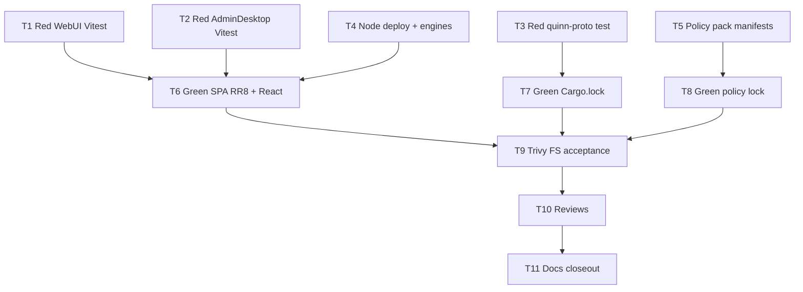

# Clear Trivy HIGH — React Router 8 + Node 22 migration

**Status:** Archived  
**Date:** 2026-07-26  
**Archived:** 2026-07-26
**Goal:** Clear the five Trivy HIGH findings across Admin Desktop, Web UI, Cargo.lock, and the Azure CrossGuard policy pack by migrating to React Router 8 / Node 22 (no GHSA suppressions) and applying precise lockfile bumps elsewhere.

---

## 1. Problem / Motivation

`trivy fs --scanners vuln --severity HIGH,CRITICAL --exit-code 1` fails the PR security gate with five HIGH findings across four lockfiles:

| Lockfile | Package | Current | Required | Advisory |
| --- | --- | --- | --- | --- |
| `1-Presentation/MotorcycleRAG.AdminDesktop/package-lock.json` | `react-router` (via `react-router-dom`) | 7.18.0 | ≥8.3.0 | GHSA-qwww-vcr4-c8h2 |
| `1-Presentation/MotorcycleRag.WebUI/package-lock.json` | `react-router` | 7.18.1 | ≥8.3.0 | GHSA-qwww-vcr4-c8h2 |
| `1-Presentation/MotorcycleRAG.AdminDesktop/src-tauri/Cargo.lock` | `quinn-proto` | 0.11.14 | 0.11.15 | GHSA-4w2j-m93h-cj5j |
| `7-Deployment/scanning/policy-packs/azure/package-lock.json` | `@opentelemetry/propagator-jaeger` | 1.30.1 (via `@pulumi/pulumi` 3.251.0) | pulled by `@pulumi/pulumi` ≥3.254.0 (OTel ≥2.9) | OTel HIGH |
| same policy-pack lockfile | `brace-expansion` | 5.0.7 | 5.0.8 | HIGH |

Both SPAs use declarative routing only (`BrowserRouter` / `HashRouter`, `Routes`, `Route`, `Navigate`, `NavLink`, `Outlet`, `MemoryRouter`). The advisory is RSC-scoped, but Trivy still blocks any `react-router` &lt;8.3.0. Scoped suppression of GHSA-qwww was rejected.

React Router 8 removes the `react-router-dom` package; browser APIs export from `react-router`. Peer requirements: React/ReactDOM ≥19.2.7 and Node ≥22.22.0. PR gate already uses Node 22; `.github/workflows/deploy.yml` still pins `NODE_VERSION: "20.x"`.

---

## 2. Approved decisions

- **D1 (human, 2026-07-26).** Clear Trivy HIGH on `react-router` / GHSA-qwww-vcr4-c8h2 via **Option 1 — Migrate React Router 8 + Node 22**. Do **not** scoped-suppress GHSA-qwww.
- **D2.** Replace `react-router-dom` with `react-router` `^8.3.0` (or latest compatible 8.x ≥8.3.0) in Admin Desktop and Web UI. Do not keep a `react-router-dom` dependency alias.
- **D3.** Bump `react` and `react-dom` to `^19.2.7` (or latest 19.x ≥19.2.7) in both apps to satisfy React Router 8 peers.
- **D4.** Align deploy and local engines with Node ≥22.22.0: set `.github/workflows/deploy.yml` `NODE_VERSION` to `22.x` (or an explicit ≥22.22.0 pin); add `"engines": { "node": ">=22.22.0" }` to both SPA `package.json` files. PR-gate Node 22 jobs remain as-is unless a patch pin is needed for ≥22.22.0.
- **D5.** Clear `quinn-proto` via a precise `Cargo.lock` bump to **0.11.15** (no unnecessary direct dependency unless `cargo update -p quinn-proto` cannot resolve it).
- **D6.** Policy pack: bump resolved `@pulumi/pulumi` to **≥3.254.0** (override and/or direct dep as needed so npm resolves OTel ≥2.9); **remove** the obsolete `"@opentelemetry/core": "2.8.0"` override; bump `brace-expansion` to **5.0.8** via override. Do **not** override `@opentelemetry/propagator-jaeger` alone (incompatible OTel major mix).
- **D7.** One coordinated change set covering all four lockfiles so a single Trivy FS re-scan can go green. No partial merge that leaves any of the five HIGHs open.
- **D8.** Implementation is test-first per §4. No GHSA/Trivy ignore entries for these findings.

---

## 3. Investigation findings

Re-verified 2026-07-26 against live source (CodeGraph did not index JS `react-router-dom` imports — fallback file search used; stated here per CodeGraph-first policy).

**React Router usage (12 files):**

| App | Files |
| --- | --- |
| Admin Desktop | `src/main.tsx` (`HashRouter`), `src/App.tsx`, `src/components/AppShell.tsx`, `src/App.test.tsx`, `src/components/AppShell.test.tsx` |
| Web UI | `src/App.tsx` (`BrowserRouter`), `src/components/ProtectedRoute.tsx`, `src/layouts/MainLayout.tsx`, `src/pages/LoginPage.tsx`, `src/App.test.tsx`, `src/components/ProtectedRoute.test.tsx`, `src/layouts/MainLayout.test.tsx`, `src/pages/LoginPage.test.tsx` |

No unstable RSC APIs. Current deps: `react-router-dom` `^7.13.0`; lock resolves `react-router` 7.18.0 / 7.18.1. React is `^19.2.3` (below 19.2.7 peer).

**Node:**

- `.github/workflows/pr-gate.yml` — `node-version: 22` (Admin Desktop coverage, docs/skill jobs).
- `.github/workflows/deploy.yml` — `NODE_VERSION: "20.x"` for Web UI `npm install` / `npm run build` (must move to 22).
- Onboarding docs say only “compatible with lockfile”; no pinned Node major in `6-Docs/DevOps` prose.

**Cargo:**

- `quinn-proto` 0.11.14 is transitive (via `quinn` ← HTTP stack under `reqwest`/`oauth2`). `Cargo.toml` does not name `quinn` directly.

**Policy pack** (`7-Deployment/scanning/policy-packs/azure/`):

- Direct deps: `@pulumi/policy`, `@pulumi/azure-native@3.13.0`.
- Lock: `@pulumi/pulumi@3.251.0`, `@opentelemetry/propagator-jaeger@1.30.1`, `brace-expansion@5.0.7`, override forces `@opentelemetry/core@2.8.0`.

**Test runners today:**

- Web UI / Admin Desktop: `npm test` → `vitest run` in each package root.
- Admin Desktop Rust: `cargo test` under `src-tauri/`.
- Policy pack: `npm run lint` (`tsc --noEmit`) only — no Vitest suite.

---

## 4. Test contract

Failing tests that define each implementation task’s done-ness. Orchestrator sequences `test-dev` to author RED tests first; implementation turns them GREEN. Rows marked `no-test` use the named read-only/manual gate instead.

| Task # | Test project / file | Runner command | Behavior asserted (RED → GREEN) |
|--------|---------------------|----------------|---------------------------------|
| T1 | `1-Presentation/MotorcycleRag.WebUI/src/packageContract.test.ts` (new); update imports in `App.test.tsx`, `ProtectedRoute.test.tsx`, `MainLayout.test.tsx`, `LoginPage.test.tsx` | `cd 1-Presentation/MotorcycleRag.WebUI && npm test -- src/packageContract.test.ts src/App.test.tsx src/components/ProtectedRoute.test.tsx src/layouts/MainLayout.test.tsx src/pages/LoginPage.test.tsx` | (a) `package.json` declares `react-router` satisfying ≥8.3.0, does **not** declare `react-router-dom`, and declares `react`/`react-dom` satisfying ≥19.2.7; (b) existing route/auth UI behaviors still pass when helpers import from `react-router` (login gate, chat/settings routes, unknown-route redirect). RED until deps + source migrate. |
| T2 | `1-Presentation/MotorcycleRAG.AdminDesktop/src/packageContract.test.ts` (new); update imports in `App.test.tsx`, `AppShell.test.tsx` | `cd 1-Presentation/MotorcycleRAG.AdminDesktop && npm test -- src/packageContract.test.ts src/App.test.tsx src/components/AppShell.test.tsx` | Same package contract as T1 for Admin Desktop; signed-in route matrix and anonymous sign-in gate still pass with `react-router` imports. RED until deps + source migrate. |
| T3 | `1-Presentation/MotorcycleRAG.AdminDesktop/src-tauri/tests/quinn_proto_version.rs` (new) **or** extend an existing `src-tauri` test module that parses `Cargo.lock` | `cd 1-Presentation/MotorcycleRAG.AdminDesktop/src-tauri && cargo test quinn_proto_version -- --nocapture` | Parsed `Cargo.lock` entry for `quinn-proto` is exactly `0.11.15` (or ≥0.11.15 if a newer patch is forced by the resolver — minimum asserted 0.11.15). RED on 0.11.14. |
| T4 | *no-test* (CI/config) | Read-only: `rg -n "NODE_VERSION" .github/workflows/deploy.yml` and confirm both SPA `package.json` `engines.node` | Deploy workflow uses Node 22.x (or ≥22.22.0); both SPAs declare `"engines": { "node": ">=22.22.0" }`. Manual gate replaces automated test. |
| T5 | *no-test* (policy pack has no unit suite) | `cd 7-Deployment/scanning/policy-packs/azure && npm ci && npm run lint` | `tsc --noEmit` succeeds after Pulumi/OTel/brace-expansion resolution. Version clearance proven by T9 Trivy, not by a unit assertion. |
| T6 | Implementation of T1–T2 (no new test file) | Same runners as T1/T2 full suite + `npm run build` in each SPA | All T1/T2 contract tests GREEN; `tsc`/Vite production build succeeds on Node ≥22.22.0. |
| T7 | Implementation of T3 (no new test file) | `cargo test quinn_proto_version` + `cargo test` (full `src-tauri`) | T3 GREEN; existing Rust suite remains green. |
| T8 | Implementation of T5 (no new test file) | Policy-pack `npm ci && npm run lint` | GREEN compile; lockfile shows `@pulumi/pulumi` ≥3.254.0, `brace-expansion` 5.0.8, no `@opentelemetry/core@2.8.0` override, no lone Jaeger override. |
| T9 | *no-test* (acceptance scan) | `trivy fs --scanners vuln --severity HIGH,CRITICAL --exit-code 1 --skip-dirs .git --skip-dirs .kilo --skip-dirs .opencode --skip-dirs .pnpm-store .` | Exit code 0: none of the five target HIGHs remain; no new HIGH/CRITICAL introduced in the four touched lockfiles. |
| T10 | *no-test* (review) | `code-review` + `security-review` skills on the change set | APPROVED / pass; confirms no GHSA suppressions and no unsafe OTel override mix. |
| T11 | *no-test* (docs closeout) | Docs review against acceptance criteria | Canonical Node/React Router guidance and plan index/status updated; plan eligible for archive only after T9–T10 evidence. |

---

## 5. Task list

| # | Phase | Component | Description | Skills | Test contract |
|---|-------|-----------|-------------|--------|---------------|
| T1 | Red | Web UI Vitest | Author `packageContract.test.ts`; retarget routing test imports from `react-router-dom` → `react-router`. Leave production source on v7 so contract/import tests fail. | `test-dev` | §4 T1 |
| T2 | Red | Admin Desktop Vitest | Same package-contract + import retarget for Admin Desktop tests. | `test-dev` | §4 T2 |
| T3 | Red | Admin Desktop Rust | Add `quinn_proto_version` lockfile assertion test expecting ≥0.11.15. | `test-dev`, `tauri-dev` | §4 T3 |
| T4 | Config | Deploy + engines | Bump `deploy.yml` `NODE_VERSION` to `22.x` (or ≥22.22.0); add `engines.node` to both SPA `package.json`. Acceptance: §4 T4 manual checks. | `github-devops` | §4 T4 (no-test) |
| T5 | Config prep | Policy pack manifests | Update `package.json` overrides: remove `@opentelemetry/core` 2.8.0; ensure `@pulumi/pulumi` ≥3.254.0 and `brace-expansion` 5.0.8. Lockfile regeneration is T8. | `github-devops` | §4 T5 (no-test) |
| T6 | Green | Web UI + Admin Desktop React | Migrate both apps: depend on `react-router` ≥8.3.0; remove `react-router-dom`; bump React/ReactDOM ≥19.2.7; rewrite the 12 source/test import sites; regenerate both `package-lock.json` with `npm ci`/`npm install` on Node ≥22.22.0. Acceptance: §4 T1/T2/T6 green + `npm run build`. | `react` (react-dev) | §4 T1, T2, T6 |
| T7 | Green | Cargo.lock | `cargo update -p quinn-proto --precise 0.11.15` (or equivalent) under `src-tauri`; keep `Cargo.toml` free of unnecessary direct pins unless required. Acceptance: §4 T3/T7 green. | `tauri-dev` | §4 T3, T7 |
| T8 | Green | Policy pack lockfile | Regenerate `package-lock.json` from T5 manifests; verify resolved versions; `npm ci && npm run lint`. | `github-devops` | §4 T5, T8 |
| T9 | Verify | Repo root Trivy | Run the acceptance Trivy FS command; fix any residual HIGH/CRITICAL in the four lockfiles without suppressions. | `github-devops`, `security-review` | §4 T9 (no-test) |
| T10 | Review | Change set | Independent code-review and security-review of SPA migration, Node bump, Cargo bump, and policy-pack override strategy. | `code-review`, `security-review` | §4 T10 (no-test) |
| T11 | Closeout | Docs + plan index | Update Web UI / Admin Desktop onboarding (Node ≥22.22.0, React Router 8 package name), DevOps overview if deploy Node is documented, catalog `last-reviewed` as needed; set this plan to Review required → archive per docs-dev closeout rules after evidence. | `docs-dev`, `app-docs-standard` | §4 T11 (no-test) |

---

## 6. Sequencing / dependency graph

Every green task depends on its red/contract predecessor. Disjoint red tasks may run in parallel.



**Parallelism:** T1 ∥ T2 ∥ T3 ∥ T4 ∥ T5. Then T6 ∥ T7 ∥ T8. Then T9 → T10 → T11.

---

## 7. Residual decisions / risks

| Item | Owner / resolution |
| --- | --- |
| Exact published `react-router` 8.x patch (≥8.3.0) at implement time | Implementer pins latest compatible 8.x; contract only asserts ≥8.3.0 |
| Whether `cargo update -p quinn-proto --precise 0.11.15` needs a `[patch]` or direct dep | T7 owner; prefer lock-only; escalate only if resolver cannot select 0.11.15 |
| `@pulumi/policy` / `@pulumi/azure-native` may need a minor bump if override alone cannot pull `@pulumi/pulumi` ≥3.254.0 | T5/T8 owner; keep override strategy per D6; no lone Jaeger override |
| Local developer machines still on Node 20 will fail `engines` / RR8 install | Document in T11; not a product runtime issue for the BFF image (UI is prebuilt in deploy) |
| Trivy DB drift may surface new HIGH/CRITICAL unrelated to these four lockfiles during T9 | T9 owner triages; in-scope fixes only for regressions caused by this change; unrelated findings become a separate plan |

---

## 8. Out of scope

| Item | Why / where it belongs |
| --- | --- |
| Scoped Trivy/GHSA suppression for GHSA-qwww | Rejected by D1 |
| Migrating to React Router Framework/RSC or `react-router/dom` server APIs | SPAs stay declarative client routers |
| Rewriting routing architecture (data routers, loaders, SSR) | Not required to clear the advisory |
| Linux Tauri/glib accepted-risk note in `Cargo.toml` | Unrelated MODERATE; existing accepted risk |
| Container image OS package Trivy findings | Nightly container scan; separate from FS lockfile HIGHs |
| Broad npm dependency upgrades beyond peers required by RR8 | Minimize blast radius |
| Changing PR-gate Trivy severity policy | Gate stays HIGH,CRITICAL |

---

## 9. Required skills

- `test-dev`
- `react` / react-dev (SPA migration)
- `tauri-dev` (Cargo.lock / Rust test)
- `github-devops` (deploy Node, policy-pack lockfile, Trivy acceptance)
- `code-review`
- `security-review`
- `docs-dev`
- `app-docs-standard`

---

## 10. Verification harness

The plan is done only when all of the following hold:

1. **Test contract GREEN:** T1, T2, T3 runners pass; T6/T7/T8 build/lint gates pass.
2. **Trivy acceptance (T9):**
   ```sh
   trivy fs --scanners vuln --severity HIGH,CRITICAL --exit-code 1 \
     --skip-dirs .git --skip-dirs .kilo --skip-dirs .opencode --skip-dirs .pnpm-store .
   ```
   Exit 0, with explicit confirmation that `react-router` &lt;8.3.0, `quinn-proto` 0.11.14, `@opentelemetry/propagator-jaeger` 1.30.1 (via old Pulumi), and `brace-expansion` 5.0.7 no longer appear as HIGH on the four lockfiles.
3. **`code-review` APPROVED** and **`security-review` passed** for the change set (no suppressions; OTel majors consistent).
4. **Docs closeout (T11)** completed by `docs-dev`; plan index status moved appropriately; archive only after acceptance criteria verified.

---

## Acceptance criteria (summary)

- [x] Both SPAs depend on `react-router` ≥8.3.0, not `react-router-dom`; React ≥19.2.7.
- [x] All 12 import sites and Vitest helpers use `react-router`; package-contract + routing tests green.
- [x] Deploy workflow builds Web UI on Node 22.x; both SPAs declare `engines.node` ≥22.22.0.
- [x] `Cargo.lock` has `quinn-proto` 0.11.15; Rust version test green.
- [x] Policy pack lock resolves `@pulumi/pulumi` ≥3.254.0, `brace-expansion` 5.0.8; obsolete `@opentelemetry/core` 2.8.0 override removed; no Jaeger-only override.
- [x] Trivy FS HIGH/CRITICAL scan (command above) exits 0 for the remediated findings.
- [x] Reviews + docs closeout complete; no GHSA-qwww suppression.
