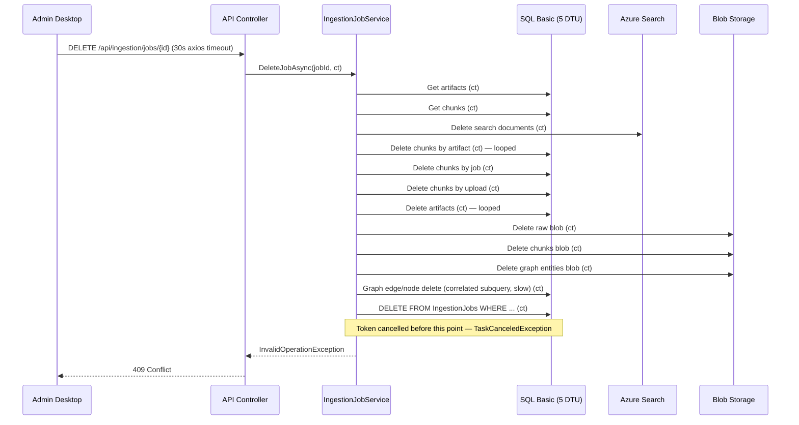
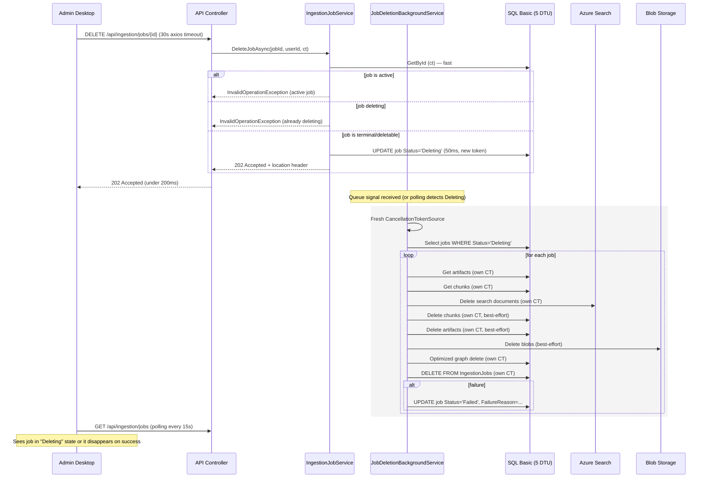

# Design: Ingestion Job Delete Timeout Fix (SQL Basic Tier)

## Overview

`DELETE /api/ingestion/jobs/{jobId}` performs ~10+ sequential cleanup operations across four external systems (SQL, Azure Search, Blob Storage, SQL Graph) before the final SQL DELETE — all sharing the HTTP request's `CancellationToken`. On SQL Basic tier (5 DTUs), the graph delete's dual IN subquery forces a full `GraphEdge` table scan and can take tens of seconds, and the cumulative time pushes past the ~30s timeout window, canceling the token before the final DELETE executes. This causes `TaskCanceledException` → 409 Conflict.

**The design restructures deletion into an immediately-accepted two-phase pattern**: the synchronous HTTP request performs minimal validation and marks the job as `Deleting` (new status), then queues actual cleanup to a background service running with its own timeout budget. This is consistent with the existing `ImportGraphArtifactsAsync` pattern (lines 310–312 of `IngestionJobService.cs`) which already uses `Task.Run(() => ..., CancellationToken.None)` for out-of-request work.

**Key constraint**: SQL remains on Basic tier (5 DTUs). No tier upgrade.

## Architecture

### Current State (Problem)



### Target State (Fix)



### Key Design Decision: Background Deletion with Status Marker

**Primary recommendation**: Add `Deleting` to `IngestionJobStatus`, transition on HTTP request, and let a `BackgroundService` perform cleanup with its own timeout budget. This is the correct architecture for long-running cleanup on constrained infrastructure.

**Rationale**:
- The `ImportGraphArtifactsAsync` method at line 312 already uses `Task.Run(() => ..., CancellationToken.None)` — this is the same pattern but formalized into a proper `BackgroundService`.
- A `BackgroundService` with its own `CancellationTokenSource` decouples cleanup from the HTTP request lifecycle entirely.
- The `Deleting` status prevents double-submission and gives the Admin Desktop UI a visible processing state.
- Each cleanup operation in the background can have its own per-operation timeout (e.g., 30s for SQL queries on Basic tier) without affecting other operations.

**Alternatives considered and rejected**:

| Alternative | Why rejected |
|---|---|
| Increase axios timeout to 120s | Doesn't fix the root cause; SQL Basic tier operations are genuinely slow, not just a timeout config issue. 120s HTTP requests are fragile (load balancer timeouts, user patience). |
| Just use `CancellationToken.None` for final delete | Addresses symptom only. Token still fires mid-delete and cancels graph operations; the user gets a 500/409 anyway from earlier failures. |
| Use `Task.Run` fire-and-forget (no status tracking) | Already used in `ImportGraphArtifactsAsync`, but deletion has different semantics: the user needs to know the job is gone. Without status tracking, the UI shows the job still exists while it's being deleted. |
| Optimize only the graph query, keep sync | Query optimization helps but doesn't solve for the worst case (large graphs, Azure Search throttling, blob storage latency). The fundamental problem is too many serialized external calls sharing one token. |
| Soft delete (add `IsDeleted` flag) | Adds schema complexity. Requires updating every query to filter out soft-deleted rows. On 5 DTU Basic tier, `WHERE IsDeleted = 0` on every read adds overhead. Inconsistent with the existing hard-delete pattern. |

## Prerequisites

### Cache `HasSqlIdColumnAsync` (do this first — independent of the async-delete design)

`IngestionJobRepository.HasSqlIdColumnAsync` (line 48) executes a metadata query against `INFORMATION_SCHEMA` on **every single query** — selects, inserts, and updates alike. This doubles the DB round-trips for every repository call. The delete path currently triggers it at least 6 times (GetById, GetByIngestionJobId×2, GetByUploadId×2, GetRecent reads) before any cleanup even starts. On a slow Basic tier connection those extra round-trips alone can consume 5–10 seconds of the 30s budget.

**Fix**: Cache the result as a static `Lazy<Task<bool>>` or a `volatile bool` initialized on first use:

```csharp
// Lazily resolved once per application lifetime — schema column presence never changes at runtime.
private static volatile int _hasSqlIdColumn = -1; // -1 = unknown, 0 = false, 1 = true

private static async Task<bool> HasSqlIdColumnAsync(IDbConnection connection, CancellationToken ct)
{
    if (_hasSqlIdColumn >= 0) return _hasSqlIdColumn == 1;

    const string sql = "SELECT CASE WHEN COL_LENGTH('dbo.IngestionJobs', 'Id') IS NULL THEN 0 ELSE 1 END;";
    var result = await connection.ExecuteScalarAsync<int>(new CommandDefinition(sql, cancellationToken: ct));
    Interlocked.CompareExchange(ref _hasSqlIdColumn, result, -1);
    return _hasSqlIdColumn == 1;
}
```

This is a purely additive change with no risk: the schema column presence is a deploy-time invariant, not runtime state.

## Components and Interfaces

### 1. Domain Changes

**New enum value**: `IngestionJobStatus.Deleting`

File: `3-Domain/MotorcycleRAG.Domain/Enums/IngestionJobStatus.cs`

Add `Deleting` to the enum. This is a **transient state**, not terminal: the job is no longer usable by any operation, but its row still exists until background cleanup completes and deletes the row. If cleanup fails the job rolls back to `Failed`. The UI should treat `Deleting` as a processing state (show a "deleting…" chip; exclude from actionable lists).

### 2. Application Layer

**Modified: `IngestionJobService.DeleteJobAsync`**

File: `2-Application/MotorcycleRAG.Application/Services/Ingestion/IngestionJobService.cs`

Refactor into two phases:
1. **Validation + status transition** (synchronous, within HTTP request)
   - Get job by ID (fast point query on `IX_IngestionJobs_IngestionJobId`)
   - Validate not active (same as today)
   - Validate not already `Deleting` (idempotency guard)
   - Update status to `Deleting` (fast single-row update) — use `CancellationToken.None` so this critical transition always completes even near the request timeout
   - Return immediately — the controller maps this to 202 Accepted

2. **Cleanup** (background, triggered by the `JobDeletionBackgroundService`)

InvalidOperationException is still thrown for active jobs (409) and already-deleting jobs (409 with different detail).

**New file: `JobDeletionBackgroundService`**

File: `2-Application/MotorcycleRAG.Application/Services/Ingestion/JobDeletionBackgroundService.cs`

A `BackgroundService` following the existing `ScheduledPipelineService` pattern:
- Constructor takes `IServiceScopeFactory` (no DI of scoped services directly).
- `ExecuteAsync` polls for jobs with `Status = Deleting` on a configurable interval (e.g., 10 seconds).
- For each job, creates a scope, resolves `IIngestionJobService`, and calls the cleanup portion (extracted from `DeleteAssociatedAssetsAsync`).
- Each cleanup step has its own `CancellationToken` with a per-operation timeout (e.g., 60 seconds per SQL query).
- On success: the job row is deleted by the final `DELETE FROM IngestionJobs`.
- On failure: the job status is set back to `Failed` with a `FailureReason` explaining cleanup failed, so the user can retry.
- Uses a `SemaphoreSlim(1, 1)` to prevent concurrent deletions (Basic tier can't handle parallel deletes).
- Optionally accepts a `Channel<Guid>` for immediate enqueue instead of polling — but polling is simpler and already proven by `ScheduledPipelineService`.

**Extracted method: `IIngestionJobService.ExecuteCleanupAsync`**

Or keep it private and callable via the background service through a new interface. Since the background service runs in the Application layer and `IngestionJobService` is also in Application, direct method call is acceptable (no layer violation). Alternative: extract the cleanup logic into a `JobCleanupService` and have both the HTTP path (for direct calls when fast enough) and the background service call it.

### 3. Presentation Layer (API Controller)

File: `1-Presentation/MotorcycleRAG.API/Controllers/IngestionJobsController.cs`

Modified `DeleteJobAsync`:
- On success from service: return `202 Accepted` with a minimal response body `{ jobId: "...", status: "Deleting" }`.
- On InvalidOperationException (active job or already deleting): return `409 Conflict` (existing behavior).
- The controller remains thin — it just maps the service outcome to HTTP.

**Remove the controller-level pre-fetch**: The current controller calls `GetJobStatusAsync` *before* calling `DeleteJobAsync`, which then calls `GetByIdAsync` internally — this is two DB reads for the same row. The refactored controller should call the service directly and let the service return a typed result or throw for not-found and conflict cases. The controller's pre-fetch read should be deleted.

Current (double-read):
```csharp
var job = await _ingestionJobService.GetJobStatusAsync(jobId, userId, ct); // DB read 1
if (job is null) return NotFound(...);
await _ingestionJobService.DeleteJobAsync(jobId, userId, ct);             // DB read 2 (GetByIdAsync inside)
```

Target (single-read):
```csharp
await _ingestionJobService.DeleteJobAsync(jobId, userId, ct); // single DB read inside service; throws for not-found
return Accepted(new { jobId, status = "Deleting" });
```

The service should throw a distinct exception (or use a result type) to distinguish "not found" (404) from "conflict" (409).

**OpenAPI contract**: `specs/001-system-spec/contracts/openapi.yaml` must be updated. The current DELETE endpoint declares `204 No Content`. It needs `202 Accepted` with the response body schema, and `409 Conflict` should gain a new error code for "already deleting."

### 4. Persistence Layer

**Optimized graph delete query** (critical for Basic tier performance):

File: `4-Persistence/MotorcycleRAG.Persistence/Sql/Repositories/SqlGraphRepository.cs`, method `DeleteByDocumentAsync`

**Problem**: The current query at lines 282–293 uses uncorrelated IN subqueries:
```sql
DELETE FROM [dbo].[GraphEdge]
WHERE [FromNodeId] IN (
    SELECT [Id] FROM [dbo].[GraphNode] WHERE [SourceDocumentId] = @SourceDocumentId
)
OR [ToNodeId] IN (
    SELECT [Id] FROM [dbo].[GraphNode] WHERE [SourceDocumentId] = @SourceDocumentId
);
```
The inner SELECT does not reference `GraphEdge`, so SQL Server *can* optimize this to a semi-join — but with an `OR` condition spanning two separate IN subqueries, the optimizer struggles to use indexes on `FromNodeId` and `ToNodeId` simultaneously. On 5 DTUs this typically produces a full scan of `GraphEdge`, and the dual-subquery form doubles the work even when the optimizer does cache the inner result.

**Fix**: Use a temp table (or inlined CTE) to materialize the node IDs once, then join:

```sql
-- Phase 1: Collect affected node IDs into a temp table
SELECT [Id] INTO #NodesToDelete
FROM [dbo].[GraphNode]
WHERE [SourceDocumentId] = @SourceDocumentId;

-- Phase 2: Delete edges referencing those nodes (using JOIN, not subquery)
DELETE e
FROM [dbo].[GraphEdge] e
INNER JOIN #NodesToDelete n ON e.[FromNodeId] = n.[Id] OR e.[ToNodeId] = n.[Id];

-- Phase 3: Delete the nodes
DELETE n
FROM [dbo].[GraphNode] n
INNER JOIN #NodesToDelete d ON n.[Id] = d.[Id];
```

This approach:
- Scans `GraphNode` once for `SourceDocumentId` (uses `IX_GraphNode_SourceDocumentId` index — already exists at line 991–992 of `schema.sql`).
- The JOIN-based delete on `GraphEdge` is more efficient than `IN (SELECT ...)` on SQL Server, even on Basic tier.
- On Basic tier (5 DTU), temp tables in `tempdb` are fast for small materialized sets.

**Additional index**: Add an index on `FromNodeId` alone to support the JOIN. The existing composite `IX_GraphEdge_FromTo_RelationshipType` covers queries filtering by `(FromNodeId, ToNodeId, RelationshipType)` together but the JOIN `ON e.FromNodeId = n.Id` only benefits from the leading column. This index already helps; if performance is still insufficient, add a dedicated `CREATE NONCLUSTERED INDEX [IX_GraphEdge_FromNodeId] ON [dbo].[GraphEdge] ([FromNodeId])` and similarly for `ToNodeId`. But start with the query rewrite first to avoid adding indexes on the 2GB-limited Basic tier.

**Per-operation timeouts on Dapper CommandDefinition**:

`SqlGraphRepository.DeleteByDocumentAsync` already sets `commandTimeout: 15` on its `CommandDefinition` (line 305). However, the other repository DELETE methods (`DeleteByArtifactIdAsync`, `DeleteByIngestionJobIdAsync`, `DeleteByUploadIdAsync`, `IngestionJobRepository.DeleteAsync`) do not — they rely on the global `SqlOptions.CommandTimeout`. For background-service delete operations, explicitly set a per-command timeout of 60–90 seconds so individual SQL ops have a generous budget without indefinitely blocking the background loop.

## Data Models

### New Status: `Deleting`

```
IngestionJobStatus enum:
  Queued (0)
  Processing (1)
  Indexing (2)
  Completed (3)
  Failed (4)
  Cancelled (5)
  PartiallyCompleted (6)
  Deleting (7)        ← NEW
```

`Deleting` is a **transient** state — the row exists temporarily while background cleanup runs. The background service either deletes the row entirely (success) or transitions back to `Failed` (cleanup error). No other operation (retry, cancel, fail, delete) is valid while a job is `Deleting`.

**Status array ripple effects** — `IngestionJobStatus.Deleting` must be explicitly handled in all status-gating logic in `IngestionJobService`:

| Array / method | Required change |
|---|---|
| `ActiveStatuses` | No change needed — `Deleting` is not active/processing |
| `FailedStatuses` | No change needed — `Deleting` is not a failed state |
| `FinishedStatuses` | No change needed — `Deleting` is not finished |
| `IsTerminalStatus` | Add `Deleting` so `TransitionStageAsync` rejects stage updates on a deleting job |
| `CancelJobAsync` guard | Add `Deleting` to the terminal check so cancel is rejected |
| `FailJobAsync` guard | Add `Deleting` to the terminal check so fail is rejected |
| `DeleteJobAsync` | Add guard: throw if `job.Status == Deleting` ("Job deletion is already in progress") |
| `ClearFailedJobsAsync` | No change needed — bulk-deletes by status (`Failed`, `Cancelled`), does not touch `Deleting` |
| `ClearFinishedJobsAsync` | Must NOT include `Deleting` in `FinishedStatuses`; verify `GetByStatusesAsync` filter |
| `GetRecentIngestionJobsAsync` | No filter change — return `Deleting` jobs so UI can show "deleting…" chip |
| `ShouldIncludeAsPending` / `HasPendingWorkflow` | `Deleting` should NOT count as "pending workflow" — exclude from pending file list |

**No new tables or schema columns needed.** The status field already exists as an `NVARCHAR` column.

### IngestionJob entity

No new properties. The existing `Status` property accommodates the new enum value. The `FailureReason` field serves double duty: if cleanup fails and status is rolled back to `Failed`, `FailureReason` contains the error.

## Error Handling

### HTTP Request Phase (thin, fast, always returns)

| Scenario | Behavior |
|---|---|
| Job not found | 404 Not Found (existing) |
| Job is active (Processing/Indexing) | 409 Conflict — "Job is active and cannot be deleted" |
| Job is already Deleting | 409 Conflict — "Job deletion is already in progress" (idempotency guard) |
| Job is in terminal state (Completed/Failed/Cancelled/PartiallyCompleted) | 202 Accepted — transition to Deleting, return |
| SQL update to Deleting fails (e.g., connection issue) | 500 Internal Server Error |

### Background Cleanup Phase (resilient, best-effort)

| Scenario | Behavior |
|---|---|
| Azure Search delete fails | Logged as warning; continues (best-effort, same as today via `RunBestEffortAsync`) |
| Blob delete fails | Logged as warning; continues |
| SQL chunk delete fails | Logged as warning; continues |
| SQL artifact delete fails | Logged as warning; continues |
| Graph delete fails | Logged as error; job status → Failed with FailureReason |
| Final IngestionJob DELETE fails | Logged as error; job status → Failed with FailureReason |
| All cleanup succeeds | Row deleted; job disappears from lists |

**Key principle**: Cleanup is best-effort. A failed cleanup does not prevent future retries — the user can re-delete the job (which is now in `Failed` status) and the background service will try again. Orphaned search documents/blobs/chunks are an acceptable temporary state given the Basic tier constraints.

### Background Service Resilience

- The `JobDeletionBackgroundService` wraps each job's cleanup in try/catch.
- If a single job's cleanup fails, it rolls that job back to `Failed` and moves to the next job.
- The service does not crash on individual cleanup failures.
- If the service itself crashes (process restart), any jobs stuck in `Deleting` are picked up on the next poll cycle.

## Testing Strategy

### Unit Tests

1. **`IngestionJobService.DeleteJobAsync` — validation phase**
   - Returns `InvalidOperationException` for active job (Processing/Indexing).
   - Returns `InvalidOperationException` for already-Deleting job (idempotency).
   - Transitions terminal job to `Deleting` successfully.
   - Does NOT perform any cleanup (verify no calls to artifact/chunk/graph/blob repositories).

2. **`IngestionJobService` cleanup logic (extracted method)**
   - Executes all cleanup steps when called.
   - Continues after individual cleanup failures (best-effort).
   - Deletes the job row on success.
   - Updates status to `Failed` on final-delete failure.

3. **`JobDeletionBackgroundService`**
   - Picks up jobs with `Deleting` status.
   - Skips jobs with non-Deleting status.
   - Handles empty queue (no Deleting jobs).
   - Serializes deletions (semaphore).

4. **`SqlGraphRepository.DeleteByDocumentAsync` — optimized query**
   - Deletes edges and nodes for the given `SourceDocumentId`.
   - Handles empty graph (no nodes/edges for document).
   - Correctly scopes to the single document (does not delete other documents' graph data).

### Integration Tests

1. **End-to-end delete flow** (TestContainer or real SQL)
   - Create job with associated artifacts, chunks, graph data.
   - HTTP DELETE returns 202.
   - Background service picks up and completes cleanup.
   - Job row is gone; graph nodes/edges are gone; artifacts/chunks are gone.

2. **Background service restart resilience**
   - Create job in `Deleting` status.
   - Restart background service.
   - Verify job is picked up and cleaned up.

3. **Graph query performance on Basic tier**
   - Load test with 100+ graph nodes and 500+ edges per document.
   - Time the delete: should complete within 30 seconds on Basic tier after optimization.

### Admin Desktop (E2E)

1. Click delete on a job → sees a loading state or the job disappears within one polling cycle.
2. 30s axios timeout does not fire — the API returns 202 in under 500ms.
3. If API returns 409 for active job, error message displays correctly.

### Controller Tests

1. `DELETE /api/ingestion/jobs/{id}` returns 202 when job transitions to Deleting.
2. Returns 409 when job is active.
3. Returns 404 when job not found.

## Design Decisions Summary

| Decision | Rationale |
|---|---|
| Background deletion via `BackgroundService` + `Deleting` status | Only way to decouple cleanup duration from HTTP request timeout without upgrading SQL tier |
| Polling-based background service (not `Channel<T>`) | Simpler; consistent with `ScheduledPipelineService` pattern; 10s poll interval is acceptable |
| Optimize graph delete with temp table + JOIN | Eliminates correlated subquery scan on Basic tier; uses existing `IX_GraphNode_SourceDocumentId` index |
| Per-operation Dapper command timeouts (60–90s) | Gives individual SQL ops enough time on 5 DTU without blocking the entire background process |
| Best-effort cleanup (orphaned resources tolerated) | On Basic tier, reliable synchronous cleanup of all resources is infeasible; orphan cleanup can be a separate maintenance job |
| Admin Desktop: no changes needed beyond polling | The existing 15s TanStack Query polling naturally handles the delay; the job transitions from visible → Deleting → gone |
