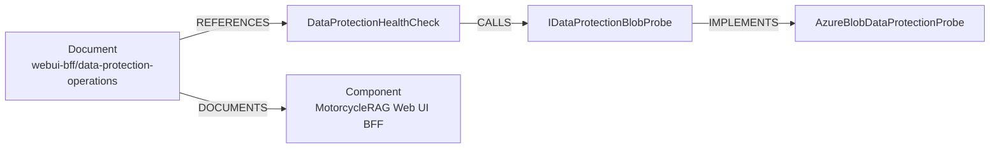

# MotorcycleRAG Documentation Ontology

## Purpose and scope

This is the authoritative schema for documentation frontmatter and for the knowledge graph derived from it. It applies to every document in scope of the [documentation standard](documentation-standard.md).

The ontology exists so that documentation joins **deterministically** to the code graph. `.codegraph/codegraph.db` already indexes every symbol, route, and file in the repository; it does not index Markdown. Frontmatter supplies the join keys that connect the two, so a retrieval agent can traverse from a runbook to the code it operates without any inference step.

The type sets below are **closed**. Adding a node type, edge type, `doc-type`, or frontmatter key is a change to this document, reviewed like any other interface change — not an authoring decision made in a single file.

## Frontmatter schema

Every in-scope document begins with a YAML frontmatter block. Keys are **hyphenated**, matching the `HyphenatedNamingConvention` deserializer used by Kyber-Weave.

```yaml
---
id: webui-bff/data-protection-operations      # stable slug; never changes once assigned
title: Data Protection Key Persistence — Operations Guide
doc-type: runbook                              # closed vocabulary
status: current                                # closed vocabulary
component: MotorcycleRAG Web UI BFF            # must match a catalog Component
source-root: 1-Presentation/MotorcycleRag.WebUI.BFF
owner: Web UI maintainers                      # must match a catalog Owner
last-reviewed: 2026-07-19
code-refs:                                     # exact CodeGraph symbol names
  - DataProtectionHealthCheck
  - IDataProtectionBlobProbe
  - AddBffDataProtection
api-endpoints: []                              # exact 'METHOD /path' route strings
decided-by: []                                 # ADR document ids
supersedes: []                                 # document ids
---
```

Keep the block short. It carries identity and relations only; everything else belongs in the prose. If a fact appears in frontmatter it SHALL NOT be repeated as a bold key-value line in the body.

### Key reference

| Key | Required | Meaning |
| --- | --- | --- |
| `id` | always | Stable slug, unique across the corpus. Assigned once and never changed, so graph edges survive file moves and renames. |
| `title` | always | Human title. Matches the `#` heading. |
| `doc-type` | always | Document shape. Closed vocabulary. |
| `status` | always | Lifecycle state. Closed vocabulary. |
| `component` | by `doc-type` | The catalog component this document describes. Carries the component relation — **not** the directory. |
| `source-root` | by `doc-type` | Repository-relative path to the component's source root. Must exist. |
| `owner` | always | Owning team. Must match a catalog Owner value. |
| `last-reviewed` | always | ISO date of the last source verification. |
| `code-refs` | by `doc-type` | Exact CodeGraph symbol names this document explains. |
| `api-endpoints` | when applicable | Exact CodeGraph route strings. Mandatory if the document explains an API. |
| `decided-by` | optional | ADR ids that govern this document's subject. |
| `supersedes` | optional | Document ids this one replaces. |

### `doc-type` vocabulary

`architecture` · `onboarding` · `requirements` · `adr` · `plan` · `spec` · `runbook` · `reference` · `rule` · `governance` · `index`

### `status` vocabulary

`current` · `draft` · `needs-review` · `superseded`

`status` records the **document's own currency** — whether its content still reflects reality. It is deliberately distinct from three other statuses that live in the body and SHALL NOT be folded into frontmatter:

| Body field | Meaning | Where it is defined |
| --- | --- | --- |
| `**Status:**` on a plan | Plan lifecycle: `Draft`, `Ready`, `In progress`, `Blocked`, … | [plan index](plans/README.md) |
| `**Status:**` on an ADR | Decision state: `Accepted`, `Rejected`, `Superseded` | ADR convention |
| `**Status:**` on a design reference | Implementation state, e.g. `Implemented (Jan 2026)` | the document itself |

A `Draft` plan whose text is accurate is `status: draft`; a `Completed` plan whose text has gone stale is `status: superseded`. The two axes move independently.

### Required-key matrix

| `doc-type` | Additionally required |
| --- | --- |
| `architecture` | `component`; `source-root` and non-empty `code-refs` together |
| `onboarding` | `component`, `source-root` |
| `requirements` | `component` |
| `runbook` | `component`; non-empty `code-refs` **when** `source-root` is set |
| `adr` | `status`, `last-reviewed` |
| `plan`, `spec` | `status`, `component` |
| `reference`, `rule`, `governance`, `index` | base keys only |

`source-root` and `code-refs` are a **pair**, and the pairing is what makes a document reachable from the code graph. Naming a source root without naming symbols leaves the document unreachable; naming symbols without a source root leaves them unanchored.

- A **component** architecture document SHALL set both.
- A **system-level** architecture document that describes no single component sets neither, and is reached through its `component` edge instead.
- A runbook that operates a specific component's code sets both. A **process-only** runbook that operates no indexed source — a GitHub settings procedure, for example — sets `component` alone.

Never invent a `code-refs` entry to satisfy the rule. A fabricated reference is the same disease the rule exists to prevent, and it will fail the drift tier anyway.

A document that explains an API endpoint SHALL list the exact route string in `api-endpoints`. "Exact" means byte-identical to the CodeGraph `route` node name, including HTTP method and full path template — for example `GET /api/me/usage`, not `/api/me/usage` or `GET api/me/usage`.

## Node types

### Code-side

Never hand-authored. Always projected from `.codegraph/codegraph.db`.

| Node | CodeGraph source | Identity |
| --- | --- | --- |
| `API_Endpoint` | `kind='route'` | `name` — exact `METHOD /path` string |
| `Service` | `kind='class'` under `2-Application/**/Services/**` | `qualified_name` |
| `Repository` | `kind='class'` under `4-Persistence/**` | `qualified_name` |
| `Interface` | `kind='interface'` | `qualified_name` |
| `Symbol` | any other `class` / `method` / `function` | `qualified_name` |
| `SourceFile` | `kind='file'` | `file_path` |

### Documentation-side

| Node | Discriminator |
| --- | --- |
| `Document` | one per in-scope Markdown file, subtyped by `doc-type` |

### Concept-side

Authored, closed vocabulary.

| Node | Source of truth |
| --- | --- |
| `Component` | the Component column of the [catalog](catalog.md) |
| `Design_Decision` | one per file in `adr/` |
| `Team` | the Owner column of the [catalog](catalog.md) |

## Edge types

| Edge | Derived from | Resolution |
| --- | --- | --- |
| `DOCUMENTS` | `component` → `Component` | exact string match against the catalog |
| `DESCRIBES` | `source-root` → `SourceFile*` | path prefix; must exist on disk |
| `REFERENCES` | `code-refs[]` → `Symbol` / `Service` / `Repository` / `Interface` | resolved to a CodeGraph node `id` |
| `EXPOSES` | `api-endpoints[]` → `API_Endpoint` | exact match against a `route` node `name` |
| `OWNED_BY` | `owner` → `Team` | closed vocabulary |
| `DECIDED_BY` | `decided-by[]` → `Design_Decision` | document id match |
| `SUPERSEDES` | `supersedes[]` → `Document` | document id match |
| `LINKS_TO` | relative Markdown links in the body | validated by `7-Deployment/scripts/validate-docs.sh` |
| `CALLS` / `IMPLEMENTS` / `CONTAINS` | the CodeGraph `edges` table | pre-existing; not authored here |

Multi-hop traversal falls out of these without inference. For example, from an operations runbook to the concrete probe implementation:



## Scope

**In scope:** `system/`, `rules/`, `adr/`, the component documentation folders, `operations/`, `reference/`, `DevOps/`, `plans/`, `specs/`, and the `6-Docs/` root documents.

**Out of scope:**

- `archive/` — historical only; never retrieved as current guidance.
- Vendored files that carry unrelated frontmatter of their own, currently the five upstream skill documents under `DevOps/`.
- The agent scratchpad, which lives outside `6-Docs/` entirely. See the **Agent Scratchpad** entry in the root `AGENTS.md` Config Registry.

## Entity drift

The failure mode this ontology is built to prevent: a developer renames a symbol in code, the documentation graph keeps pointing at the old name, and multi-hop reasoning silently breaks. Nothing in the prose reveals the break, because the prose still reads correctly.

Two rules follow.

1. **Never hand-write a `code-refs` or `api-endpoints` value.** Take it from the index:

   ```bash
   codegraph query "DataProtectionHealthCheck" -j
   ```

   ```bash
   sqlite3 .codegraph/codegraph.db "select name from nodes where kind='route' order by name;"
   ```

   Grep is not a substitute for route strings. CodeGraph resolves `[Route("api/me")]` plus `[HttpGet("usage")]` into `GET /api/me/usage`, a string that appears nowhere in the source text.

2. **Validation is CI-blocking**, in two tiers:

   | Tier | Command | Rules |
   | --- | --- | --- |
   | Schema | `kyber-weave docs validate` | `KW-DOC-SPEC-001` … `KW-DOC-SPEC-006` |
   | Drift | `kyber-weave docs drift` | `KW-DOC-DRIFT-001` … `KW-DOC-DRIFT-003` |

   The schema tier needs no index and runs on every documentation change. The drift tier resolves against `.codegraph/codegraph.db` and runs whenever code or documentation changes.

## Graph export

`kyber-weave docs graph --out <dir>` emits `nodes.jsonl` and `edges.jsonl`, one JSON object per line:

```json
{"type":"node","id":"doc:webui-bff/data-protection-operations","label":"Document","docType":"runbook","title":"…","path":"6-Docs/operations/webui-bff-data-protection-operations.md"}
{"type":"edge","label":"REFERENCES","from":"doc:webui-bff/data-protection-operations","to":"method:09426503497132a12f29f2b00a1380d4"}
```

Code nodes are **referenced by CodeGraph id, not duplicated** into the export. CodeGraph remains the single store for code structure; the export carries only document nodes and the document-to-code join edges. An external ingester consumes the export alongside the CodeGraph index rather than instead of it.
