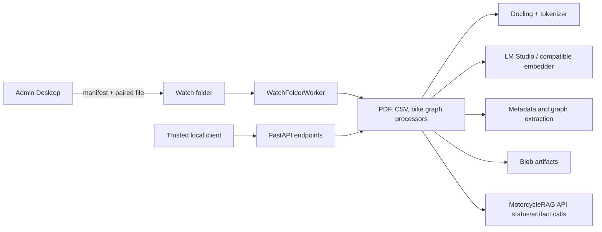

# Local Processing Service Architecture

## Overview

The Local Processing Service is a FastAPI process that owns local file processing and exposes job-oriented HTTP controls. It starts a watch-folder worker with the app lifecycle, chooses an embedding provider, validates source paths, dispatches work to PDF/CSV/graph processors, stores generated artifacts, and reports processing stages to MotorcycleRAG API.

## Architecture

## Components and Interfaces

| Component | Responsibility | Interfaces |
| --- | --- | --- |
| FastAPI app | Lifespan, CORS, health, job, processing, model-discovery, and shutdown endpoints | `/health`, `/embedding/models`, `/process/*`, `/jobs`, `/control/shutdown` |
| `WatchFolderWorker` | Polls and validates manifest/file pairs, then dispatches PDF or CSV work | `files/` and `manifests/` contract |
| Processors | PDF extraction/chunking, CSV processing, and deterministic bike-graph import | Async job state and processor methods |
| Embedder factory | Selects LM Studio/OpenAI-compatible or Ollama-compatible embeddings and applies truncation | Environment-driven provider configuration |
| Extractors | Metadata and graph extraction through configured compatible inference endpoints | Structured extraction models |
| `BlobWriter` and `ApiClient` | Persist output artifacts and report stages to the central API | Blob storage and authenticated API HTTP |

## Data Models

| Model | Purpose |
| --- | --- |
| `ProcessPDFRequest` | Upload/document identifiers, blob or local source, resume job ID, and metadata. |
| `ProcessCSVRequest` / `ProcessBikeGraphRequest` | CSV/graph source and import identifiers. |
| `Metadata`, `Chunk`, and `GraphEntity` | Extracted document attributes, chunk payloads/embeddings, and graph data. |
| Processing and job status | Job ID, state, progress, chunk/page counts, artifact locations, and sanitized failure data. |
| Watch-folder manifest | API job identifiers, source file metadata, local paired name, and `processorRunId`. |

## Error Handling

- `/health` reports unhealthy or degraded dependencies and whether new work can be accepted; PDF readiness includes tokenizer state.
- Processing endpoints validate required identifiers and require either a validated local source or required blob-source fields before starting background work.
- Path validation rejects unsafe local paths. The watcher rejects malformed manifests, traversal-like names, missing paired files, and size mismatches.
- HTTP failures use explicit 400, 404, 409, 502, or 500 responses as appropriate; unexpected exceptions are logged server-side without returning tracebacks.
- Shutdown stops acceptance of new work and waits up to 30 seconds for active jobs before exit.

## Testing Strategy

- **Unit:** pytest coverage for processors, embeddings, extractors, path validation, stage runner, API client, storage, and watch-folder behavior.
- **Endpoint:** FastAPI tests for health, model discovery, processing validation, jobs, cleanup, and shutdown.
- **Integration:** real-PDF processing with an explicitly configured tokenizer and provider, plus API/blob integration in a controlled environment.
- **End-to-end:** Admin Desktop queues a real source through the watch folder; verify worker consumption, local status, API status reporting, and stored artifacts.
