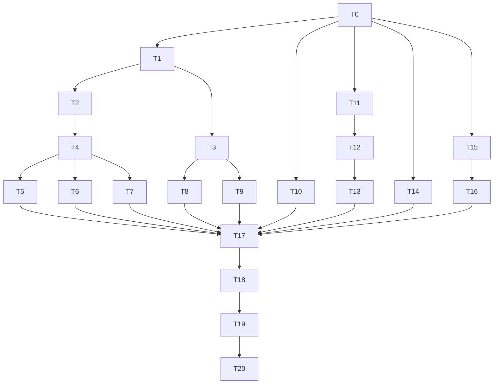

# Security and Quality Alert Remediation

**Status:** Review required
**Date:** 2026-07-18
**Goal:** Remediate the verified 128 open GitHub code-scanning alerts, harden the Admin Desktop-to-local-processor boundary, and restore trustworthy per-language security scanning without losing diagnostic value.

## 0. Current execution status / takeover handoff

**Status remains `Review required`. Do not archive.** Local implementation for T0–T15 is in the working tree; GitHub convergence gates T16–T19 are incomplete, so T20 archival criteria are not met.

| Task | State | Evidence / gap |
| --- | --- | --- |
| T0–T8, T10–T11, T14–T15 | Implemented locally | Logging encoders/sinks, path validation, local-control auth, SQL transport, trusted-script catalog, defusedxml coverage, JWT test-literal fix |
| T9 | Implemented locally; security-review APPROVED (D3/D5) | `url_validation` wired into `safe_http`; API-client and model-discovery policy |
| T12 / T12a | Implemented locally | Poisoned-lock stop recovery GREEN (`processor_stop_when_*` tests); TLS material cleaned on poison paths |
| T13 | Implemented locally | Prior real bridge pass recorded by conductor |
| T16 | Partial | **#399 dismissed** 2026-07-18 (`used in tests`; FakeDbConnection.cs:360; classifications=`test`; provider-isolated ADO.NET fake under `5-Test`). **#401 still open** on develop `@62fab115` line 54 — trusted-script catalog is enforced in the local working tree but not merged; post-merge Semgrep must re-run before dismiss-or-clear. Open Semgrep also still includes source-fix alerts #398 and #400 (not dismissal candidates). |
| T17 | Blocked (GitHub / R3) | Local suites GREEN (220 C# + 311 Python; Cargo poison/lifecycle green). Live default-branch check 2026-07-18: **124 open CodeQL alerts** still in legacy category `/language:csharp` (plus 3 open Semgrep). Not zero; remediations uncommitted. |
| T18 | Blocked | CodeQL per-language matrix migration waits on T17 default-branch condition; workflow still forces `/language:csharp` |
| T19 | Partial | Security APPROVED for T9/T12/T13. Code-reviewer re-reviewed and APPROVED T12a rework + `main.py` exception stacks + `url_validation` wiring. Full independent gate incomplete until T17/T18 (live GitHub scans). |
| T20 docs | Canonical docs updated for implemented behavior | This closeout documents verified local behavior and open GitHub blockers; plan is **not** archived |

No commit or push has been performed for this remediation set. Canonical documentation updated in this closeout: `6-Docs/system/security.md`, `6-Docs/DevOps/overview.md`, Admin Desktop architecture/requirements, local-processing-service architecture/requirements/local-processor, DbSetup docs, and affected `6-Docs/catalog.md` review dates.

---

## 1. Problem / Motivation

The previously reported count of 39 security and quality issues is stale. Live GitHub code-scanning state at commit `62fab115b3eabcd6cec710fbdaf7a58b3468ff77` contains 128 open alerts: 124 CodeQL and four Semgrep.

The dominant root-cause chain is:

1. Request, job, file, endpoint, exception, and database-derived strings reach logging sinks.
2. The existing C# `LogSanitizer` destructively replaces a small control-character set and truncates values; Python has no shared equivalent.
3. CodeQL does not recognize the existing helper as a barrier, as shown by flagged middleware sinks that already call it.
4. This produces 112 log-forging/log-injection alerts while still failing the approved diagnostic-preservation requirement.

The remaining alerts expose separate verified weaknesses: four outbound HTTP calls disable certificate validation, five endpoint flows permit partial SSRF, one path-validation flow needs a canonical containment proof, two SQL connections do not enforce secure transport, two SQL findings require either trusted-source enforcement or test-only evidence, one coverage helper uses unsafe XML parsing, and one test contains a JWT-shaped literal.

Admin Desktop currently proxies processor requests over unauthenticated loopback HTTP. The React webview calls Tauri IPC, but Rust constructs `http://127.0.0.1:{port}` requests and Uvicorn is launched without TLS. This does not cause the four outbound Python TLS alerts, but it conflicts with the repository HTTPS directive and leaves the local control API without peer or request authentication.

The custom CodeQL workflow is the correct sole scanner owner and GitHub default setup is already `not-configured`. However, the July 17 workflow expansion runs C#, Python, and JavaScript/TypeScript under the forced `/language:csharp` category. This contaminated alert history. The source remediation must first close the legacy-category alerts; only then may the workflow migrate to distinct language categories.

## 2. Approved decisions

- **D1.** The implementation target is the verified live baseline of 128 open alerts, not the stale count of 39.
- **D2.** Non-PII diagnostic values SHALL be preserved in full through reversible visible escaping. Raw CR, LF, tab, NUL, C0, and C1 control characters SHALL not reach plain-text logs. Default truncation is removed. PII and query text remain subject to repository-required redaction.
- **D3.** Admin Desktop SHALL use a per-launch app-managed local CA, a server leaf valid for `localhost` and `127.0.0.1`, and a high-entropy bearer token. The CA SHALL not be installed in the operating-system trust store.
- **D4.** The custom PR CodeQL workflow remains the sole owner. GitHub default setup remains disabled. Language-specific matrix categories are introduced only after the legacy category has closed the original alerts.
- **D5.** Remote HTTP endpoints require HTTPS and normal certificate/hostname validation. Plain HTTP exceptions are limited to literal loopback local-model endpoints; `verify=False` and hostname bypasses are forbidden.
- **D6.** Unsafe XML parsing in test tooling SHALL be replaced with `defusedxml`.
- **D7.** Dismissals are permitted only for individually proven test-only or trusted-script findings. Logging alerts SHALL not be bulk-dismissed.
- **D8.** SQL transport SHALL require encryption. Any certificate-trust exception must be explicit and confined to a local negative test.
- **D9.** This plan is approved for implementation using test-first task sequencing and mandatory documentation closeout.

## 3. Investigation findings

- Live alerts comprise 101 Python log-injection, 11 C# log-forging, five partial-SSRF, four certificate-validation, two insecure-SQL-connection, two Semgrep SQL-injection, one XXE, one JWT-literal, and one path-injection finding.
- C# logging alerts are in `IngestionJobService`, `RequestPipelineTimingMiddleware`, `IngestionJobRepository`, `IndexedArtifactRepository`, `DisabledPdfProcessor`, and `CorrelationService`.
- Python logging alerts are in `pdf_processor.py`, `main.py`, `metadata_extractor.py`, `graph_extractor.py`, `csv_processor.py`, `bike_graph_processor.py`, and `api_client.py`.
- `0-Base/MotorcycleRAG.Core/Utilities/LogSanitizer.cs` and its tests are the current canonical C# helper. No shared Python log sanitizer exists.
- `CorrelationService.BeginScope` can receive arbitrary string-valued additional properties and requires recursive string encoding.
- The four `verify=False` alerts and four of the SSRF alerts are in `src/api/api_client.py`; the fifth SSRF alert is in `src/embeddings/model_discovery.py`.
- Admin Desktop launches Uvicorn on `127.0.0.1`, but `processor_request`, readiness, and shutdown use unauthenticated HTTP. The direct Python entry point binds `0.0.0.0` and must be restricted.
- Existing Rust dependencies include `getrandom` and rustls-backed `reqwest`; certificate generation requires the approved `rcgen` dependency.
- Semgrep alert #399 is classified as test code in `FakeDbConnection.cs`. Alert #401 executes DDL batches from a file and needs an enforced approved-script boundary before any dismissal.
- `5-Test/scripts/requirements.txt` already owns `defusedxml`; the unsafe coverage runner has not adopted it.
- The affected catalog entries already exist. Closeout updates review dates and canonical content; it does not add components.

## 4. Task list

| # | Phase | Component | Description | Skills |
|---|-------|-----------|-------------|--------|
| T0 | Baseline | GitHub security | Capture the immutable 128-alert mapping, current SHA, analysis categories, and default-setup `not-configured` state. Acceptance: evidence separates CodeQL/Semgrep, rules, files, and alert numbers. Dependencies: none. | `github-cli`, `github-devops` |
| T1 | Red | Log encoding tests | Update `5-Test/MotorcycleRAG.Core.Tests/LogSanitizerTests.cs`; create `5-Test/local-processing-service.Tests/test_log_sanitizer.py`. Acceptance: tests require full printable-value preservation, backslash-first reversible escaping, all control-character classes, null handling, and no default truncation. Dependencies: T0. | `test-dev` |
| T2 | Green | C# log encoder | Update `LogSanitizer.Sanitize` in `0-Base/MotorcycleRAG.Core/Utilities/LogSanitizer.cs`. Acceptance: T1 C# tests pass and non-control content is unchanged. Dependencies: T1. | `dotnet-dev` |
| T3 | Green | Python log encoder | Create `2-Application/local-processing-service/src/security/log_sanitizer.py` and update `src/security/__init__.py`. Acceptance: T1 Python tests pass with the same contract as C#. Dependencies: T1. | `python-dev` |
| T4 | Red | C# log sinks | Add captured-log/scope tests in the existing middleware, ingestion-service, repository, disabled-processor, and correlation-service test files. Acceptance: injected control characters cannot create physical log lines and full escaped values remain recoverable. Dependencies: T2. | `test-dev` |
| T5 | Green | API/Application logs | Update `RequestPipelineTimingMiddleware` and `IngestionJobService`, including stage and failure-reason sinks. Acceptance: T4 tests pass and alerts #268-271 clear. Dependencies: T4. | `dotnet-dev` |
| T6 | Green | DAL logs | Update `IngestionJobRepository` and `IndexedArtifactRepository`. Acceptance: repository tests pass and alerts #260, #261, and #263-265 clear. Dependencies: T4. | `dal-dev` |
| T7 | Green | Persistence services logs | Update `DisabledPdfProcessor` and `CorrelationService`, recursively encoding string scope values. Acceptance: tests pass and alerts #138 and #262 clear. Dependencies: T4. | `dotnet-dev` |
| T8 | Red/Green | Python non-client logs | Add `caplog` contracts and update `pdf_processor.py`, `main.py`, `metadata_extractor.py`, `graph_extractor.py`, `csv_processor.py`, and `bike_graph_processor.py` plus their existing tests. Do not edit `api_client.py`. Acceptance: full escaped diagnostics, no raw control characters, and matching tests pass. Dependencies: T3. | `test-dev`, `python-dev` |
| T9 | Red/Green | Outbound URLs and TLS | Add endpoint-policy tests in `test_api_client.py` and `test_model_discovery.py`; create `src/security/url_validation.py`; update `api_client.py` and `model_discovery.py`, including API-client logs. Acceptance: remote HTTPS validation is enabled; only literal loopback model endpoints may use HTTP; credentials, fragments, malformed authorities, link-local/private remote hosts, and unsafe redirects fail closed; query data uses request parameters; alerts #288-296 and API-client log alerts clear. Dependencies: T3. | `test-dev`, `python-dev`, `security-review` |
| T10 | Red/Green | Local paths | Extend `test_main_path_validation.py`; update `_resolve_local_path` in `src/security/path_validation.py`. Acceptance: strict canonical containment rejects traversal, symlink escape, prefix collisions, missing/non-file paths, and wrong suffixes; alert #259 clears. Dependencies: T0. | `test-dev`, `python-dev` |
| T11 | Red/Green | Processor control authentication | Create `test_main_auth.py` and `src/security/local_control_auth.py`; update existing endpoint fixtures and `src/main.py`. Acceptance: every local control endpoint requires a constant-time-validated bearer token; missing runtime token fails closed; direct entry binds `127.0.0.1`. Dependencies: T0. | `test-dev`, `python-dev`, `csp-security` |
| T12 | Green | Tauri processor TLS | Create `src-tauri/src/processor_transport.rs`; update `src-tauri/src/lib.rs`, `Cargo.toml`, and `Cargo.lock`. Own `ProcessorState`, launch arguments, readiness, request, path/authority validation, stop, credential cleanup, and private temporary certificate files. Acceptance: per-launch CA/leaf/token; reused reqwest client trusts only the generated CA; hostname validation remains enabled; authenticated HTTPS covers readiness, requests, and shutdown; Rust tests reject HTTP, bad CA, wrong hostname/token, and authority-changing paths. Dependencies: T11. | `tauri-dev`, `security-review` |
| T13 | Integration | Real local bridge | Exercise React/Tauri IPC to Rust to authenticated HTTPS FastAPI. Acceptance: start, health, request, and stop succeed on the real bridge; HTTP, missing/wrong token, unknown CA, and external-interface access fail; no OS trust installation occurs. Dependencies: T12. | `tauri-dev`, `test-dev` |
| T14 | Red/Green | SQL transport | Update `SqlDbSetupConnectionFactory.cs`, `DbSetupConnectionFactoryTests.cs`, and the negative connection case in `SqlDatabaseHealthCheckTests.cs`. Acceptance: `SqlConnectionStringBuilder` enforces encryption; certificate trust bypass exists only in the explicit local negative test; alerts #286-287 clear. Dependencies: T0. | `dal-dev`, `test-dev` |
| T15 | Red/Green | Semgrep source fixes | Enforce canonical approved-script containment in `SqlScriptExecutor.cs` and tests; replace XML parsing in `run_unit_coverage.py` with `defusedxml.ElementTree` and add malicious-entity coverage; generate the JWT test value at runtime in `AuthenticationServiceExtensionsTests.cs`. Acceptance: alerts #398, #400, and #401 clear or #401 is eligible for the evidence gate in T16. Dependencies: T0. | `dal-dev`, `test-dev`, `python-dev` |
| T16 | Evidence | Narrow dismissals | Review `FakeDbConnection.cs` alert #399 and the enforced DDL boundary. Acceptance: dismiss only #399 as test-only with file/line/provider-isolation evidence; dismiss #401 only if the trusted-script invariant is enforced yet Semgrep remains open. No rule-wide suppression. Dependencies: T15. | `security-review`, `github-cli` |
| T17 | Convergence | Legacy-category verification | Run targeted and aggregate suites, builds, Cargo tests, pytest, Semgrep, and the existing legacy-category CodeQL analysis. If CodeQL cannot recognize the reviewed encoders, add narrowly scoped sanitizer models under `.github/codeql/log-sanitizer-model/`; never dismiss logging alerts. Acceptance: original alerts are fixed or individually approved and the legacy category reaches zero open alerts after default-branch analysis. Dependencies: T5-T10, T13-T16. | `github-devops`, `test-dev`, `security-review` |
| T18 | Scanner migration | PR CodeQL | Update `.github/workflows/pr-gate.yml` to one matrix leg per `csharp`, `python`, and `javascript-typescript`, with automatic or language-specific categories and language-appropriate setup. Acceptance: default setup remains `not-configured`; scans have distinct categories; no SARIF conflict or category contamination. Dependencies: T17. | `github-devops` |
| T19 | Review | Independent gates | Perform independent code and security review and reconcile live GitHub alerts. Acceptance: `code-reviewer` approves; `security-review` approves logging, URL/TLS, local auth, certificate lifecycle, path, SQL, XML, and dismissal evidence; live scans pass. Dependencies: T18. | `code-review`, `security-review`, `github-cli` |
| T20 | Closeout | Canonical documentation | Update `6-Docs/system/security.md`, `6-Docs/DevOps/overview.md`, Admin Desktop architecture/requirements/local-processor guidance, local-processing-service architecture/requirements/local-processor guidance, DbSetup documentation, affected catalog review dates, this plan, and the plan index. Acceptance: `docs-dev` verifies every criterion and archives only after implementation and documentation evidence pass; otherwise the plan becomes `Review required` or returns active. Dependencies: T19. | `docs-dev`, `app-docs-standard` |

## 5. Sequencing / dependency graph

T2 and T3 may run in parallel. After their test contracts are established, T5-T11, T14, and T15 use non-overlapping source ownership and may run in parallel subject to the graph. T17 is the mandatory convergence gate. T18 is deliberately later so the old `/language:csharp` category receives a clean default-branch analysis before category migration.

## 6. Residual decisions / risks

- **R1 — Static-analysis recognition:** The reviewed shared encoders may remain opaque to CodeQL. T17 resolves this with the narrowest supported sanitizer model; logging-alert dismissal is not an allowed resolution.
- **R2 — Certificate-file lifecycle:** Cross-platform file deletion can differ after Uvicorn opens the key. T12 owns private permissions, cleanup on all failure/stop paths, and documented residual behavior where immediate deletion is not supported.
- **R3 — Category migration:** Closing legacy alerts requires a successful default-branch analysis before T18. GitHub workflow state, not local analysis alone, resolves this condition.
- **R4 — DDL scanning:** SQL DDL batches cannot be parameterized like data values. T15 must enforce the canonical trusted-script boundary; T16 may dismiss only the remaining exact alert with evidence.
- **R5 — Environment expansion:** No Azure resource change is planned. If implementation introduces an Azure configuration dependency, stop and obtain approval before expanding scope.

## 7. Out of scope

- Mutual TLS, system-wide certificate installation, and `mkcert`; the approved ephemeral CA plus bearer design supplies the required local trust boundary without persistent machine trust.
- UI redesign, ingestion workflow changes, or changes to the watch-folder manifest contract; transport security is internal to the existing Tauri bridge.
- Redacting or hashing all diagnostic identifiers; this conflicts with D2. Existing PII/query-redaction policy remains authoritative.
- Broad CodeQL/Semgrep suppression, repository-wide rule disabling, or bulk alert dismissal.
- Enabling GitHub default CodeQL setup; advanced PR scanning remains the sole owner.
- Azure infrastructure, deployment, Key Vault, App Configuration, or production certificate changes.
- Dependency upgrades unrelated to `rcgen` or the already-owned `defusedxml` tooling dependency.

## 8. Required skills

- `test-dev`
- `dotnet-dev`
- `python-dev`
- `dal-dev`
- `tauri-dev`
- `github-devops`
- `github-cli`
- `csp-security`
- `security-review`
- `code-review`
- `docs-dev`
- `app-docs-standard`

## 9. Verification harness

- **C# unit tests:** targeted Core, API, Application, Persistence, and DbSetup projects plus the solution-filter unit suite. New tests cover exact encoded log values, structured scopes, SQL encryption, trusted scripts, and runtime-generated JWT input.
- **Python unit tests:** run from `2-Application/local-processing-service` using its Poetry environment. Cover shared encoding, every flagged log module, endpoint policy, certificate validation, loopback-only HTTP, redirect rejection, canonical paths, bearer auth, health, processing, jobs, and shutdown.
- **Rust tests:** run `cargo test` for Admin Desktop Tauri code. Cover certificate generation, CA trust, hostname validation, bearer attachment, URL authority preservation, lifecycle cleanup, and launch arguments.
- **Real bridge check:** start the processor through Admin Desktop/Tauri, verify authenticated HTTPS health and requests, and verify authenticated shutdown. Negative checks prove HTTP and invalid credentials/certificates fail.
- **Static analysis:** Semgrep must clear source-remediated alerts; the legacy CodeQL category must close the original alerts before the per-language matrix migration; the first matrix analysis must complete under distinct categories. GitHub default setup remains `not-configured`.
- **Dismissal evidence:** each dismissal records alert number, exact location, reason, enforced invariant, and reviewer approval. No logging alert may be dismissed.
- **Code review:** `code-reviewer` must approve after all implementation verification is captured.
- **Security review:** `security-review` must approve the complete trust boundaries, logging representation, input validation, SQL behavior, test-tool parsing, and dismissal evidence.
- **Azure validation:** no Azure mutation or live Azure validation is required. If scope expands to Azure configuration, `azure-reader` performs read-only validation after subscription allowlist verification and before approval.
- **Documentation:** run Markdown lint, internal-link validation, catalog/required-document validation, and secret scanning. `docs-dev` verifies plan acceptance criteria and canonical documentation before archiving.
