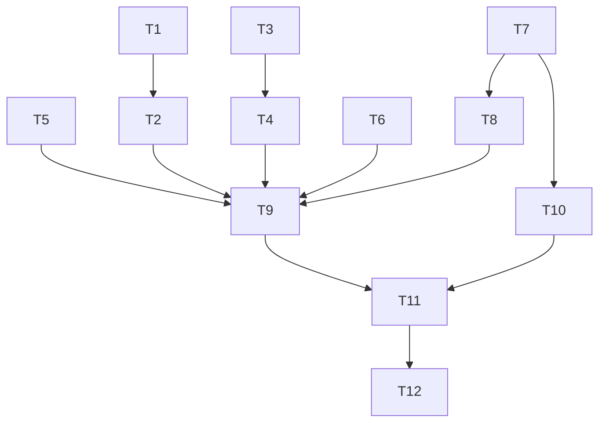

# CodeQL and Trivy Residual Alert Remediation

**Status:** Ready
**Date:** 2026-07-19
**Goal:** Clear the listed open CodeQL and Trivy alerts on `develop` via CodeQL-visible hardening, CodeQL category remediation, justified narrow dismissals only where needed, Dockerfile OS package upgrades, CI/nightly MEDIUM-inclusive image rescans, and user-approved ACR republish of `motorcycle-rag-api` and `motorcycle-rag-ui`.

---

## 1. Problem / Motivation

GitHub Security still shows open alerts that create noise despite prior mitigations already present on `develop`:

| Alert | Tool / rule | Location (live) | Symptom |
| --- | --- | --- | --- |
| #405 | CodeQL `py/partial-ssrf` (critical) | `model_discovery.py` ~128 | Operator model-discovery GET still flagged |
| #404 | CodeQL `py/partial-ssrf` (critical) | `api_client.py` ~377 | Stage-report PATCH URL still flagged |
| #892 | CodeQL `py/path-injection` (high) | `path_validation.py` ~43 | Caller path into `Path(...)` still flagged |
| #259 | CodeQL `py/path-injection` (high) | `path_validation.py` ~31 (stale SHA `62fab115`) | Superseded instance; must close with #892 |
| #402 | CodeQL `cs/insecure-sql-connection` (high) | `SqlDbSetupConnectionFactory.cs` ~19 | Sink model ignores `SqlConnectionEncryptOption.Mandatory` |
| #713/#712/#711/#710/#683/#682 | Trivy MEDIUM | `motorcycle-rag-ui` | Vulnerable `tar` / `perl-base` / `gzip` |
| #678/#677/#676/#675/#648/#647 | Trivy MEDIUM | `motorcycle-rag-api` | Same package set |

Verified root-cause chain:

1. Live source already enforces SSRF policy (`safe_http`), path containment (`resolve` + `relative_to`), and SQL encryption (`Encrypt = Mandatory`, `TrustServerCertificate = false`), including inline `# codeql[...]` comments.
2. PR CodeQL uploads with forced `category: "/language:csharp"` while analyzing `csharp, python, javascript-typescript`, so Python findings and suppressions land in a contaminated legacy category and do not clear reliably.
3. CodeQL sink models do not treat `SqlConnectionEncryptOption.Mandatory`, UUID path segments, or `relative_to` as barriers.
4. Dockerfiles run generic `apt-get upgrade -y`, but published/scanned images still ship vulnerable package versions; nightly container Trivy uploads only `HIGH,CRITICAL`, so MEDIUM findings linger.
5. Registry images refresh only through `deploy.yml` ACR push; GitHub alert clearance also requires a MEDIUM-inclusive SARIF re-upload after rebuild.

This plan is a focused residual slice. It does **not** reopen [2026-07-18 Security and Quality Alert Remediation](2026-07-18-security-quality-remediation.md) (`Review required`) as implementation authority; that plan remains for broader leftover gates (logging legacy volume, Semgrep #401, etc.).

---

## 2. Approved decisions

- **D1.** Clear CodeQL noise with CodeQL-visible hardening plus narrow, evidence-backed dismissals only for residuals that remain after hardening and correct-category rescan. CodeQL category contamination (`category: "/language:csharp"` for multi-language analysis) is in scope and must be fixed in this plan; do not defer category remediation if it blocks alert clearance.
- **D2.** Full Trivy path: explicit OS package upgrades in `Dockerfile.api` / `Dockerfile.ui`; CI/nightly rebuild + Trivy SARIF including **MEDIUM** for api/ui; user-approved deploy/ACR push for `motorcycle-rag-api` and `motorcycle-rag-ui` is in scope.
- **D3.** Preserve Admin Desktop absolute `local_file_path` contract under `LOCAL_PROCESSOR_INPUT_DIR` containment; do not switch to basename-only paths.
- **D4.** Preserve model-discovery ability to probe operator-supplied public-HTTPS or literal-loopback endpoints behind `safe_http` policy; if #405 remains after category fix + comment/model hygiene, dismiss with written evidence (not a rule-wide suppress).
- **D5.** No new infrastructure products, dependencies, or root-level docs without separate approval. Dockerfile and workflow edits under `7-Deployment/` and `.github/workflows/` are approved as part of D1/D2. Canonical doc touch is limited to DevOps/security notes required by workflow or image-build behavior change, via plan closeout.
- **D6.** ACR push / `deploy.yml` execution requires explicit user approval at implementation time (agents must not push ACR unprompted). Plan includes the task; operator gate remains.

---

## 3. Investigation findings

- Alert instances for #404/#405/#402/#892 are open under category `/language:csharp` on commit `c4498fa0…`; #259 is open on older `62fab115…` line 31.
- `pr-gate.yml` CodeQL job: `languages: csharp, python, javascript-typescript` but `analyze` sets `category: "/language:csharp"`.
- `api_client.report_stage` builds `f"{self._base_url}/…/{processor_job_id}/status"` after `uuid.UUID(processor_job_id)` and `validate_api_base_url`; uses `create_api_https_async_client`.
- `model_discovery._async_get_json` GETs candidate URLs built from operator endpoint after `validate_model_discovery_endpoint` / safe transport DNS re-validation.
- `path_validation._resolve_local_path` already does env-root `resolve(strict=True)`, candidate `resolve(strict=True)`, `relative_to(input_root)`, file + suffix checks; tests in `5-Test/local-processing-service.Tests/test_main_path_validation.py`.
- `SqlDbSetupConnectionFactory.Create` already forces `Encrypt = SqlConnectionEncryptOption.Mandatory` and `TrustServerCertificate = false`; test `Create_WhenConnectionStringDisablesEncryption_EnforcesSecureTransport` asserts Mandatory.
- Trivy fixed versions (from alert payloads): `tar` → `1.35+dfsg-3ubuntu0.3`; `perl-base` → `5.38.2-3.2ubuntu0.3`; `gzip` → `1.12-1ubuntu3.2` (Ubuntu noble/base of `mcr.microsoft.com/dotnet/aspnet:10.0`).
- Nightly builds `motorcycle-rag-api` / `motorcycle-rag-ui` from `7-Deployment/Dockerfile.*` and uploads SARIF with categories `nightly-trivy-container-api` / `nightly-trivy-container-ui` at `severity: HIGH,CRITICAL` only.
- `deploy.yml` builds and pushes `${ACR}/motorcycle-rag-api:{latest,sha}` and `motorcycle-rag-ui:{latest,sha}`.

---

## 4. Task list

| # | Phase | Component | Description | Skills |
|---|-------|-----------|-------------|--------|
| T1 | Red | Local processor paths | Extend `5-Test/local-processing-service.Tests/test_main_path_validation.py` for any containment API change (absolute under root allowed; traversal/symlink/prefix-collision still rejected). Acceptance: new/updated tests fail before T2 green. Deps: none. | `test-dev` |
| T2 | Green | Path injection #892/#259 | Update `_resolve_local_path` in `2-Application/local-processing-service/src/security/path_validation.py` so user input is joined/canonicalized in a CodeQL-recognizable containment pattern (e.g. resolve under `input_root` + `os.path.commonpath` / equivalent barrier) without weakening D3. Remove obsolete inline suppressions only if alerts clear without them; keep comments if still required as secondary. Acceptance: T1 green; #892 clears on post-merge CodeQL; #259 closes as fixed/stale. Deps: T1. | `python-dev` |
| T3 | Red | API client / discovery HTTP | Add/extend tests in `test_api_client.py` and `test_model_discovery.py` for URL construction: authority only from validated base/policy; stage path uses UUID-only job id; discovery still allows public HTTPS + loopback HTTP per policy. Acceptance: failing tests define the contract before T4. Deps: none (parallel with T1). | `test-dev` |
| T4 | Green | Partial SSRF #404/#405 | Update `ApiClient` stage-report URL build in `api_client.py` (validated base + UUID path join via `httpx.URL`/`URL.join` or equivalent; keep `create_api_https_async_client`). For `model_discovery.py`, keep operator-probe design behind `safe_http`; tighten call-site so only policy-validated absolute URLs reach `client.get`; ensure sync path has parity with async. Acceptance: T3 green; #404 clears after correct-category rescan; #405 clears or is eligible for T9 dismissal with evidence. Deps: T3. | `python-dev` |
| T5 | Red/Green | SQL encrypt #402 | Update `SqlDbSetupConnectionFactory.Create` so Encrypt is set in a CodeQL-recognized form (e.g. `builder["Encrypt"] = "True"` or bool `true` mapping to Mandatory) while resulting connection string still has `SqlConnectionEncryptOption.Mandatory` and `TrustServerCertificate = false`. Keep/adjust `DbSetupConnectionFactoryTests`. Acceptance: unit test passes; #402 clears after CodeQL rescan. Deps: none (parallel). | `dotnet-dev`, `test-dev` |
| T6 | Green | CodeQL categories | Update `.github/workflows/pr-gate.yml` CodeQL job to analyze with **per-language categories** (matrix or equivalent: `csharp`, `python`, `javascript-typescript`), removing the forced single `category: "/language:csharp"`. Keep custom workflow as sole owner; default setup remains disabled. Acceptance: subsequent develop/PR analyses upload distinct categories; Python alerts no longer attributed to `/language:csharp`. Deps: none for edit; verification couples with T8. | `github-devops` |
| T7 | Green | Container OS packages | Update `7-Deployment/Dockerfile.api` and `7-Deployment/Dockerfile.ui` base stages to explicitly upgrade/install fixed `tar`, `gzip`, and `perl-base` (and retain `apt-get upgrade` hygiene). Acceptance: image build succeeds; `dpkg -l` / Trivy on local build shows fixed versions for the six CVE pairs. Deps: none (parallel). | `github-devops` |
| T8 | Green | Nightly/CI Trivy MEDIUM | Update nightly container Trivy steps (and any needed one-shot workflow path) for api/ui to include **MEDIUM** in severity/SARIF upload so alerts #647–#713 can close. Do not weaken fail thresholds without noting in closeout. Acceptance: SARIF upload categories still distinct; MEDIUM findings for patched packages absent after T7 rebuild. Deps: T7. | `github-devops` |
| T9 | Evidence | Rescan + narrow dismissals | After merge of T2–T8: trigger/await CodeQL + container Trivy on `develop`; confirm #404/#402/#892/#259 closed; for #405 only, if still open under correct Python category with `safe_http` evidence, dismiss individually (`false positive` / won’t fix with written justification). No rule-wide suppress. Acceptance: target alert numbers closed or individually dismissed with evidence links. Deps: T2, T4, T5, T6, T8. | `github-cli`, `security-review` |
| T10 | Deploy | ACR republish | With **explicit user approval**, run the approved deploy path (`deploy.yml` or documented equivalent) to build/push `motorcycle-rag-api` and `motorcycle-rag-ui` to ACR (`latest` + SHA tags). Acceptance: ACR digests updated; pulled images show patched OS packages. Deps: T7; operator approval (D6). | `github-devops`, `github-cli` |
| T11 | Review | Independent gates | `code-reviewer` on source/workflow diffs; `security-review` on SSRF/path/SQL/Docker/dismissal evidence. Acceptance: both approve (or changes addressed). Deps: T9, T10. | `code-review`, `security-review` |
| T12 | Closeout | Docs + plan index | Update DevOps/security canonical notes only as needed for CodeQL category matrix and container package upgrade/rescan/ACR behavior; set this plan status through review → archive when acceptance met; update `6-Docs/plans/README.md`. Do not treat 2026-07-18 plan as closed by this work. Acceptance: docs-dev verifies criteria; plan archived only when alerts cleared and docs match. Deps: T11. | `docs-dev`, `app-docs-standard` |

---

## 5. Sequencing / dependency graph

Parallelizable after kickoff: T1∥T3∥T5∥T6∥T7; T2 after T1; T4 after T3; T8 after T7; T9 after hardening+scanner tasks; T10 after T7 with user approval (may run parallel to T9 once images build); T11→T12.

---

## 6. Residual decisions / risks

| Risk / residual | Owner / resolution |
| --- | --- |
| #405 may remain after correct-category analysis (intentional operator URL probe) | T9: individual dismissal with `safe_http` evidence, or further model if security-review rejects dismiss |
| CodeQL matrix migration may create new category alerts or duplicate history | T6/T9: reconcile; prefer closing legacy `/language:csharp` Python noise; do not bulk-dismiss unrelated alerts |
| Ubuntu fixed package versions may lag in MCR base or apt mirror | T7: fail build if `--only-upgrade` cannot reach fixed versions; escalate to pin newer aspnet tag |
| ACR push is production-adjacent | D6 / T10: explicit user approval before `deploy.yml` / `az acr` push |
| Broader open CodeQL/Semgrep from 2026-07-18 plan | Out of scope here; remains on that plan |

---

## 7. Out of scope

- Bulk remediation of remaining legacy CodeQL log-injection/forging alerts (2026-07-18 plan T17).
- Semgrep #401 trusted-script dismissal gate and unrelated Semgrep alerts.
- Local-processor Dockerfile / `local-processor` image Trivy (not in the listed alert set).
- Changing Admin Desktop file-picker to relative-only paths (D3).
- Removing `tar`/`gzip`/`perl-base` from the base image if required by the distro (upgrade, don’t strip essential packages without proof they are unused and safe to purge).
- Azure infrastructure / Pulumi changes beyond image push via existing deploy workflow.

---

## 8. Required skills

- `test-dev`
- `python-dev`
- `dotnet-dev`
- `github-devops`
- `github-cli`
- `security-review`
- `code-review`
- `docs-dev`
- `app-docs-standard`

Orchestrator agent mapping hints (not plan authority): `test-dev`→test-dev; `python-dev`→python-dev; `dotnet-dev`→dotnet-dev; `github-devops`/`github-cli`→github-devops; reviews→code-reviewer + security-review; closeout→docs-dev.

---

## 9. Verification harness

1. **Unit / component:** Python path + API client + model discovery tests green; DbSetup connection factory test asserts Mandatory encrypt + no trust-bypass.
2. **CodeQL:** Post-merge analysis on `develop` with per-language categories; alerts #404, #402, #892, #259 closed; #405 closed or individually dismissed with evidence.
3. **Trivy:** Rebuilt api/ui images scanned with MEDIUM included; alerts #647–#713 closed; package versions match fixed releases.
4. **ACR:** User-approved push; registry tags updated; spot-check patched packages on pulled image.
5. **Reviews:** `code-reviewer` approve; `security-review` approve (SSRF, path, SQL, Docker, dismissals).
6. **Docs closeout:** T12 complete before archive.

**Done when:** listed alerts are closed (or #405 narrowly dismissed), ACR images refreshed, reviews passed, and this plan archived per documentation standard.
