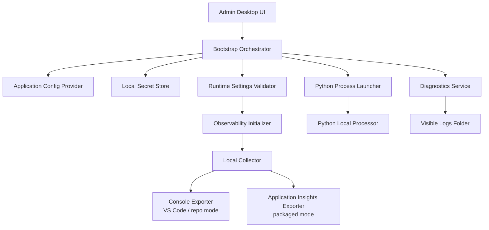

# Admin Desktop Local Processor Bootstrap Design

## Overview

This design defines how the Admin Desktop application boots, configures, observes, and diagnoses the local Python processor used by the repository's local processing workflow. The primary goal is to preserve the existing architecture choice of an Admin-owned bootstrap flow that starts and supervises the Python processor, while correcting configuration ownership and observability gaps raised in the latest approved revision.

The normal startup experience must not require end users or developers to manually create or set environment variables. Configuration is instead owned by the application through appsettings-style configuration or an equivalent strongly defined application configuration source, with secrets stored in local secret storage appropriate to the active mode. Environment variables remain permitted only as short-lived child-process launch details when a downstream Python dependency explicitly requires them.

The design also standardizes observability. A collector is required in all supported modes. In packaged or deployed mode, telemetry is exported to Application Insights. In VS Code or repository development mode, telemetry is exported to the console for immediate inspection. Routine logs must be easy for developers and coding assistants to find, must not live in hidden dotfolders, and must never be committed to source control. Packaged mode must also provide an explicit diagnostics affordance such as an `Open Logs Folder` action.

## Architecture

The Admin Desktop application remains the process owner and configuration owner for the local processor. It reads application configuration, resolves secrets from local secret storage, materializes a validated runtime settings object, configures an OpenTelemetry collector-backed observability pipeline, and only then launches the Python processor. The Python process receives a narrowly scoped startup contract containing the values it needs to run, without transferring long-lived configuration ownership to the shell environment.

The bootstrap sequence is:

1. Admin Desktop detects the active execution mode: packaged/deployed or repository development.
2. The bootstrap orchestrator loads non-secret settings from application-owned configuration files or equivalent typed configuration sources.
3. The bootstrap orchestrator resolves required secrets from local secret storage rather than user-managed environment variables.
4. A runtime settings validator ensures all required values are present before the Python process starts.
5. Observability is initialized with a required collector and mode-specific exporters.
6. The launcher starts the Python processor with explicit process arguments and, only if required by downstream dependencies, ephemeral environment variables injected into that child process.
7. Logs and diagnostics are written to a visible, mode-appropriate folder, and packaged mode exposes a UI affordance to open that location directly.

This keeps the earlier architecture intact: the desktop app remains the coordinating host for the local processor, and the Python processor remains a separately launched dependency. The revision changes ownership boundaries, not the overall topology.

## Components and Interfaces

### Bootstrap Orchestrator

The bootstrap orchestrator is the single entry point for preparing and launching the local processor. It coordinates configuration loading, secret resolution, settings validation, observability setup, process launch, health checks, and shutdown.

Responsibilities:

- Determine active runtime mode.
- Request configuration from application-owned providers.
- Resolve secrets from local secret storage.
- Build a typed runtime settings object.
- Start observability before launching the child process.
- Launch and supervise the Python processor.
- Surface diagnostics and startup failures to the UI.

### Application Configuration Provider

This component reads non-secret settings from appsettings-style configuration or an equivalent application-owned configuration source. The important design constraint is ownership: configuration is declared, versioned, and discovered by the application, not by ad hoc shell state.

Expected settings include:

- Python executable path or resolution strategy.
- Local processor entry point.
- Working directory.
- Ports or named pipe configuration, if used by the current bootstrap flow.
- Observability mode and collector endpoints.
- Visible log root path.
- Feature flags relevant to local processing.

### Local Secret Store Adapter

This component resolves secrets needed by the Admin Desktop or Python processor at startup. The concrete implementation can vary by mode and platform, but it must remain an application-invoked secret source rather than a manual environment-variable prerequisite.

Examples of appropriate behavior:

- Packaged mode reads secrets from an approved local secure store for the signed application.
- Repository development mode reads secrets from a developer-oriented local secret mechanism configured once for the application, not exported in the terminal as part of normal startup.

### Runtime Settings Validator

This validator transforms raw config and secret inputs into a strongly typed bootstrap contract and fails fast on missing or inconsistent values.

Validation rules include:

- Required settings must exist before launch.
- Secrets must be resolvable from the configured local secret source.
- Log paths must resolve outside the repository tree or within a repo path that is explicitly git-ignored.
- Observability must include a collector configuration.
- Child-process environment variable projection is allowed only for an enumerated allowlist of downstream-required keys.

### Child Process Launcher

This component starts the Python local processor and owns the narrow contract between the desktop host and the child process.

Design rules:

- Prefer command-line arguments, config files, stdin, or explicit IPC bootstrap payloads over environment variables.
- If a downstream dependency requires environment variables, the launcher injects them only into the spawned child process.
- The launcher must not require the user to pre-seed their shell environment.
- The launcher must redact secrets from logs and diagnostic surfaces.

The process launch contract is therefore:

- `arguments`: non-secret runtime inputs and file or endpoint references.
- `ephemeralEnvironment`: a small allowlisted map populated only when required.
- `workingDirectory`: explicit and deterministic.
- `diagnosticsContext`: log folder, correlation identifiers, and startup mode.

### Observability Initializer and Collector

Observability is mandatory and collector-based in all modes. The collector acts as the single routing point for traces, metrics, and logs produced by the Admin Desktop and, where practical in the current architecture, the Python local processor.

Mode-specific behavior:

- Packaged/deployed mode exports through the collector to Application Insights.
- VS Code/repository development mode exports through the collector to the console for immediate inspection.

Design decisions:

- The collector is required because it gives a consistent telemetry pipeline across host and child process boundaries.
- Console export in development mode is intentional, because it optimizes for fast inspection during local debugging and coding-assistant sessions.
- Application Insights export in packaged mode is retained because it matches deployed diagnostics expectations and supports supportability.

### Diagnostics Service

The diagnostics service makes logs easy to find and inspect.

Requirements implemented by this component:

- Routine logs are written to a visible, non-hidden folder.
- Packaged mode exposes an `Open Logs Folder`-style affordance in the Admin Desktop UI.
- Repository development mode keeps logs in a predictable non-hidden path that developers and coding assistants can inspect directly.
- The repository must not commit generated logs.

Recommended path strategy:

- Packaged mode: OS-appropriate application diagnostics folder under a visible application directory.
- Repository development mode: a visible diagnostics directory such as `6-Docs/agent-notes/logs/` or another existing non-hidden git-ignored workspace path.

The exact path may follow existing repository conventions, but hidden dotfolders are not allowed for routine log discovery.

## Data Models

The design uses a small set of runtime models to keep configuration ownership explicit.

### BootstrapSettings

Represents validated non-secret configuration.

Fields:

- `mode`: `Packaged` or `RepositoryDevelopment`
- `pythonExecutable`
- `processorEntryPoint`
- `workingDirectory`
- `transportSettings`
- `logRootPath`
- `collectorConfig`
- `appInsightsConfigPresent`
- `allowedChildEnvironmentKeys`

### SecretSettings

Represents resolved secret values retrieved from local secret storage.

Fields:

- `serviceCredentials`
- `apiKeys`
- `connectionSecrets`
- `otherDependencySecrets`

This model must never be serialized to routine logs.

### ProcessorLaunchContract

Represents the exact startup payload used to launch the Python processor.

Fields:

- `arguments`
- `ephemeralEnvironment`
- `startupTimeout`
- `healthCheckTarget`
- `correlationId`
- `diagnosticsSessionPath`

### CollectorConfig

Represents collector wiring for the current mode.

Fields:

- `collectorEndpoint`
- `enabledSignals`
- `exportTarget`
- `consoleExportEnabled`
- `applicationInsightsConnectionConfigured`

Relationships:

- `BootstrapSettings` references one `CollectorConfig`.
- `BootstrapSettings` and `SecretSettings` are combined by the validator into one `ProcessorLaunchContract`.
- `ProcessorLaunchContract` is consumed only by the child process launcher.

## Error Handling

The bootstrap flow must fail clearly and early when required configuration, secrets, or observability wiring is missing.

Failure modes and responses:

- Missing non-secret configuration: prevent startup, show a clear Admin Desktop error, and log which required configuration key group is absent.
- Missing secret material: prevent startup, show a remediation message that points to the application's local secret setup, and never suggest manually exporting shell variables as the normal fix.
- Invalid collector configuration: prevent startup because observability is required; log the invalid collector state and show a diagnostics-oriented error.
- Application Insights misconfiguration in packaged mode: treat as a startup failure unless an approved packaged-mode collector target is configured; do not silently downgrade to no telemetry.
- Console exporter misconfiguration in repository development mode: prevent startup and surface the expected local diagnostics destination.
- Child process launch failure: capture exit code, startup stderr, correlation ID, and log folder location; surface this in the Admin Desktop UI.
- Python processor health check timeout: terminate the failed startup attempt, preserve logs, and direct the user to the visible diagnostics path.
- Attempt to rely on ambient environment variables: ignore unowned shell state by default unless explicitly mapped through the allowlisted child-process projection mechanism.

The design intentionally avoids hidden fallback behavior. If the system cannot satisfy configuration ownership or observability requirements, it fails explicitly rather than silently degrading.

## Testing Strategy

Testing must validate both the preserved bootstrap architecture and the revised configuration and observability requirements.

### Unit Tests

- Verify the bootstrap orchestrator selects the correct mode.
- Verify application configuration loading does not require ambient environment variables for normal startup.
- Verify the validator rejects missing required settings.
- Verify the validator rejects missing collector configuration.
- Verify only allowlisted keys are projected into `ephemeralEnvironment`.
- Verify secrets are redacted from logs and error messages.
- Verify diagnostics path resolution never chooses a hidden dotfolder for routine logs.

### Integration Tests

- Start the Admin Desktop bootstrap flow in repository development mode and confirm the Python processor launches without manual shell environment setup.
- Confirm the collector starts and console export is active in repository development mode.
- Confirm the configured visible logs directory receives startup and runtime logs.
- Start the packaged-mode bootstrap flow and confirm telemetry export is wired to Application Insights through the collector.
- Confirm packaged mode exposes the diagnostics affordance and resolves the expected logs folder.
- Confirm generated logs are written only to git-ignored or non-repository locations.

### End-to-End Tests

- Exercise a full Admin Desktop local processing scenario in repository development mode, validating that a new developer can run the workflow without hand-setting environment variables.
- Exercise the same scenario in packaged mode, validating startup, collector wiring, Application Insights export configuration, and diagnostics-folder access.
- Simulate startup failures such as missing secrets, invalid collector configuration, and child process crashes, and verify the UI points users to visible logs and actionable remediation.

### Manual Validation

- Confirm developers and coding assistants can find routine logs quickly from the repository development workspace without searching hidden folders.
- Confirm packaged-mode users can open the logs folder directly from the product diagnostics affordance.
- Confirm no stale design content remains in this document and that the file contains exactly one coherent design.
