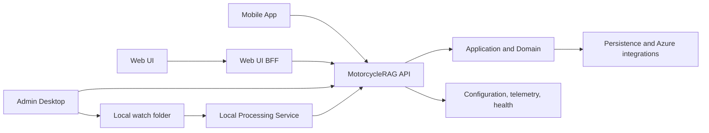

# MotorcycleRAG System Architecture

## Overview

MotorcycleRAG combines multiple client applications with a Clean Architecture backend and a local-first document-ingestion processor. Browser traffic reaches the API through the Web UI BFF; administrative ingestion is coordinated by the Admin Desktop application; and the Local Processing Service performs local document work while the API maintains the durable job record.

## Architecture

## Components and Interfaces

- **Presentation:** API, Web UI/BFF, Admin Desktop, and Mobile App own their user/system boundaries and have dedicated documentation folders.
- **Application and Domain:** use cases depend on `MotorcycleRAG.Contracts` interfaces; business rules and concrete domain types remain in Domain. Shared data-only transport DTOs belong in `MotorcycleRAG.Contracts.Models`. The detailed dependency and placement rules are in [architecture-general.md](../rules/architecture-general.md).
- **Persistence and integrations:** SQL, local-file, trusted-web, storage, search, AI, configuration, credential-provider, and SDK-factory implementations stay behind application-facing abstractions.
- **Composition roots:** each host composes concrete framework and SDK dependencies in its bootstrap/registration extensions. Controllers and application services receive the resulting contracts through DI rather than resolving or constructing infrastructure dependencies themselves.
- **Local ingestion:** Admin Desktop creates the cloud ingestion work and safely publishes the paired file/manifest; the Python service consumes it and reports status through the API.

### Model classification and boundaries

- A Domain Entity has stable identity and owns an invariant, legal state transition, or other domain behavior. Persistence keys and public properties alone do not qualify a type as an Entity; Entity state is changed through invariant-preserving methods.
- A DTO is a data carrier/property bag. Shared DTOs cross application boundaries from `MotorcycleRAG.Contracts.Models` and use the `Dto` suffix; use-case-local DTOs stay in Application. DTOs do not own domain invariants or lifecycle transitions.
- A value object is immutable and equality-by-value. It may contain domain behavior, but it has no independent identity and is neither a DTO nor an Entity.
- Persistence rows and schema projections that are not shared contracts remain private to Persistence. Persistence maps those rows at the adapter boundary instead of exposing storage shape to Domain or shared contracts.
- Each file contains one top-level type, with its filename and namespace matching the type classification. External/API/search/database shapes are mapped explicitly at their owning boundary.

## Data Models

Shared transport models belong in `MotorcycleRAG.Contracts.Models`; interfaces belong in `MotorcycleRAG.Contracts`. The authoritative ingestion correlation is the processor-run identifier associated with the API ingestion job. Component documentation defines the detailed models at each boundary.

## Error Handling

Clients present sanitized failures, the API applies authentication and standardized HTTP error handling, and the Local Processing Service reports explicit readiness and job states. Cross-application failures must be diagnosed through health endpoints, correlated job identifiers, and structured telemetry rather than raw secrets or request content.

## Testing Strategy

- Unit tests validate component and layer behavior in the owning test project.
- Integration tests validate API, persistence, authentication, and service contracts.
- End-to-end tests exercise user-visible boundaries, including the real local-first ingestion shape where applicable.
- Documentation checks validate that every cataloged component remains discoverable.
