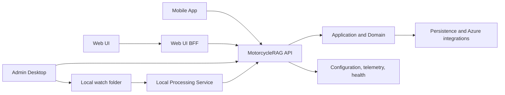

# MotorcycleRAG System Architecture

## Overview

MotorcycleRAG combines multiple client applications with a Clean Architecture backend and a local-first document-ingestion processor. Browser traffic reaches the API through the Web UI BFF; administrative ingestion is coordinated by the Admin Desktop application; and the Local Processing Service performs local document work while the API maintains the durable job record.

## Architecture

## Components and Interfaces

- **Presentation:** API, Web UI/BFF, Admin Desktop, and Mobile App own their user/system boundaries and have dedicated documentation folders.
- **Application and Domain:** use cases, business rules, shared contracts, and orchestration follow the dependency and placement rules in [architecture-general.md](../rules/architecture-general.md).
- **Persistence and integrations:** SQL, storage, search, AI, and configuration implementations stay behind application-facing abstractions.
- **Local ingestion:** Admin Desktop creates the cloud ingestion work and safely publishes the paired file/manifest; the Python service consumes it and reports status through the API.

## Data Models

Shared transport models belong in `MotorcycleRAG.Contracts.Models`; interfaces belong in `MotorcycleRAG.Contracts`. The authoritative ingestion correlation is the processor-run identifier associated with the API ingestion job. Component documentation defines the detailed models at each boundary.

## Error Handling

Clients present sanitized failures, the API applies authentication and standardized HTTP error handling, and the Local Processing Service reports explicit readiness and job states. Cross-application failures must be diagnosed through health endpoints, correlated job identifiers, and structured telemetry rather than raw secrets or request content.

## Testing Strategy

- Unit tests validate component and layer behavior in the owning test project.
- Integration tests validate API, persistence, authentication, and service contracts.
- End-to-end tests exercise user-visible boundaries, including the real local-first ingestion shape where applicable.
- Documentation checks validate that every cataloged component remains discoverable.
