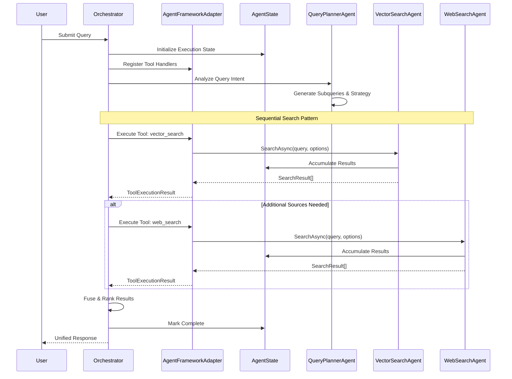
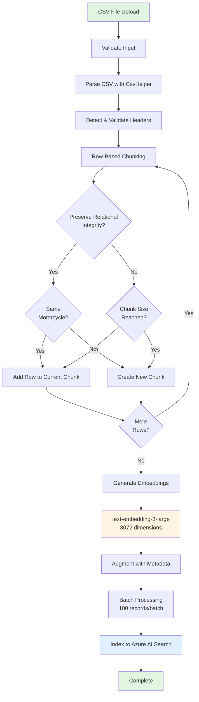
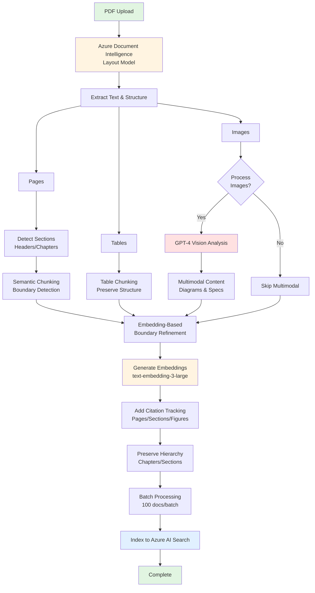
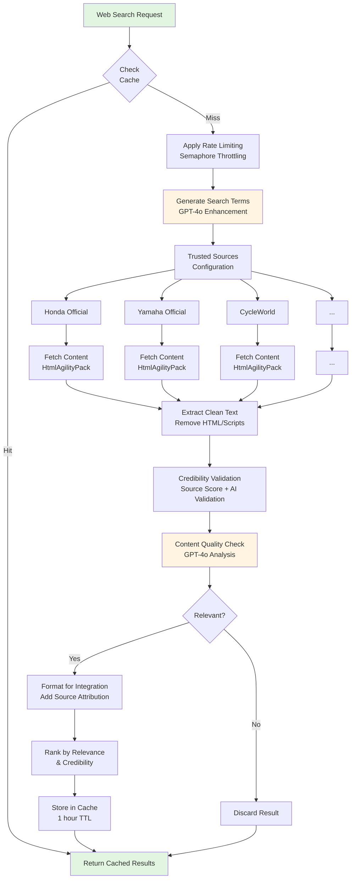
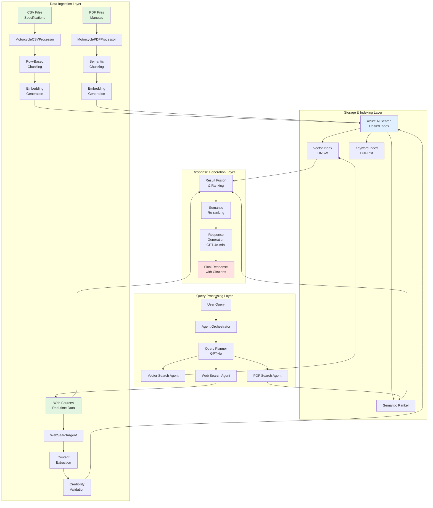

# Motorcycle RAG System

A sophisticated multi-agent RAG (Retrieval-Augmented Generation) system for intelligent motorcycle information retrieval, built on Azure AI Foundry platform using Clean Architecture principles.

## Overview

This system implements a multi-agent architecture to orchestrate intelligent search across heterogeneous data sources including CSV specifications, PDF manuals, and real-time web sources. It uses a sequential search pattern with intelligent query planning, hybrid vector/keyword search, and comprehensive resilience patterns.

## Architecture

### Multi-Agent System
- **Query Planner Agent**: Uses GPT-4o to analyze user queries and generate optimal search strategies
- **Vector Search Agent**: Performs hybrid vector/keyword search on indexed motorcycle data
- **Web Search Agent**: Augments results with real-time web information and current data
- **Agent Orchestrator**: Coordinates the sequential search flow and result aggregation

### Clean Architecture Layers
```
1-Presentation/     # ASP.NET Core Web API
2-Application/      # Business logic and agents
3-Domain/          # Core models and interfaces
4-Persistence/     # Azure services and data access
5-Test/           # Unit and integration tests
6-Docs/           # Documentation
7-Deployment/     # Infrastructure as Code
```

## Microsoft Agent Framework Integration

The system leverages the **Microsoft Agent Framework** to orchestrate multi-agent collaboration and tool-based communication for intelligent search operations.

### Architecture Components

#### AgentFrameworkAdapter

The `AgentFrameworkAdapter` serves as the bridge between custom search agents and the Microsoft Agent Framework, providing:

- **Tool Execution**: Executes tool calls from LLM-based agents with parameter validation and error handling
- **Handler Registration**: Extensible registry for registering custom tool handlers
- **Inter-Agent Communication**: Facilitates communication between agents using standardized message formats
- **Search Agent Integration**: Creates handlers for `VectorSearchAgent`, `WebSearchAgent`, and `PDFSearchAgent`

**Key Capabilities:**
```csharp
// Register tool handlers for search agents
adapter.RegisterToolHandler("vector_search", handler);
adapter.RegisterToolHandler("web_search", handler);
adapter.RegisterToolHandler("pdf_search", handler);

// Execute tool calls from LLM
var result = await adapter.ExecuteToolAsync(toolCall);
```

#### AgentState

`AgentState` manages execution context and state across agent interactions:

- **Execution Context**: Tracks query execution with unique execution IDs
- **Message History**: Maintains conversation between agents (status, queries, results, errors)
- **Result Accumulation**: Collects search results from all agents
- **Error Tracking**: Records agent-specific errors with timestamps
- **Metadata Management**: Stores execution metadata for observability

**State Lifecycle:**
1. Initialize with original query
2. Track agent messages and results
3. Record errors during execution
4. Mark execution as complete/failed
5. Calculate execution duration

#### ToolDefinitions

`ToolDefinitions` defines callable tools that LLM-based agents can invoke:

**Available Tools:**
- **`vector_search`**: Hybrid vector/keyword search on indexed motorcycle data
  - Parameters: `query`, `maxResults`, `minRelevanceScore`
  - Returns structured search results with relevance scores
  
- **`web_search`**: External web search from trusted sources
  - Parameters: `query`, `maxResults`, `trustedSourcesOnly`
  - Returns augmented information from authoritative sites
  
- **`pdf_search`**: Technical documentation search in PDF manuals
  - Parameters: `query`, `maxResults`, `documentType`
  - Returns detailed technical specifications and procedures
  
- **`plan_search_strategy`**: Query planning and strategy optimization
  - Parameters: `query`, `includeSemantic`, `includeWeb`, `includePdf`
  - Returns optimized search execution plan

Each tool definition includes:
- Tool name and display name
- Detailed description for LLM context
- JSON schema for parameters
- Required/optional parameter specifications
- Default values and constraints

#### AgentOrchestrator

`AgentOrchestrator` coordinates multiple search agents using framework patterns:

- **Sequential Search Execution**: Orchestrates agents in priority order (Vector → Web → PDF)
- **Result Fusion**: Deduplicates and merges results from multiple agents
- **Semantic Ranking**: Applies GPT-4-based semantic ranking using embeddings
- **Response Generation**: Uses GPT-4o-mini to generate natural language responses
- **Framework Integration**: Initializes and manages agent framework adapters

**Coordination Flow:**
1. Initialize framework adapter with registered agents
2. Execute agents sequentially with error resilience
3. Accumulate results in shared state
4. Apply deduplication by document ID
5. Perform semantic ranking with text-embedding-3-large
6. Return top-ranked results

### Agent Communication Flow



### Tool-Based Communication Patterns

The system uses a **function-calling pattern** where:

1. **LLM Agents** (GPT-4o) analyze queries and decide which tools to invoke
2. **AgentFrameworkAdapter** receives tool calls with structured arguments
3. **Tool Handlers** execute the actual search operations
4. **Results** are returned as structured JSON with metadata
5. **State Management** tracks the conversation and accumulated results

**Example Tool Call Flow:**
```json
{
  "toolName": "vector_search",
  "arguments": {
    "query": "Honda CBR 1000RR specifications",
    "maxResults": 10,
    "minRelevanceScore": 0.7
  },
  "callId": "tool-call-uuid"
}
```

**Example Tool Result:**
```json
{
  "toolCallId": "tool-call-uuid",
  "success": true,
  "result": {
    "results": [...],
    "resultCount": 5,
    "agentType": "VectorSearch",
    "executedAt": "2024-01-15T10:30:00Z"
  }
}
```

## Data Ingestion Strategy

The system implements a **multi-source data ingestion pipeline** that processes motorcycle data from CSV specifications, PDF manuals, and web sources with intelligent chunking, embedding generation, and hybrid indexing.

### CSV Data Ingestion

The `MotorcycleCSVProcessor` handles structured motorcycle specification data with relational integrity preservation.

#### Processing Pipeline



#### Key Features

**Row-Based Chunking Strategy:**
- Preserves relational integrity by keeping related rows together
- Groups rows by motorcycle identifiers (Make, Model, Year)
- Configurable chunk size (default: 100 rows per chunk)
- Maintains CSV structure with header information

**Header Detection & Field Mapping:**
- Automatic header detection with `CsvHelper`
- Validates presence of required fields: Make, Model, Year, Engine specs
- Maps CSV columns to domain model properties
- Handles missing fields gracefully with warnings

**Field Validation:**
```csharp
Required Fields:
- Make (motorcycle manufacturer)
- Model (model name/number)
- Year (production year)
- Engine displacement (CC)
- Power output (HP/kW)
```

**Metadata Augmentation:**
- Computed fields: title generation, chunk indexing
- Source tracking: original file name, chunk index
- Processing metadata: row count, headers, method
- Identifier preservation: Make, Model, Year per chunk

**Embedding Generation:**
- Model: `text-embedding-3-large` (3072 dimensions)
- Content: Row data formatted as "Field: Value | Field: Value"
- Batch processing: 100 embeddings per API call
- Error handling: Retry on transient failures

**Batch Processing Configuration:**
```csharp
BatchSize: 100 records per operation
MaxRows: Configurable limit (default: 10,000)
ChunkSize: 100 rows per chunk
PreserveRelationalIntegrity: true
IdentifierFields: ["Make", "Model", "Year"]
```

### PDF Data Ingestion

The `MotorcyclePDFProcessor` handles unstructured motorcycle manuals with semantic chunking and multimodal capabilities.

#### Processing Pipeline



#### Key Features

**Azure Document Intelligence Integration:**
- **Layout Model**: Extracts text, tables, and document structure
- **OCR Capabilities**: Handles scanned PDFs and image-based content
- **Table Detection**: Identifies and preserves tabular data
- **Page Analysis**: Extracts page-level metadata (dimensions, orientation)

**Semantic Chunking:**
- **Boundary Detection**: Uses semantic similarity to determine chunk boundaries
- **Section-Based**: Respects document structure (chapters, sections, subsections)
- **Size Constraints**: Min/max chunk sizes with overlap for context
  - MaxChunkSize: 1500 tokens
  - MinChunkSize: 500 tokens
  - ChunkOverlap: 200 tokens
- **Similarity Threshold**: 0.8 cosine similarity for chunk merging

**Multimodal Processing with GPT-4 Vision:**
- Analyzes diagrams, schematics, and technical illustrations
- Extracts parts identification and labeling
- Describes visual instructions and procedures
- Identifies safety warnings and cautions
- Captures technical specifications in visual format

**Hierarchical Structure Preservation:**
```
Document Hierarchy:
├── Chapter 1: Introduction
│   ├── Section 1.1: Overview
│   │   └── Subsection 1.1.1: Features
│   └── Section 1.2: Specifications
├── Chapter 2: Maintenance
│   ├── Section 2.1: Oil Change
│   └── Section 2.2: Brake Service
```

**Citation Tracking:**
- **Page Numbers**: Tracks exact page location
- **Section References**: Links to chapter/section hierarchy
- **Figure References**: Associates diagrams with text
- **Table References**: Links tabular data to descriptions

**Embedding Generation:**
- Model: `text-embedding-3-large` (3072 dimensions)
- Content: Semantic chunks with section context
- Batch processing: 10 chunks per embedding API call
- Error resilience: Continues on individual chunk failures

### Web Data Augmentation

The `WebSearchAgent` augments results with real-time web information from trusted sources.

#### Processing Pipeline



#### Key Features

**Trusted Sources Configuration:**
```csharp
TrustedSources:
- Honda Official (credibility: 0.95)
- Yamaha Official (credibility: 0.95)
- Kawasaki Official (credibility: 0.95)
- CycleWorld (credibility: 0.85)
- Motorcycle.com (credibility: 0.85)
- RevZilla (credibility: 0.80)
```

**Rate Limiting:**
- **Semaphore-Based Throttling**: Controls concurrent requests
- **Max Concurrent Requests**: 5 simultaneous connections
- **Min Request Interval**: 500ms between requests
- **Per-Source Tracking**: Prevents overwhelming individual sites
- **Request Timeout**: 30 seconds per request

**Content Extraction:**
- **HtmlAgilityPack**: Parses HTML and extracts clean text
- **Selector Priority**: Tries multiple CSS selectors for robustness
- **HTML Cleanup**: Removes scripts, styles, and navigation elements
- **Entity Decoding**: Handles HTML entities and special characters
- **Length Limiting**: Truncates to 500 characters per excerpt

**Credibility Validation:**
- **Source Scoring**: Pre-configured scores for known sources
- **AI-Based Validation**: GPT-4o analyzes content quality
- **Quality Metrics**: Technical accuracy, relevance, completeness
- **Threshold Filtering**: MinCredibilityScore: 0.7 (configurable)

**Cache Management:**
- **In-Memory Cache**: Dictionary-based result storage
- **TTL**: 1 hour cache expiration
- **Size Limit**: Max 100 queries cached
- **LRU Eviction**: Removes oldest entries when full
- **Query Normalization**: Lowercase keys for cache hits

### Azure AI Search Indexing

All processed data is indexed into **Azure AI Search** with hybrid search capabilities.

#### Index Schema

```csharp
Index: motorcycle-index (unified)

Fields:
- id (String, Key): Unique document identifier
- title (String, Searchable, Filterable): Document title
- content (String, Searchable): Full text content
- contentVector (Float[], Vector): 3072-dim embedding
- type (String, Filterable, Facetable): Document type (CSV/PDF/Web)
- make (String, Filterable, Facetable): Motorcycle manufacturer
- model (String, Filterable, Facetable): Model name
- year (Int, Filterable, Facetable): Production year
- sourceFile (String, Filterable): Original source file
- pageNumber (Int, Filterable): Page number (PDF only)
- section (String, Filterable): Document section
- tags (String[], Filterable, Facetable): Metadata tags
- publishedDate (DateTime, Filterable, Sortable): Publication date
- lastUpdated (DateTime, Filterable, Sortable): Last update timestamp
```

#### Hybrid Search Configuration

**Vector Search:**
- Field: `contentVector` (3072 dimensions)
- Algorithm: HNSW (Hierarchical Navigable Small World)
- Similarity: Cosine similarity
- Parameters:
  - m: 4 (connections per node)
  - efConstruction: 400 (index build quality)
  - efSearch: 500 (search quality)

**Keyword Search:**
- Fields: `content`, `title`, `make`, `model`
- Analyzer: Microsoft English analyzer
- Features: Stemming, stop-word removal, phonetic matching

**Semantic Ranking:**
- Configuration: Built-in semantic ranking
- Query Type: Semantic hybrid (vector + keyword + ranking)
- Top Results: Re-ranks top 50 results
- Captions: Extracts relevant excerpts

**Faceted Filtering:**
```csharp
Facets:
- make: Top manufacturers
- model: Top models
- year: Production year range
- type: Document type distribution
- tags: Common tags
```

#### Indexing Process

**Batch Processing:**
- Batch Size: 100 documents per indexing operation
- Chunking: Processes large datasets in batches
- Error Handling: Continues on individual document failures
- Retry Policy: 3 retries with exponential backoff

**Index Operations:**
```csharp
Operations:
- IndexDocumentsAsync(): Upsert documents
- MergeOrUploadDocumentsAsync(): Merge updates
- DeleteDocumentsAsync(): Remove documents
- SearchAsync(): Hybrid search query
```

## Technology Stack

- **Platform**: Azure AI Foundry (unified AI services platform)
- **Framework**: ASP.NET Core Web API (.NET 10.0)
- **Agent Framework**: Microsoft Agent Framework (multi-agent orchestration)
- **AI Services**: Azure OpenAI (GPT-4o, GPT-4o-mini, GPT-4 Vision, text-embedding-3-large)
- **Search**: Azure AI Search (hybrid vector/keyword with semantic ranking)
- **Document Processing**: Azure Document Intelligence (Layout model for OCR and PDF processing)
- **Web Scraping**: HtmlAgilityPack for content extraction
- **Configuration**: Azure App Configuration + Azure Key Vault
- **Infrastructure**: Pulumi (Infrastructure as Code)
- **Monitoring**: Application Insights with comprehensive telemetry
- **Resilience**: Polly (circuit breakers, retries, fallbacks)
- **Testing**: xUnit, Moq, Integration Tests
- **Deployment**: Azure Container Apps / App Service

## Getting Started

### Prerequisites

- .NET 10.0 SDK
- Azure subscription with the following services:
  - Azure AI Foundry project
  - Azure OpenAI service (GPT-4o, GPT-4o-mini, text-embedding-3-large)
  - Azure AI Search service
  - Azure Document Intelligence service
  - Azure App Configuration (optional, for centralized config)
  - Azure Key Vault (optional, for secrets management)
  - Application Insights (optional, for monitoring)

### Quick Start

1. **Clone the repository**
   ```powershell
   git clone <repository-url>
   Set-Location motorcycle-rag-system
   ```

2. **Configure Azure services**
   - Set up Azure AI Foundry project
   - Deploy Azure OpenAI, AI Search, and Document Intelligence services
   - Configure authentication (Managed Identity recommended)

3. **Update configuration**
   ```powershell
   # Copy and modify configuration files
   Copy-Item "1-Presentation/MotorcycleRAG.API/appsettings.json" "1-Presentation/MotorcycleRAG.API/appsettings.Development.json"

   # Edit appsettings.Development.json with your Azure service endpoints
   # For production, use Azure App Configuration and Key Vault
   ```

4. **Ingest motorcycle data**
   ```powershell
   # Ingest CSV specifications
   Invoke-RestMethod -Uri "http://localhost:5000/api/data/ingest/csv" `
     -Method Post `
     -ContentType "multipart/form-data" `
     -InFile "path/to/motorcycle-specs.csv"

   # Ingest PDF manuals
   Invoke-RestMethod -Uri "http://localhost:5000/api/data/ingest/pdf" `
     -Method Post `
     -ContentType "multipart/form-data" `
     -InFile "path/to/maintenance-manual.pdf"
   ```

5. **Run the application**
   ```powershell
   # Build and run
   dotnet build
   dotnet test
   dotnet run --project 1-Presentation/MotorcycleRAG.API
   ```

### API Endpoints

**Query Endpoints:**
- **POST** `/api/motorcycles/query` - Process motorcycle queries with RAG
- **GET** `/api/motorcycles/health` - Health check endpoint
- **GET** `/health` - General health checks
- **GET** `/swagger` - API documentation (development only)

**Data Ingestion Endpoints:**
- **POST** `/api/data/ingest/csv` - Ingest CSV motorcycle specifications
- **POST** `/api/data/ingest/pdf` - Ingest PDF motorcycle manuals
- **POST** `/api/data/ingest/web` - Trigger web data augmentation
- **GET** `/api/data/ingest/status/{jobId}` - Check ingestion job status

## Development

### Build and Test

```powershell
# Build the entire solution
dotnet build MotorcycleRAG.sln

# Run all tests
dotnet test MotorcycleRAG.sln

# Run specific test projects
dotnet test 5-Test/tests/MotorcycleRAG.UnitTests
dotnet test 5-Test/tests/MotorcycleRAG.IntegrationTests

# Run with code coverage
dotnet test /p:CollectCoverage=true /p:CoverletOutputFormat=cobertura
```

### Development Workflow

1. **Local Development**
   ```powershell
   # Hot reload during development
   dotnet watch --project 1-Presentation/MotorcycleRAG.API

   # Debug with Visual Studio
   # Open MotorcycleRAG.sln and start debugging
   ```

2. **Configuration Management**
   - Development: `appsettings.Development.json`
   - Production: Azure App Configuration + Key Vault
   - Environment-specific overrides supported

3. **Testing Strategy**
   - Unit tests for all components
   - Integration tests for Azure services
   - Resilience testing with Polly patterns

### Architecture Principles

- **Clean Architecture**: Strict separation of concerns across layers
- **Interface-based design**: Dependency injection throughout
- **Async/await patterns**: All I/O operations are asynchronous
- **Resilience patterns**: Circuit breakers, retries, and fallbacks with Polly
- **Comprehensive observability**: Structured logging, metrics, and tracing
- **Security-first**: Authentication, authorization, and input validation
- **Cost optimization**: Intelligent caching and resource management

## Deployment

### Infrastructure as Code

The project uses Pulumi for infrastructure provisioning:

```powershell
# Navigate to infrastructure directory
Set-Location "7-Deployment/infrastructure"

# Install dependencies
pulumi plugin install resource azure-native 2.0.0

# Set configuration (or use GitHub secrets for CI/CD)
pulumi config set azure-native:location eastus
pulumi config set azureOpenAIEndpoint "https://your-openai.openai.azure.com"

# Preview deployment
pulumi preview

# Deploy infrastructure
pulumi up
```

### Azure Services Setup

See [`6-Docs/azure-ai-foundry-setup.md`](6-Docs/azure-ai-foundry-setup.md) for detailed Azure AI Foundry configuration.

### Container Deployment

```powershell
# Build Docker image
docker build -t motorcyclerag-api -f 7-Deployment/Dockerfile .

# Run locally
docker run -p 8080:80 motorcyclerag-api

# Push to Azure Container Registry (ACR)
az acr build --registry myregistry --image motorcyclerag-api .
```

## Configuration

### Environment Variables

| Variable | Description | Required |
|----------|-------------|----------|
| `AzureAI__FoundryEndpoint` | Azure AI Foundry endpoint | Yes |
| `AzureAI__OpenAIEndpoint` | Azure OpenAI service endpoint | Yes |
| `AzureAI__SearchServiceEndpoint` | Azure AI Search endpoint | Yes |
| `AzureAI__DocumentIntelligenceEndpoint` | Document Intelligence endpoint | Yes |
| `AzureAI__Models__ChatModel` | Chat model deployment name (GPT-4o) | Yes |
| `AzureAI__Models__CompletionModel` | Completion model (GPT-4o-mini) | Yes |
| `AzureAI__Models__EmbeddingModel` | Embedding model (text-embedding-3-large) | Yes |
| `AzureAI__Models__VisionModel` | Vision model (GPT-4 Vision) | Yes |
| `ApplicationInsights__ConnectionString` | App Insights connection string | No |
| `DataProcessing__CSV__MaxRows` | Max CSV rows to process | No |
| `DataProcessing__CSV__ChunkSize` | CSV chunk size (default: 100) | No |
| `DataProcessing__CSV__PreserveRelationalIntegrity` | Preserve motorcycle grouping | No |
| `DataProcessing__PDF__MaxChunkSize` | Max PDF chunk tokens (default: 1500) | No |
| `DataProcessing__PDF__MinChunkSize` | Min PDF chunk tokens (default: 500) | No |
| `DataProcessing__PDF__ChunkOverlap` | Token overlap (default: 200) | No |
| `DataProcessing__PDF__ProcessImages` | Enable GPT-4 Vision (default: true) | No |
| `DataProcessing__PDF__SimilarityThreshold` | Chunk merge threshold (default: 0.8) | No |
| `WebSearch__MaxConcurrentRequests` | Max concurrent web requests (default: 5) | No |
| `WebSearch__MinRequestIntervalMs` | Rate limit interval (default: 500ms) | No |
| `WebSearch__RequestTimeoutSeconds` | Request timeout (default: 30s) | No |
| `WebSearch__MinCredibilityScore` | Min source credibility (default: 0.7) | No |

### Azure App Configuration

For production deployments, use Azure App Configuration:

```json
{
  "AppConfig:Endpoint": "https://your-appconfig.azconfig.io",
  "Settings:Sentinel": "v1.0"
}
```

## Data Processing Workflow

The complete data ingestion and search workflow:



## Monitoring and Quality Assurance

### Data Pipeline Monitoring

**Ingestion Metrics:**
- Documents processed per hour/day
- Processing time per document type
- Error rates by processor type
- Embedding generation latency
- Index update success rate

**Quality Metrics:**
- Chunk size distribution
- Embedding quality scores
- Citation accuracy (PDF)
- Duplicate detection rate
- Metadata completeness

**Health Checks:**
```csharp
GET /health/ingestion
{
  "status": "Healthy",
  "checks": {
    "csvProcessor": "Healthy",
    "pdfProcessor": "Healthy",
    "azureSearch": "Healthy",
    "documentIntelligence": "Healthy"
  },
  "metrics": {
    "documentsProcessedToday": 1523,
    "averageProcessingTimeMs": 450,
    "errorRate": 0.02
  }
}
```

### Search Quality Monitoring

**Query Metrics:**
- Average search latency by agent type
- Result relevance scores
- Cache hit rate
- Agent execution success rate
- Tool invocation frequency

**Quality Assurance:**
- Relevance scoring validation
- Result diversity measurement
- Citation accuracy tracking
- User feedback collection
- A/B testing for ranking algorithms

**Application Insights Tracking:**
```csharp
Custom Events:
- QueryExecuted: Track all queries with context
- AgentExecutionCompleted: Agent performance
- ToolInvoked: Tool usage patterns
- ResultFusionCompleted: Fusion metrics
- EmbeddingGenerated: Embedding operations

Custom Metrics:
- SearchLatency: P50, P95, P99
- ResultCount: Average per query
- RelevanceScore: Distribution
- CacheHitRate: Percentage
- ErrorRate: By component
```

### Data Quality Validation

**Automated Validation:**
- Required field presence checks
- Metadata consistency validation
- Embedding dimension verification
- Citation link validation
- Duplicate content detection

**Manual Review Process:**
- Sample 1% of processed documents
- Verify chunk quality and boundaries
- Validate citation accuracy
- Check multimodal content descriptions
- Review search result relevance

### Performance Optimization

**Indexing Optimization:**
- Batch size tuning (current: 100 docs/batch)
- Parallel processing for large datasets
- Incremental indexing for updates
- Index schema optimization
- Vector quantization for storage

**Search Optimization:**
- Query result caching (1-hour TTL)
- Embedding caching for frequent queries
- Connection pooling for Azure services
- Circuit breakers for resilience
- Rate limiting for cost control

## Contributing

1. Follow Clean Architecture principles and the established layer structure
2. Ensure all tests pass before submitting PRs
3. Add comprehensive unit and integration tests for new functionality
4. Update API documentation and OpenAPI specifications
5. Follow the established coding standards and async patterns
6. Add appropriate logging and telemetry for new features

## License

This project is licensed under the MIT License - see the LICENSE file for details.
